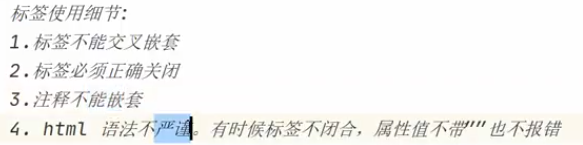
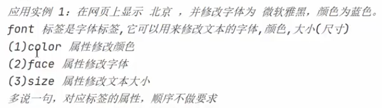
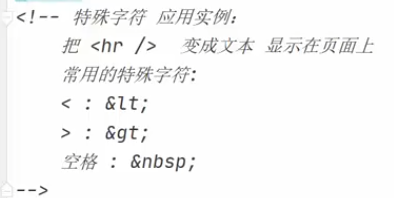

# 标签使用细节




# font标签



# 字符实体



# 标题标签

<h1>
    diyibiaoqian
</h1>


# 超链接

<a href="https://www.sohu.com" target=_blank> ywz</a>


# 表格标签和跨行跨列


在 HTML 表格中，**跨行**和**跨列**可以通过 `rowspan` 和 `colspan` 属性实现。以下是详细用法和示例：

---

### 1. 基本表格结构
HTML 表格由 `<table>`、`<tr>`（行）、`<th>`（表头）和 `<td>`（单元格）组成：
```html
<table border="1">
  <tr>
    <th>姓名</th>
    <th>年龄</th>
  </tr>
  <tr>
    <td>张三</td>
    <td>25</td>
  </tr>
</table>
```

---

### 2. 跨列合并：`colspan`
`colspan` 属性用于横向合并单元格（跨列）。
- **示例**：合并表头为两列：
```html
<table border="1">
  <tr>
    <th colspan="2">用户信息</th> <!-- 合并两列 -->
  </tr>
  <tr>
    <th>姓名</th>
    <th>年龄</th>
  </tr>
  <tr>
    <td>李四</td>
    <td>30</td>
  </tr>
</table>
```
**效果**：
```
|    用户信息     |
| 姓名   | 年龄  |
| 李四   | 30    |
```

---

### 3. 跨行合并：`rowspan`
`rowspan` 属性用于纵向合并单元格（跨行）。
- **示例**：合并左侧单元格为两行：
```html
<table border="1">
  <tr>
    <th rowspan="2">部门</th> <!-- 合并两行 -->
    <th>员工</th>
  </tr>
  <tr>
    <td>王五</td>
  </tr>
</table>
```
**效果**：
```
| 部门 | 员工 |
|      | 王五 |
```

---

### 4. 混合跨行跨列
结合 `rowspan` 和 `colspan` 创建复杂表格：
```html
<table border="1">
  <tr>
    <th rowspan="2">部门</th>
    <th colspan="2">信息</th>
  </tr>
  <tr>
    <th>姓名</th>
    <th>年龄</th>
  </tr>
  <tr>
    <td>技术部</td>
    <td>赵六</td>
    <td>28</td>
  </tr>
</table>
```
**效果**：
```
| 部门   |     信息      |
|        | 姓名   | 年龄  |
| 技术部 | 赵六   | 28    |
```

---

### 5. 注意事项
1. **单元格数量匹配**：合并后需调整其他行的单元格数量，确保每行总单元格数一致。
2. **嵌套表格**：复杂布局可结合嵌套表格实现。
3. **样式优化**：使用 CSS（如 `border-collapse`）美化表格边框。

通过 `rowspan` 和 `colspan`，可以灵活设计表格布局，适应数据展示需求。

HTML 表单（Form）是网页中用于收集用户输入数据的核心组件，例如登录、注册、搜索框等场景。表单通过 `<form>` 标签定义，内部包含输入控件（如文本框、按钮、下拉菜单等），用户输入的数据可以通过表单提交到服务器进行处理。

---

### **一、表单的基本结构**
```html
<form action="服务器处理地址" method="提交方法">
  <!-- 输入控件（如文本框、按钮等） -->
  <input type="text" name="username">
  <input type="submit" value="提交">
</form>
```
- **`action`**：指定表单数据提交到服务器的 URL（后端接口）。
- **`method`**：定义数据提交的 HTTP 方法，常用 `GET` 或 `POST`。

---

### **二、表单常用输入控件**
#### **1. 文本输入**
```html
<input type="text" name="username" placeholder="请输入用户名">
```
- **`type="text"`**：单行文本输入框。
- **`name`**：提交到服务器的参数名（键）。
- **`placeholder`**：输入框的提示文本。

#### **2. 密码输入**
```html
<input type="password" name="password" required>
```
- **`type="password"`**：密码输入框（内容会隐藏）。
- **`required`**：必填项（HTML5 验证）。

#### **3. 单选按钮（Radio）**
```html
<input type="radio" name="gender" value="male"> 男
<input type="radio" name="gender" value="female"> 女
```
- **`name` 相同**：表示同一组单选按钮。
- **`value`**：提交到服务器的值。

#### **4. 复选框（Checkbox）**
```html
<input type="checkbox" name="hobby" value="reading"> 阅读
<input type="checkbox" name="hobby" value="music"> 音乐
```
- 可多选，多个选项的 `name` 相同。

#### **5. 下拉菜单（Select）**
```html
<select name="city">
  <option value="beijing">北京</option>
  <option value="shanghai">上海</option>
</select>
```

#### **6. 多行文本输入**
```html
<textarea name="comment" rows="4" cols="50"></textarea>
```

#### **7. 文件上传**
```html
<input type="file" name="file" accept="image/*">
```
- **`accept`**：限制上传文件类型（如 `image/*` 表示图片）。

#### **8. 提交按钮**
```html
<input type="submit" value="提交">
<!-- 或 -->
<button type="submit">提交</button>
```

#### **9. 隐藏域（Hidden）**
```html
<input type="hidden" name="token" value="abc123">
```
- 用户不可见，用于传递后台需要的固定值。

---

### **三、表单的提交方法**
#### **1. `method="GET"`**
- **特点**：数据附加在 URL 中（如 `?username=John&age=20`）。
- **适用场景**：数据量小、非敏感信息（如搜索）。

#### **2. `method="POST"`**
- **特点**：数据放在 HTTP 请求体中，不可见。
- **适用场景**：敏感或大数据量（如登录、文件上传）。

---

### **四、表单验证（HTML5）**
HTML5 提供了内置的客户端验证功能：
#### **1. 必填项验证**
```html
<input type="text" name="email" required>
```

#### **2. 格式验证**
```html
<input type="email" name="email"> <!-- 验证邮箱格式 -->
<input type="url" name="website"> <!-- 验证 URL 格式 -->
<input type="number" min="1" max="100"> <!-- 数值范围 -->
```

#### **3. 正则表达式验证**
```html
<input type="text" pattern="[A-Za-z]{6}" title="6位字母">
```

---

### **五、表单数据编码类型（`enctype`）**
指定表单数据在发送到服务器时的编码方式：
```html
<form enctype="multipart/form-data" method="post">
  <input type="file" name="file">
</form>
```
- **`application/x-www-form-urlencoded`**（默认）：普通文本数据。
- **`multipart/form-data`**：文件上传时必须使用。
- **`text/plain`**：纯文本格式（较少用）。

---

### **六、表单与后端交互示例**
#### **1. 前端表单（HTML）**
```html
<form action="/submit" method="post">
  <input type="text" name="username" placeholder="用户名">
  <input type="password" name="password" placeholder="密码">
  <input type="submit" value="登录">
</form>
```

#### **2. 后端处理（以 Node.js 为例）**
```javascript
const express = require("express");
const app = express();

app.use(express.urlencoded({ extended: true }));

app.post("/submit", (req, res) => {
  const username = req.body.username;
  const password = req.body.password;
  // 验证用户名和密码...
  res.send("登录成功！");
});
```

---

### **七、最佳实践**
1. **使用 `<label>` 提升可访问性**：
   ```html
   <label for="username">用户名：</label>
   <input type="text" id="username" name="username">
   ```

2. **合理分组表单元素**：
   ```html
   <fieldset>
     <legend>用户信息</legend>
     <!-- 输入控件 -->
   </fieldset>
   ```

3. **禁用表单自动填充**：
   ```html
   <input type="text" name="secret" autocomplete="off">
   ```

---

### **总结**
HTML 表单是用户与服务器交互的核心工具，掌握其基本结构、输入控件、验证方法及提交机制是 Web 开发的基础。合理设计表单能提升用户体验和数据安全性。