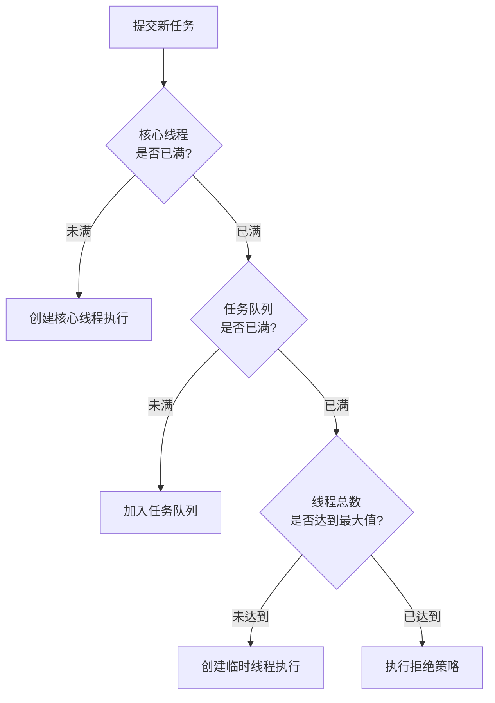

# ThreadPoolExecutor 入门指南

ThreadPoolExecutor 是 Java 并发包中功能最强大的线程池实现，提供了灵活且高效的线程管理能力。下面我将从基础使用到高级功能全面讲解。

## 一、为什么需要线程池？

在深入 ThreadPoolExecutor 前，先了解线程池的价值：
1. **降低资源消耗**：复用已创建的线程，减少线程创建/销毁开销
2. **提高响应速度**：任务到达时无需等待线程创建
3. **提高线程可控性**：统一分配、调优和监控线程资源
4. **防止资源耗尽**：通过队列缓冲和拒绝策略控制并发规模

## 二、核心构造参数

ThreadPoolExecutor 的核心构造函数包含 7 个参数：

```java
public ThreadPoolExecutor(
    int corePoolSize,          // 核心线程数
    int maximumPoolSize,       // 最大线程数
    long keepAliveTime,        // 非核心线程空闲存活时间
    TimeUnit unit,             // 时间单位
    BlockingQueue<Runnable> workQueue,  // 任务队列
    ThreadFactory threadFactory,        // 线程工厂
    RejectedExecutionHandler handler    // 拒绝策略
)
```

## 三、线程池工作流程



## 四、基础使用示例

```java
import java.util.concurrent.*;

public class ThreadPoolDemo {
    public static void main(String[] args) {
        // 创建线程池
        ThreadPoolExecutor executor = new ThreadPoolExecutor(
            2, // 核心线程数
            4, // 最大线程数
            30, // 空闲线程存活时间
            TimeUnit.SECONDS, // 时间单位
            new ArrayBlockingQueue<>(2), // 任务队列（容量2）
            Executors.defaultThreadFactory(), // 线程工厂
            new ThreadPoolExecutor.AbortPolicy() // 拒绝策略
        );

        // 提交10个任务
        for (int i = 1; i <= 10; i++) {
            final int taskId = i;
            executor.execute(() -> {
                System.out.println(Thread.currentThread().getName() 
                    + " 执行任务: " + taskId);
                try {
                    Thread.sleep(1000); // 模拟任务执行
                } catch (InterruptedException e) {
                    Thread.currentThread().interrupt();
                }
            });
        }

        // 关闭线程池
        executor.shutdown();
    }
}
```

## 五、常用 API 详解

### 1. 任务提交方法

| 方法                                                         | 说明                             |
| ------------------------------------------------------------ | -------------------------------- |
| `void execute(Runnable command)`                             | 提交无返回值的任务               |
| `Future<?> submit(Runnable task)`                            | 提交Runnable任务，返回Future     |
| `<T> Future<T> submit(Callable<T> task)`                     | 提交Callable任务，返回Future     |
| `<T> List<Future<T>> invokeAll(Collection<Callable<T>> tasks)` | 提交所有任务并等待完成           |
| `<T> T invokeAny(Collection<Callable<T>> tasks)`             | 提交所有任务，返回最先完成的结果 |

### 2. 线程池管理方法

| 方法                                                    | 说明                         |
| ------------------------------------------------------- | ---------------------------- |
| `void shutdown()`                                       | 平缓关闭（执行完已提交任务） |
| `List<Runnable> shutdownNow()`                          | 立即关闭（尝试中断所有线程） |
| `boolean isShutdown()`                                  | 检查是否已调用shutdown       |
| `boolean isTerminated()`                                | 检查所有任务是否完成         |
| `boolean awaitTermination(long timeout, TimeUnit unit)` | 等待线程池终止               |

### 3. 监控方法

| 方法                                 | 说明                          |
| ------------------------------------ | ----------------------------- |
| `int getPoolSize()`                  | 获取当前线程池中线程数量      |
| `int getActiveCount()`               | 获取正在执行任务的线程数      |
| `int getCorePoolSize()`              | 获取核心线程数                |
| `int getMaximumPoolSize()`           | 获取最大线程数                |
| `long getCompletedTaskCount()`       | 获取已完成任务数量            |
| `long getTaskCount()`                | 获取总任务数（已执行+队列中） |
| `BlockingQueue<Runnable> getQueue()` | 获取任务队列                  |

## 六、核心组件详解

### 1. 任务队列 (BlockingQueue)

| 队列类型                | 特性                      | 适用场景           |
| ----------------------- | ------------------------- | ------------------ |
| `ArrayBlockingQueue`    | 有界队列（固定大小）      | 需要控制资源消耗   |
| `LinkedBlockingQueue`   | 可选有界/无界（默认无界） | 任务量不可预测     |
| `SynchronousQueue`      | 不存储任务的直接传递队列  | 要求立即执行任务   |
| `PriorityBlockingQueue` | 带优先级的无界队列        | 需要任务优先级控制 |

### 2. 拒绝策略 (RejectedExecutionHandler)

| 策略           | 行为                            | 实现类                |
| -------------- | ------------------------------- | --------------------- |
| 中止策略       | 抛出 RejectedExecutionException | `AbortPolicy`         |
| 调用者运行策略 | 由提交任务的线程自己执行        | `CallerRunsPolicy`    |
| 丢弃最旧策略   | 丢弃队列头的任务并重试          | `DiscardOldestPolicy` |
| 丢弃策略       | 静默丢弃新任务                  | `DiscardPolicy`       |

自定义拒绝策略示例：
```java
executor.setRejectedExecutionHandler((task, executor) -> {
    System.err.println("任务被拒绝: " + task);
    // 可记录日志或将任务持久化
});
```

### 3. 线程工厂 (ThreadFactory)

自定义线程工厂示例：
```java
ThreadFactory customFactory = r -> {
    Thread t = new Thread(r);
    t.setName("Worker-" + t.getId()); // 自定义线程名
    t.setPriority(Thread.NORM_PRIORITY);
    t.setDaemon(false); // 用户线程
    return t;
};
```

## 七、高级使用技巧

### 1. 动态调整线程池参数

```java
// 运行时调整核心线程数
executor.setCorePoolSize(5);

// 运行时调整最大线程数
executor.setMaximumPoolSize(10);

// 设置核心线程空闲超时回收
executor.allowCoreThreadTimeOut(true);
```

### 2. 优雅关闭线程池

```java
// 1. 停止接收新任务
executor.shutdown();

try {
    // 2. 等待现有任务完成
    if (!executor.awaitTermination(60, TimeUnit.SECONDS)) {
        // 3. 强制关闭未完成的任务
        List<Runnable> unfinished = executor.shutdownNow();
        System.out.println("强制关闭的任务数: " + unfinished.size());
        
        // 4. 再次等待
        if (!executor.awaitTermination(60, TimeUnit.SECONDS)) {
            System.err.println("线程池未能完全关闭");
        }
    }
} catch (InterruptedException e) {
    // 5. 重新中断
    executor.shutdownNow();
    Thread.currentThread().interrupt();
}
```

### 3. 监控线程池状态

```java
// 定时监控线程池状态
ScheduledExecutorService monitor = Executors.newSingleThreadScheduledExecutor();
monitor.scheduleAtFixedRate(() -> {
    System.out.println("=== 线程池状态 ===");
    System.out.println("活动线程: " + executor.getActiveCount());
    System.out.println("池中线程: " + executor.getPoolSize());
    System.out.println("核心线程: " + executor.getCorePoolSize());
    System.out.println("最大线程: " + executor.getMaximumPoolSize());
    System.out.println("完成任务: " + executor.getCompletedTaskCount());
    System.out.println("队列大小: " + executor.getQueue().size());
    System.out.println("队列剩余容量: " + executor.getQueue().remainingCapacity());
}, 0, 5, TimeUnit.SECONDS);
```

## 八、最佳实践建议

1. **合理配置线程数**：
   - CPU密集型：`核心线程数 = CPU核数 + 1`
   - IO密集型：`核心线程数 = CPU核数 × 2`
   - 混合型：`核心线程数 = CPU核数 × (1 + 等待时间/计算时间)`

2. **避免使用无界队列**：
   ```java
   // 不推荐 - 可能导致OOM
   new ThreadPoolExecutor(n, n, 0L, TimeUnit.MILLISECONDS, 
                         new LinkedBlockingQueue<>());
   
   // 推荐 - 使用有界队列
   new ThreadPoolExecutor(n, n, 0L, TimeUnit.MILLISECONDS, 
                         new ArrayBlockingQueue<>(100));
   ```

3. **合理选择拒绝策略**：
   - 关键业务：`CallerRunsPolicy`（保证任务执行）
   - 非关键业务：`DiscardPolicy`（静默丢弃）
   - 需要记录：自定义策略（记录日志或持久化）

4. **使用命名线程**：
   ```java
   // 自定义线程工厂，添加有意义的名称
   ThreadFactory namedFactory = r -> 
       new Thread(r, "DB-Query-Thread-" + threadCounter.getAndIncrement());
   ```

5. **资源清理**：
   ```java
   Runtime.getRuntime().addShutdownHook(new Thread(() -> {
       executor.shutdown();
       try {
           if (!executor.awaitTermination(60, TimeUnit.SECONDS)) {
               executor.shutdownNow();
           }
       } catch (InterruptedException e) {
           executor.shutdownNow();
       }
   }));
   ```

## 九、与 Executors 工具类的比较

| 方法                        | 内部实现                                        | 问题             | 推荐替代方案                                                 |
| --------------------------- | ----------------------------------------------- | ---------------- | ------------------------------------------------------------ |
| `newCachedThreadPool()`     | core=0, max=Integer.MAX_VALUE, SynchronousQueue | 线程数无上限     | `new ThreadPoolExecutor(0, n, 60s, new SynchronousQueue<>())` |
| `newFixedThreadPool(n)`     | core=max=n, LinkedBlockingQueue(无界)           | 队列可能无限增长 | `new ThreadPoolExecutor(n, n, 0, TimeUnit.MILLISECONDS, new ArrayBlockingQueue<>(100))` |
| `newSingleThreadExecutor()` | core=max=1, LinkedBlockingQueue(无界)           | 同上             | `new ThreadPoolExecutor(1, 1, 0, TimeUnit.MILLISECONDS, new ArrayBlockingQueue<>(100))` |

## 十、完整示例：带监控的线程池

```java
import java.util.concurrent.*;
import java.util.concurrent.atomic.AtomicInteger;

public class AdvancedThreadPool {
    public static void main(String[] args) {
        // 创建自定义线程工厂
        ThreadFactory factory = r -> {
            Thread t = new Thread(r);
            t.setName("CustomWorker-" + t.getId());
            t.setUncaughtExceptionHandler((thread, ex) -> {
                System.err.println("线程异常: " + thread.getName() + ", 错误: " + ex.getMessage());
            });
            return t;
        };

        // 创建线程池
        ThreadPoolExecutor executor = new ThreadPoolExecutor(
            2, 5, 30, TimeUnit.SECONDS,
            new ArrayBlockingQueue<>(10),
            factory,
            new ThreadPoolExecutor.CallerRunsPolicy()
        );

        // 监控线程
        ScheduledExecutorService monitor = Executors.newSingleThreadScheduledExecutor();
        monitor.scheduleAtFixedRate(() -> {
            System.out.println("\n==== 监控报告 ====");
            System.out.println("活动线程: " + executor.getActiveCount());
            System.out.println("池中线程: " + executor.getPoolSize());
            System.out.println("完成任务: " + executor.getCompletedTaskCount());
            System.out.println("队列大小: " + executor.getQueue().size());
            System.out.println("队列剩余容量: " + executor.getQueue().remainingCapacity());
        }, 1, 1, TimeUnit.SECONDS);

        // 提交20个任务
        for (int i = 1; i <= 20; i++) {
            final int taskId = i;
            executor.submit(() -> {
                System.out.println(Thread.currentThread().getName() + " 开始任务: " + taskId);
                try {
                    // 模拟不同执行时间
                    Thread.sleep(500 + (int)(Math.random() * 1000));
                } catch (InterruptedException e) {
                    Thread.currentThread().interrupt();
                }
                System.out.println(Thread.currentThread().getName() + " 完成任务: " + taskId);
                return taskId;
            });
        }

        // 优雅关闭
        Runtime.getRuntime().addShutdownHook(new Thread(() -> {
            System.out.println("\n正在关闭线程池...");
            executor.shutdown();
            monitor.shutdown();
            
            try {
                if (!executor.awaitTermination(10, TimeUnit.SECONDS)) {
                    System.out.println("强制关闭未完成的任务...");
                    executor.shutdownNow();
                }
                
                if (!monitor.awaitTermination(5, TimeUnit.SECONDS)) {
                    monitor.shutdownNow();
                }
            } catch (InterruptedException e) {
                executor.shutdownNow();
                monitor.shutdownNow();
                Thread.currentThread().interrupt();
            }
            System.out.println("线程池已关闭");
        }));
    }
}
```

## 总结

ThreadPoolExecutor 提供了高度可配置的线程池实现，通过合理配置核心参数：
- `corePoolSize`：核心线程数（长期保留）
- `maximumPoolSize`：最大线程数（临时线程）
- `keepAliveTime`：非核心线程空闲时间
- `workQueue`：任务队列（控制缓冲）
- `threadFactory`：线程创建工厂
- `rejectedExecutionHandler`：拒绝策略

最佳实践：
1. 根据任务类型合理配置线程数
2. 使用有界队列防止资源耗尽
3. 选择合适的拒绝策略
4. 自定义线程工厂以便问题排查
5. 实现优雅关闭确保资源释放
6. 添加监控机制掌握线程池状态

掌握 ThreadPoolExecutor 的使用，能显著提升 Java 并发程序的性能和稳定性。

# Java 并发编程：Callable 接口详解

`java.util.concurrent.Callable` 是 Java 并发包中一个重要的函数式接口，用于表示**可返回结果**且**可能抛出异常**的任务。它是 `Runnable` 接口的强大补充，为 Java 并发编程提供了更灵活的任务处理能力。

## 一、Callable 与 Runnable 的核心区别

| 特性            | Runnable            | Callable                     |
| --------------- | ------------------- | ---------------------------- |
| **返回值**      | ❌ 无返回值 (`void`) | ✅ 有返回值 (泛型类型)        |
| **异常处理**    | ❌ 不能抛出受检异常  | ✅ 可以抛出受检异常           |
| **方法签名**    | `void run()`        | `V call() throws Exception`  |
| **引入版本**    | Java 1.0            | Java 5.0 (JSR-166)           |
| **使用场景**    | 简单异步任务        | 需要结果或异常处理的复杂任务 |
| **Future 支持** | 有限支持            | 完整支持                     |

## 二、Callable 接口定义

```java
@FunctionalInterface
public interface Callable<V> {
    /**
     * 计算结果，或在无法执行时抛出异常
     */
    V call() throws Exception;
}
```

- `V`：任务执行结果的类型
- `throws Exception`：允许抛出任何异常

## 三、基础使用示例

### 1. 创建 Callable 任务

```java
import java.util.concurrent.Callable;

public class BasicCallableExample {
    public static void main(String[] args) {
        // 创建 Callable 任务（Lambda 表达式）
        Callable<Integer> sumTask = () -> {
            int sum = 0;
            for (int i = 1; i <= 100; i++) {
                sum += i;
                // 模拟耗时操作
                Thread.sleep(10);
            }
            return sum;
        };
        
        System.out.println("任务已创建，准备执行...");
    }
}
```

### 2. 通过线程池执行 Callable

```java
import java.util.concurrent.*;

public class ExecutorCallableExample {
    public static void main(String[] args) {
        // 创建线程池
        ExecutorService executor = Executors.newSingleThreadExecutor();
        
        // 创建 Callable 任务
        Callable<String> task = () -> {
            Thread.sleep(2000); // 模拟耗时操作
            return "任务执行完成，结果: " + System.currentTimeMillis();
        };
        
        try {
            // 提交任务并获取 Future
            Future<String> future = executor.submit(task);
            
            System.out.println("任务已提交，等待结果...");
            
            // 阻塞获取结果（最长等待3秒）
            String result = future.get(3, TimeUnit.SECONDS);
            System.out.println(result);
        } catch (TimeoutException e) {
            System.err.println("任务执行超时");
        } catch (InterruptedException | ExecutionException e) {
            System.err.println("任务执行异常: " + e.getCause().getMessage());
        } finally {
            executor.shutdown();
        }
    }
}
```

## 四、Future 对象详解

当提交 Callable 任务时，会返回一个 `Future` 对象，用于管理异步任务的生命周期：

### Future 核心方法

| 方法                                   | 描述                                            |
| -------------------------------------- | ----------------------------------------------- |
| `V get()`                              | 阻塞直到任务完成并返回结果                      |
| `V get(long timeout, TimeUnit unit)`   | 阻塞指定时间获取结果，超时抛出 TimeoutException |
| `boolean cancel(boolean mayInterrupt)` | 尝试取消任务（参数决定是否中断运行中的任务）    |
| `boolean isCancelled()`                | 检查任务是否被取消                              |
| `boolean isDone()`                     | 检查任务是否完成（正常结束、异常结束或取消）    |

### Future 使用示例

```java
Future<Integer> future = executor.submit(() -> {
    // 模拟可能失败的任务
    if (Math.random() > 0.5) {
        throw new RuntimeException("随机失败");
    }
    return 42;
});

try {
    // 非阻塞检查
    while (!future.isDone()) {
        System.out.println("任务执行中...");
        Thread.sleep(500);
    }
    
    // 获取结果
    Integer result = future.get();
    System.out.println("结果: " + result);
} catch (InterruptedException | ExecutionException e) {
    System.err.println("任务失败: " + e.getCause().getMessage());
}
```

## 五、高级用法

### 1. 批量执行任务 (invokeAll)

```java
ExecutorService executor = Executors.newFixedThreadPool(3);

List<Callable<String>> tasks = Arrays.asList(
    () -> { Thread.sleep(1000); return "任务1完成"; },
    () -> { Thread.sleep(2000); return "任务2完成"; },
    () -> { Thread.sleep(1500); return "任务3完成"; }
);

try {
    // 提交所有任务并等待全部完成
    List<Future<String>> futures = executor.invokeAll(tasks);
    
    for (Future<String> future : futures) {
        // 不会阻塞，因为所有任务已完成
        System.out.println(future.get());
    }
} catch (InterruptedException | ExecutionException e) {
    e.printStackTrace();
} finally {
    executor.shutdown();
}
```

### 2. 获取最先完成的任务结果 (invokeAny)

```java
ExecutorService executor = Executors.newFixedThreadPool(3);

List<Callable<String>> tasks = Arrays.asList(
    () -> { Thread.sleep(1500); return "结果A"; },
    () -> { Thread.sleep(800); return "结果B"; },  // 最先完成
    () -> { Thread.sleep(2000); return "结果C"; }
);

try {
    // 返回最先完成的任务结果
    String result = executor.invokeAny(tasks);
    System.out.println("最先完成的结果: " + result); // 输出: 最先完成的结果: 结果B
} catch (InterruptedException | ExecutionException e) {
    e.printStackTrace();
} finally {
    executor.shutdown();
}
```

### 3. 超时控制与任务取消

```java
ExecutorService executor = Executors.newSingleThreadExecutor();

Callable<Long> longTask = () -> {
    try {
        // 模拟长时间任务
        Thread.sleep(10000);
        return System.currentTimeMillis();
    } catch (InterruptedException e) {
        System.out.println("任务被中断");
        throw e;
    }
};

Future<Long> future = executor.submit(longTask);

try {
    // 设置超时时间
    Long result = future.get(2, TimeUnit.SECONDS);
    System.out.println("结果: " + result);
} catch (TimeoutException e) {
    System.err.println("任务超时，尝试取消...");
    // 尝试取消任务 (true 表示中断运行中的线程)
    boolean cancelled = future.cancel(true);
    System.out.println("取消" + (cancelled ? "成功" : "失败"));
} catch (Exception e) {
    e.printStackTrace();
} finally {
    executor.shutdown();
}
```

## 六、异常处理最佳实践

### 1. 捕获并处理特定异常

```java
Callable<Integer> task = () -> {
    try {
        // 可能抛出 IOException 的代码
        return Files.readAllBytes(Path.of("data.txt")).length;
    } catch (IOException e) {
        // 转换异常类型
        throw new DataProcessingException("文件处理失败", e);
    }
};

Future<Integer> future = executor.submit(task);

try {
    int size = future.get();
    System.out.println("文件大小: " + size + " bytes");
} catch (ExecutionException e) {
    if (e.getCause() instanceof DataProcessingException) {
        // 处理特定业务异常
        System.err.println("数据处理错误: " + e.getCause().getMessage());
    } else {
        // 处理其他异常
        System.err.println("未知错误: " + e.getCause());
    }
}
```

### 2. 使用 CompletableFuture 增强处理

```java
CompletableFuture.supplyAsync(() -> {
    try {
        // 模拟任务
        Thread.sleep(500);
        if (new Random().nextBoolean()) {
            throw new IllegalStateException("随机错误");
        }
        return "成功结果";
    } catch (InterruptedException e) {
        Thread.currentThread().interrupt();
        throw new RuntimeException(e);
    }
}, executor)
.exceptionally(ex -> {
    // 异常处理
    System.err.println("任务失败: " + ex.getMessage());
    return "默认值";
})
.thenAccept(result -> {
    // 结果处理
    System.out.println("最终结果: " + result);
});
```

## 七、实际应用场景

### 1. 并行数据处理

```java
public Map<String, Double> fetchStockPrices(List<String> symbols) {
    ExecutorService executor = Executors.newFixedThreadPool(10);
    
    List<Callable<StockPrice>> tasks = symbols.stream()
        .map(symbol -> (Callable<StockPrice>) () -> {
            // 模拟从不同API获取数据
            return stockService.getPrice(symbol);
        })
        .collect(Collectors.toList());
    
    try {
        List<Future<StockPrice>> futures = executor.invokeAll(tasks);
        
        Map<String, Double> results = new HashMap<>();
        for (Future<StockPrice> future : futures) {
            StockPrice price = future.get();
            results.put(price.getSymbol(), price.getPrice());
        }
        return results;
    } catch (InterruptedException | ExecutionException e) {
        throw new RuntimeException("获取股票价格失败", e);
    } finally {
        executor.shutdown();
    }
}
```

### 2. 服务超时熔断

```java
public String callWithTimeout(Callable<String> task, long timeout, TimeUnit unit) {
    ExecutorService executor = Executors.newSingleThreadExecutor();
    
    try {
        Future<String> future = executor.submit(task);
        return future.get(timeout, unit);
    } catch (TimeoutException e) {
        // 超时处理逻辑
        future.cancel(true);
        return "Fallback Result";
    } catch (Exception e) {
        // 异常处理逻辑
        return "Error: " + e.getMessage();
    } finally {
        executor.shutdown();
    }
}
```

### 3. 批处理任务进度跟踪

```java
public void processBatch(List<Callable<Void>> tasks) {
    ExecutorService executor = Executors.newFixedThreadPool(4);
    List<Future<Void>> futures = new ArrayList<>();
    
    // 提交所有任务
    for (Callable<Void> task : tasks) {
        futures.add(executor.submit(task));
    }
    
    // 进度跟踪
    while (!futures.isEmpty()) {
        Iterator<Future<Void>> iterator = futures.iterator();
        while (iterator.hasNext()) {
            Future<Void> future = iterator.next();
            if (future.isDone()) {
                try {
                    future.get(); // 检查是否有异常
                    iterator.remove();
                } catch (Exception e) {
                    System.err.println("任务失败: " + e.getMessage());
                }
            }
        }
        
        // 显示进度
        int completed = tasks.size() - futures.size();
        System.out.printf("进度: %d/%d (%.1f%%)%n",
            completed, tasks.size(), 
            (completed * 100.0 / tasks.size()));
        
        // 等待一段时间再检查
        Thread.sleep(1000);
    }
    
    executor.shutdown();
}
```

## 八、性能优化与注意事项

1. **线程池配置原则**
   - I/O 密集型任务：`线程数 = CPU核心数 * (1 + 平均等待时间/计算时间)`
   - CPU 密集型任务：`线程数 = CPU核心数 + 1`
   - 使用 `ThreadPoolExecutor` 替代 `Executors` 工厂方法以更好控制参数

2. **资源清理**
   ```java
   ExecutorService executor = ...;
   Runtime.getRuntime().addShutdownHook(new Thread(() -> {
       executor.shutdown();
       try {
           if (!executor.awaitTermination(10, TimeUnit.SECONDS)) {
               executor.shutdownNow();
           }
       } catch (InterruptedException e) {
           executor.shutdownNow();
           Thread.currentThread().interrupt();
       }
   }));
   ```

3. **避免阻塞主线程**
   ```java
   CompletableFuture.runAsync(() -> {
       try {
           Future<?> future = executor.submit(task);
           // 使用回调处理结果
       } catch (Exception e) {
           // 异常处理
       }
   });
   ```

4. **上下文传递**
   ```java
   // 使用 ThreadLocal 时需注意线程池重用问题
   Callable<String> contextAwareTask = () -> {
       try (var ignored = contextHolder.bind(context)) {
           return process();
       }
   };
   ```

## 九、Callable 与 CompletableFuture 结合

Java 8 引入的 `CompletableFuture` 提供了更强大的异步编程能力：

```java
CompletableFuture.supplyAsync(() -> {
    // 执行耗时计算
    return calculateResult();
}, executor)
.thenApply(result -> {
    // 转换结果
    return transform(result);
})
.exceptionally(ex -> {
    // 异常处理
    return handleException(ex);
})
.thenAccept(finalResult -> {
    // 最终处理
    saveResult(finalResult);
});
```

## 十、总结

### Callable 核心价值：
1. **结果返回**：解决 Runnable 无法返回结果的问题
2. **异常传播**：允许任务抛出受检异常
3. **任务组合**：与 Future 结合支持复杂异步编程
4. **超时控制**：提供 get(timeout) 方法防止无限等待

### 最佳实践：
1. 总是使用 try-catch 处理 `Future.get()` 抛出的异常
2. 为耗时任务设置合理的超时时间
3. 使用线程池而非直接创建线程
4. 优先使用 CompletableFuture 处理复杂异步流程
5. 确保正确处理线程池关闭

通过掌握 Callable 及其相关工具，您可以构建更健壮、高效的并发应用程序，有效管理异步任务的执行、结果获取和异常处理。