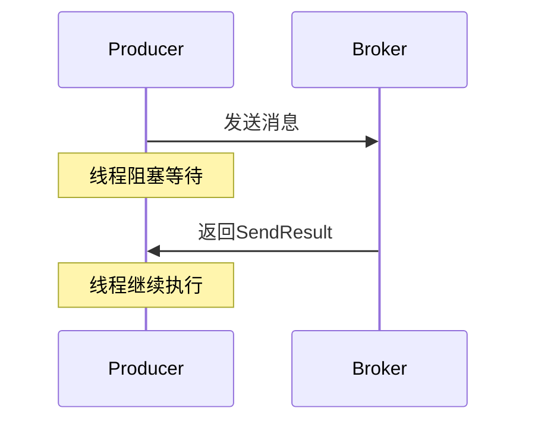
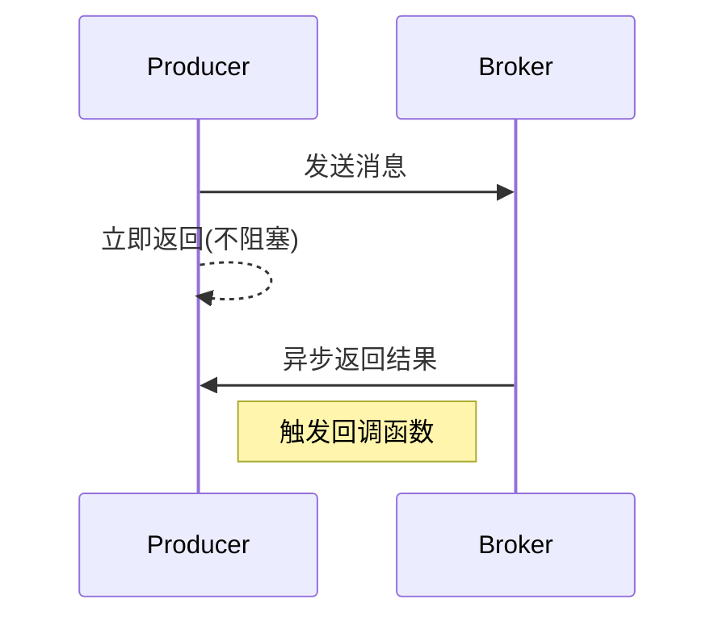
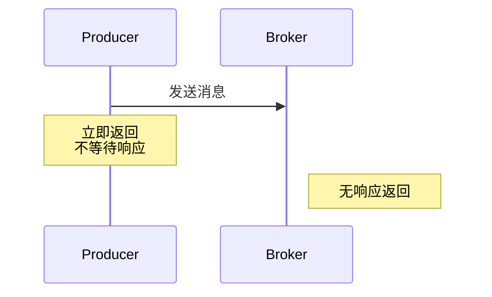
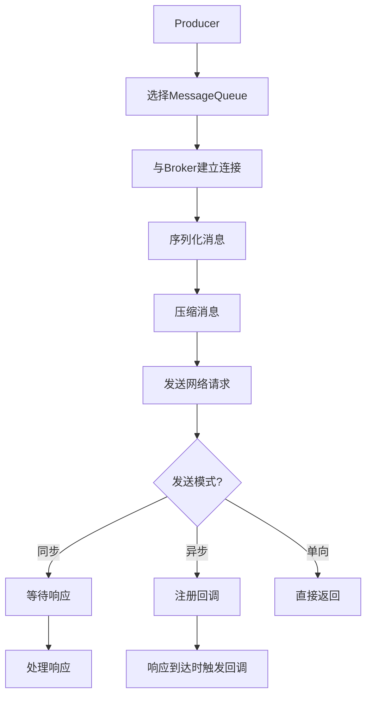
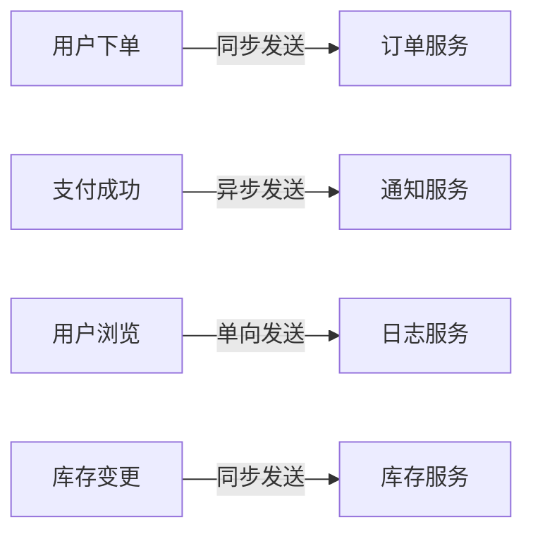
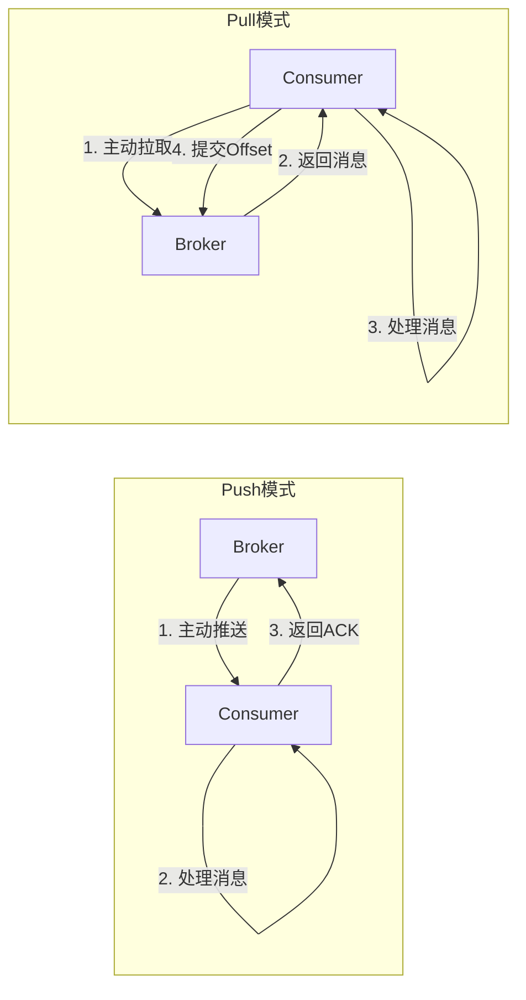
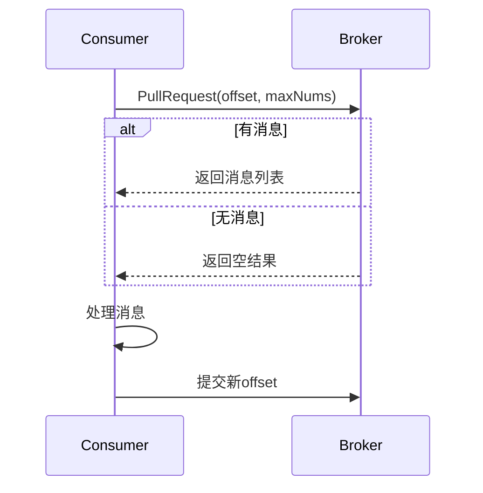
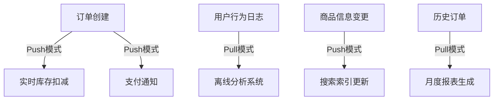
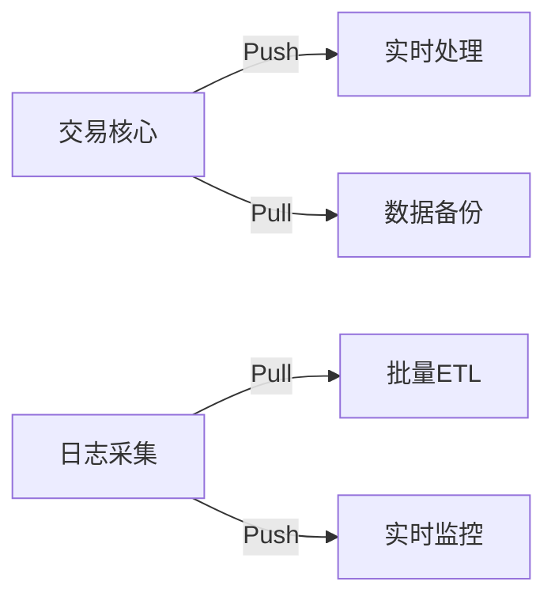

# 给我讲解rocketmq中消费者，消费者组，broker,topic,等概念

在 RocketMQ 中，消费者、消费者组、Broker、Topic 等是核心概念，理解它们的关系对掌握消息队列的工作机制至关重要。以下是详细解释：

---

### 1. **Topic（主题）**
- **定义**  
  Topic 是消息的逻辑分类，生产者将消息发送到指定 Topic，消费者订阅 Topic 来消费消息。例如，订单系统可能有一个 `OrderTopic`，支付系统有一个 `PaymentTopic`。
- **特点**  
  - **消息分类**：通过 Topic 实现不同业务逻辑的消息隔离。
  - **分区存储**：一个 Topic 的消息会分散存储在多个 `MessageQueue`（消息队列）中，每个队列是物理上的最小存储单元。
  - **多消费者订阅**：允许多个消费者组订阅同一个 Topic，实现消息的广播或集群消费。

---

### 2. **Broker**
- **定义**  
  Broker 是 RocketMQ 的服务端节点，负责消息的存储、投递和查询。它是生产者和消费者之间的中间人。
- **核心功能**  
  - **存储消息**：将 Topic 的消息持久化到磁盘（CommitLog）。
  - **处理请求**：接收生产者的消息写入请求，以及消费者的消息拉取请求。
  - **高可用**：通过主从架构（Master-Slave）实现数据冗余，主节点负责读写，从节点负责备份。
- **集群模式**  
  多个 Broker 组成集群，支持横向扩展。例如，一个 Topic 可以分布在多个 Broker 上，提高吞吐量和容灾能力。

---

### 3. **消费者（Consumer）**
- **定义**  
  消费者是订阅 Topic 并消费消息的客户端程序。例如，一个订单处理服务可能作为消费者订阅 `OrderTopic`。
- **消费模式**  
  - **集群模式（Clustering）**  
    同一消费者组内的多个消费者分摊消费 Topic 的消息（每条消息只被组内一个消费者处理）。
  - **广播模式（Broadcasting）**  
    同一消费者组内的所有消费者都会收到 Topic 的全部消息（每条消息被组内所有消费者处理）。
- **消费方式**  
  - **Push 模式**：Broker 主动推送消息给消费者（实际是长轮询模拟的 Push）。
  - **Pull 模式**：消费者主动从 Broker 拉取消息。

---

### 4. **消费者组（Consumer Group）**
- **定义**  
  消费者组是一组具有相同 Group ID 的消费者实例，共同协作消费 Topic 的消息。
- **核心作用**  
  - **负载均衡**：组内消费者分摊消息，提高消费能力。
  - **容错性**：若某个消费者宕机，组内其他消费者会接管其负责的队列。
- **重要机制**  
  - **重平衡（Rebalance）**  
    当消费者数量变化（如新增或宕机），系统会重新分配队列与消费者的绑定关系，确保负载均衡。
  - **消费位点（Offset）**  
    消费者组会记录每个队列的消费进度（Offset），支持断点续传。

---

### 5. **关键概念的关系**
1. **生产者 → Topic → Broker**  
   生产者将消息发送到某个 Topic，Broker 负责将这些消息存储到对应的 MessageQueue 中。
2. **消费者组 ← Topic**  
   消费者组订阅 Topic，组内消费者按负载均衡策略消费 Topic 的消息。
3. **Broker 集群 → 高可用**  
   多个 Broker 组成集群，Topic 的队列分布在多个 Broker 上，避免单点故障。

---

### **示例场景**
假设一个电商系统：
- **Topic**：`OrderTopic`（订单消息）。
- **Broker 集群**：3 个 Broker 节点，存储 `OrderTopic` 的 8 个 MessageQueue。
- **消费者组**：`OrderConsumerGroup`，包含 4 个消费者实例。
  - **集群模式**：每个消费者负责 2 个队列，分摊处理订单消息。
  - **重平衡**：若一个消费者宕机，剩余 3 个消费者会重新分配队列（如 3-3-2）。

---

### **总结**
- **Topic**：消息的分类标签，支持业务隔离。
- **Broker**：消息存储和传输的核心节点，保障高可用。
- **消费者组**：多个消费者协作消费，实现负载均衡与容错。
- **消费者**：实际处理消息的客户端，支持集群/广播模式。

理解这些概念后，可以更好地设计消息生产、消费逻辑，并根据业务需求调整队列数量、消费者组规模等参数。

## Nameserver是什么

在 RocketMQ 中，**NameServer** 是一个轻量级的核心组件，负责管理集群的元数据（如路由信息），它是 RocketMQ 实现**服务发现**和**路由机制**的关键。以下是它的核心作用和工作原理：

---

### **NameServer 的核心功能**
1. **路由管理**  
   NameServer 维护集群中所有 Broker 的地址和 Topic 的路由信息（例如 Topic 分布在哪些 Broker 上，每个 Broker 包含哪些 MessageQueue）。
   - 生产者发送消息时，需要先通过 NameServer 查询 Topic 对应的 Broker 地址。
   - 消费者订阅消息时，也需要通过 NameServer 获取 Topic 所在的 Broker 地址。

2. **服务发现**  
   Broker 启动时会向所有 NameServer 注册自己的信息（如 IP、端口、Topic 配置等），并定时发送心跳包保持连接。  
   - 如果某个 Broker 宕机，NameServer 会检测到心跳超时（默认 30 秒），将其从路由表中移除。

3. **无状态设计**  
   NameServer 本身不存储数据（所有路由信息基于 Broker 上报），也不参与消息的存储或传输，因此**轻量且高可用**。

---

### **NameServer 的工作流程**
1. **Broker 注册**  
   - Broker 启动时，向所有 NameServer 发送注册请求，上报自己的 Topic 和队列信息。
   - Broker 每隔 30 秒向 NameServer 发送心跳，证明自己存活。

2. **客户端（生产者/消费者）查询路由**  
   - 生产者和消费者启动时，会从 NameServer 拉取最新的路由表（缓存在本地）。
   - 客户端定时（默认 30 秒）从 NameServer 更新路由表，确保能感知 Broker 变化。

3. **故障处理**  
   - 如果 Broker 宕机，NameServer 检测到心跳超时后，会通知客户端更新路由表。
   - 客户端会自动切换到其他存活的 Broker 节点。

---

### **NameServer 的特点**
1. **去中心化**  
   NameServer 之间彼此独立，不互相通信（无主从关系），Broker 会向所有 NameServer 注册信息。  
   - 这种设计简化了架构，避免单点故障。例如，即使部分 NameServer 宕机，只要有一个存活，集群仍可工作。

2. **低耦合**  
   NameServer 只负责路由管理，不参与业务逻辑（如消息存储、事务处理），因此性能开销极小。

3. **高可用**  
   通常部署多个 NameServer 节点（例如 2-3 个），即使部分节点宕机，客户端仍能通过其他节点获取路由信息。

---

### **NameServer vs. ZooKeeper**
- **RocketMQ 选择 NameServer 的原因**  
  ZooKeeper 是强一致性的分布式协调服务，但 RocketMQ 的设计目标是**低延迟、高吞吐**，因此采用轻量级的 NameServer：  
  - NameServer 基于最终一致性（数据可能存在短暂延迟），但满足消息队列场景的需求。
  - 去除了 ZooKeeper 的复杂性，减少运维成本。

---

### **NameServer 的配置**
- 部署时，通常启动 2-3 个 NameServer 实例（通过不同端口或不同机器）。
- 生产者和消费者需配置所有 NameServer 地址（逗号分隔），例如：  
  ```properties
  namesrvAddr=192.168.1.101:9876;192.168.1.102:9876
  ```

---

### **总结**
- **NameServer** 是 RocketMQ 的“电话簿”，负责维护 Broker 的路由信息。
- 它是无状态、轻量级的组件，通过简单的心跳机制实现高可用。
- 生产者和消费者通过 NameServer 动态发现 Broker，实现消息的发送和订阅。

理解 NameServer 是掌握 RocketMQ 集群部署和故障排查的基础！

# Rocketmq集群模式

## 启动rocketmq二主二从集群模式

### broker配置信息

# RocketMQ Broker 配置文件属性详解

RocketMQ Broker 的配置文件是集群部署的核心，理解每个属性的含义对于优化性能和确保稳定性至关重要。以下是主要配置项的详细解释：

---

## 一、基础配置（必须配置）

### 1. 集群与节点标识
```properties
# 集群名称（同一集群所有Broker必须相同）
brokerClusterName=DefaultCluster

# Broker名称（同一主从组必须相同）
brokerName=broker-a

# Broker ID（0=Master，>0=Slave）
brokerId=0
```

### 2. 网络配置
```properties
# NameServer 地址列表（逗号分隔）
namesrvAddr=192.168.1.101:9876;192.168.1.102:9876

# Broker监听端口（客户端连接端口）
listenPort=10911

# HA监听端口（主从同步端口）
haListenPort=10912

# Broker对外IP（跨网络部署时必须设置）
brokerIP1=public_ip
brokerIP2=private_ip
```

---

## 二、存储配置（核心优化区）

### 1. 存储路径
```properties
# 消息存储根目录
storePathRootDir=/data/rocketmq/store

# CommitLog存储路径
storePathCommitLog=/data/rocketmq/store/commitlog

# 消费队列存储路径
storePathConsumeQueue=/data/rocketmq/store/consumequeue

# 消息索引存储路径
storePathIndex=/data/rocketmq/store/index
```

### 2. 存储策略
```properties
# 单个CommitLog文件大小（默认1GB）
mapedFileSizeCommitLog=1073741824

# 单个ConsumeQueue文件大小（默认6MB）
mapedFileSizeConsumeQueue=6000000

# 消息保留时间（小时）
fileReservedTime=72

# 删除时间点（凌晨04点执行删除）
deleteWhen=04

# 磁盘空间警戒水位（默认85%）
diskMaxUsedSpaceRatio=85
```

---

## 三、高可用配置（主从复制）

```properties
# Broker角色（SYNC_MASTER/ASYNC_MASTER/SLAVE）
brokerRole=SYNC_MASTER

# 刷盘策略（SYNC_FLUSH/ASYNC_FLUSH）
flushDiskType=ASYNC_FLUSH

# HA主节点地址（Slave必须配置）
haMasterAddress=192.168.1.101:10912

# 从节点最大落后时间（毫秒，默认5秒）
maxHaSlaveFallBehind=5000
```

---

## 四、性能优化配置

### 1. 内存管理
```properties
# 发送消息线程池队列大小
sendMessageThreadPoolQueueCapacity=10000

# 拉取消息线程池队列大小
pullMessageThreadPoolQueueCapacity=100000

# PageCache锁定内存（提高IO性能）
transientStorePoolEnable=true
transientStorePoolSize=5
```

### 2. 消息处理
```properties
# 最大消息大小（字节）
maxMessageSize=4194304  # 4MB

# 异步发送缓冲区大小（页）
sendThreadPoolQueueCapacity=50000

# 是否启用快速失败（内存满时拒绝写入）
rejectTransactionMessage=false
```

---

## 五、高级特性配置

### 1. 事务消息
```properties
# 事务消息检查线程数
transactionCheckMax=15

# 事务超时时间（毫秒）
transactionTimeout=6000

# 事务检查间隔（毫秒）
transactionCheckInterval=60000
```

### 2. 消息过滤
```properties
# 是否支持SQL92过滤
enablePropertyFilter=true

# 过滤数据最大大小（字节）
maxFilterMessageSize=65536
```

### 3. 延迟消息
```properties
# 延迟消息级别（18个固定级别）
messageDelayLevel=1s 5s 10s 30s 1m 2m 3m 4m 5m 6m 7m 8m 9m 10m 20m 30m 1h 2h
```

---

## 六、监控与诊断配置

```properties
# 是否开启监控统计
enableStatInBroker=true

# 是否打印JVM信息
printJVM=true

# 是否开启消息轨迹
traceTopicEnable=true
```

---

## 七、完整配置示例

```properties
# 基础配置
brokerClusterName=ProductionCluster
brokerName=broker-group1
brokerId=0
namesrvAddr=192.168.1.101:9876;192.168.1.102:9876
listenPort=10911

# 存储配置
storePathRootDir=/data/rocketmq/store
mapedFileSizeCommitLog=1073741824
fileReservedTime=72
deleteWhen=04
diskMaxUsedSpaceRatio=85

# 高可用配置
brokerRole=SYNC_MASTER
flushDiskType=ASYNC_FLUSH

# 性能优化
sendMessageThreadPoolQueueCapacity=20000
pullMessageThreadPoolQueueCapacity=150000
transientStorePoolEnable=true

# 高级特性
messageDelayLevel=1s 5s 10s 30s 1m 2m 3m 4m 5m 6m 7m 8m 9m 10m 20m 30m 1h 2h
enablePropertyFilter=true

# 监控配置
enableStatInBroker=true
traceTopicEnable=true
```

---

## 关键配置最佳实践

1. **存储路径分离**：将CommitLog和ConsumeQueue放在不同磁盘
   ```properties
   storePathCommitLog=/disk1/commitlog
   storePathConsumeQueue=/disk2/consumequeue
   ```

2. **主从同步优化**：
   ```properties
   # 同步复制 + 异步刷盘（最佳平衡）
   brokerRole=SYNC_MASTER
   flushDiskType=ASYNC_FLUSH
   ```

3. **内存锁定**（Linux系统）：
   ```properties
   # 在/etc/security/limits.conf添加：
   * soft memlock unlimited
   * hard memlock unlimited
   ```

4. **JVM调优**（bin/runbroker.sh）：
   ```bash
   JAVA_OPT="${JAVA_OPT} -server -Xms8g -Xmx8g -Xmn4g"
   JAVA_OPT="${JAVA_OPT} -XX:+UseG1GC -XX:G1HeapRegionSize=16m"
   ```

5. **网络优化**（Linux内核）：
   ```bash
   # 增加TCP缓冲区
   sysctl -w net.core.rmem_max=16777216
   sysctl -w net.core.wmem_max=16777216
   ```

---

## 配置验证方法

1. 检查配置生效：
   ```bash
   sh mqadmin getBrokerConfig -b 192.168.1.101:10911
   ```

2. 监控关键指标：
   ```bash
   # 查看存储状态
   sh mqadmin statsAll -t 5
   
   # 检查主从同步
   sh mqadmin brokerStatus -b 192.168.1.101:10911
   ```

3. 日志分析：
   ```bash
   tail -f ~/logs/rocketmqlogs/broker.log | grep -E 'disk|HA'
   ```

通过合理配置这些参数，可以显著提升 RocketMQ 的性能和可靠性，满足不同业务场景的需求。生产环境建议根据实际负载进行压测调优。

# 使用docker启动rocketmq可视化工具

```
docker pull styletang/rocketmq-console-ng

docker run -e "JAVA_OPTS=-Drocketmq.namesrv.addr=127.0.0.1:9876 -Dcom.rocketmq.sendMessageWithVIPChannel=false" -p 8080:8080 -t styletang/rocketmq-console-ng
```

# Java操作RocketMQ全面指南

RocketMQ提供了完整的Java客户端API，用于生产者和消费者的开发。下面我将详细介绍如何使用Java操作RocketMQ，包括核心API、最佳实践和完整示例代码。

## 一、环境准备

### 1. 添加Maven依赖
```xml
<dependency>
    <groupId>org.apache.rocketmq</groupId>
    <artifactId>rocketmq-client</artifactId>
    <version>5.0.0</version>
</dependency>
```

### 2. 基本配置
```java
// 公共配置
private static final String NAME_SERVER_ADDR = "192.168.1.101:9876;192.168.1.102:9876";
private static final String TOPIC = "ORDER_TOPIC";
private static final String PRODUCER_GROUP = "ORDER_PRODUCER_GROUP";
private static final String CONSUMER_GROUP = "ORDER_CONSUMER_GROUP";
```

## 二、生产者操作

### 1. 同步发送（可靠但延迟较高）
```java
public class SyncProducer {
    public static void main(String[] args) throws Exception {
        DefaultMQProducer producer = new DefaultMQProducer(PRODUCER_GROUP);
        producer.setNamesrvAddr(NAME_SERVER_ADDR);
        producer.start();
        
        for (int i = 0; i < 10; i++) {
            Message msg = new Message(TOPIC, 
                "TAG_A", 
                ("Order-" + i).getBytes(StandardCharsets.UTF_8));
            
            SendResult result = producer.send(msg);
            System.out.printf("Sent msg ID: %s, queue: %d%n", 
                result.getMsgId(), 
                result.getMessageQueue().getQueueId());
        }
        
        producer.shutdown();
    }
}
```

### 2. 异步发送（高性能）
```java
public class AsyncProducer {
    public static void main(String[] args) throws Exception {
        DefaultMQProducer producer = new DefaultMQProducer(PRODUCER_GROUP);
        producer.setNamesrvAddr(NAME_SERVER_ADDR);
        producer.setRetryTimesWhenSendAsyncFailed(3);
        producer.start();
        
        for (int i = 0; i < 10; i++) {
            Message msg = new Message(TOPIC, 
                "TAG_B", 
                ("Order-Async-" + i).getBytes(StandardCharsets.UTF_8));
            
            producer.send(msg, new SendCallback() {
                @Override
                public void onSuccess(SendResult sendResult) {
                    System.out.println("Async send success: " + sendResult.getMsgId());
                }
                
                @Override
                public void onException(Throwable e) {
                    System.err.println("Async send failed: " + e.getMessage());
                }
            });
        }
        
        // 等待异步发送完成
        Thread.sleep(5000);
        producer.shutdown();
    }
}
```

### 3. 单向发送（只发送不关心结果）
```java
public class OnewayProducer {
    public static void main(String[] args) throws Exception {
        DefaultMQProducer producer = new DefaultMQProducer(PRODUCER_GROUP);
        producer.setNamesrvAddr(NAME_SERVER_ADDR);
        producer.start();
        
        for (int i = 0; i < 10; i++) {
            Message msg = new Message(TOPIC, 
                "TAG_C", 
                ("Order-Oneway-" + i).getBytes(StandardCharsets.UTF_8));
            
            producer.sendOneway(msg);
        }
        
        producer.shutdown();
    }
}
```

## 三、消费者操作

### 1. Push模式消费者（推荐）
```java
public class PushConsumer {
    public static void main(String[] args) throws Exception {
        DefaultMQPushConsumer consumer = new DefaultMQPushConsumer(CONSUMER_GROUP);
        consumer.setNamesrvAddr(NAME_SERVER_ADDR);
        
        // 订阅主题和标签（*表示所有标签）
        consumer.subscribe(TOPIC, "TAG_A || TAG_B");
        
        // 注册消息监听器
        consumer.registerMessageListener(new MessageListenerConcurrently() {
            @Override
            public ConsumeConcurrentlyStatus consumeMessage(
                List<MessageExt> messages, 
                ConsumeConcurrentlyContext context) {
                
                for (MessageExt message : messages) {
                    String body = new String(message.getBody(), StandardCharsets.UTF_8);
                    System.out.printf("Received [%s] from queue %d, offset %d%n",
                        body,
                        message.getQueueId(),
                        message.getQueueOffset());
                }
                return ConsumeConcurrentlyStatus.CONSUME_SUCCESS;
            }
        });
        
        consumer.start();
        System.out.println("Consumer started. Waiting for messages...");
    }
}
```

### 2. Pull模式消费者（更灵活控制）
```java
public class PullConsumer {
    public static void main(String[] args) throws Exception {
        DefaultLitePullConsumer consumer = new DefaultLitePullConsumer(CONSUMER_GROUP);
        consumer.setNamesrvAddr(NAME_SERVER_ADDR);
        consumer.setAutoCommit(false);
        consumer.subscribe(TOPIC, "*");
        consumer.start();
        
        while (true) {
            List<MessageExt> messages = consumer.poll(Duration.ofSeconds(10));
            if (!messages.isEmpty()) {
                for (MessageExt message : messages) {
                    String body = new String(message.getBody(), StandardCharsets.UTF_8);
                    System.out.println("Pulled: " + body);
                }
                consumer.commitSync();
            }
        }
    }
}
```

## 四、高级特性实现

### 1. 顺序消息
```java
// 生产者
public class OrderedProducer {
    public static void main(String[] args) throws Exception {
        DefaultMQProducer producer = new DefaultMQProducer(PRODUCER_GROUP);
        producer.setNamesrvAddr(NAME_SERVER_ADDR);
        producer.start();
        
        // 订单ID相同的消息发送到同一个队列
        String[] orderIds = {"Order-001", "Order-002", "Order-001", "Order-003"};
        
        for (String orderId : orderIds) {
            Message msg = new Message(TOPIC, 
                "TAG_ORDER", 
                orderId.getBytes(StandardCharsets.UTF_8));
            
            // 使用订单ID作为shardingKey
            SendResult result = producer.send(msg, 
                new MessageQueueSelector() {
                    @Override
                    public MessageQueue select(List<MessageQueue> mqs, Message msg, Object arg) {
                        String key = (String) arg;
                        int index = Math.abs(key.hashCode()) % mqs.size();
                        return mqs.get(index);
                    }
                }, 
                orderId);
            
            System.out.println("Ordered msg sent: " + orderId);
        }
        
        producer.shutdown();
    }
}

// 消费者
public class OrderedConsumer {
    public static void main(String[] args) throws Exception {
        DefaultMQPushConsumer consumer = new DefaultMQPushConsumer(CONSUMER_GROUP);
        consumer.setNamesrvAddr(NAME_SERVER_ADDR);
        consumer.subscribe(TOPIC, "TAG_ORDER");
        
        consumer.registerMessageListener(new MessageListenerOrderly() {
            @Override
            public ConsumeOrderlyStatus consumeMessage(
                List<MessageExt> messages, 
                ConsumeOrderlyContext context) {
                
                context.setAutoCommit(true);
                for (MessageExt message : messages) {
                    System.out.println("Ordered msg: " + 
                        new String(message.getBody(), StandardCharsets.UTF_8));
                }
                return ConsumeOrderlyStatus.SUCCESS;
            }
        });
        
        consumer.start();
    }
}
```

### 2. 事务消息
```java
public class TransactionProducer {
    public static void main(String[] args) throws Exception {
        TransactionMQProducer producer = new TransactionMQProducer(PRODUCER_GROUP);
        producer.setNamesrvAddr(NAME_SERVER_ADDR);
        producer.setTransactionListener(new TransactionListener() {
            @Override
            public LocalTransactionState executeLocalTransaction(Message msg, Object arg) {
                try {
                    // 执行本地事务
                    System.out.println("Executing local transaction for: " + 
                        new String(msg.getBody()));
                    // 模拟业务处理
                    Thread.sleep(1000);
                    return LocalTransactionState.COMMIT_MESSAGE;
                } catch (Exception e) {
                    return LocalTransactionState.ROLLBACK_MESSAGE;
                }
            }
            
            @Override
            public LocalTransactionState checkLocalTransaction(MessageExt msg) {
                // 检查本地事务状态
                return LocalTransactionState.COMMIT_MESSAGE;
            }
        });
        
        producer.start();
        
        Message msg = new Message(TOPIC, "TAG_TX", "Transaction Message".getBytes());
        SendResult result = producer.sendMessageInTransaction(msg, null);
        System.out.println("Transaction sent: " + result.getSendStatus());
        
        Thread.sleep(5000);
        producer.shutdown();
    }
}
```

### 3. 延迟消息
```java
public class DelayedProducer {
    public static void main(String[] args) throws Exception {
        DefaultMQProducer producer = new DefaultMQProducer(PRODUCER_GROUP);
        producer.setNamesrvAddr(NAME_SERVER_ADDR);
        producer.start();
        
        Message msg = new Message(TOPIC, "TAG_DELAY", "Delayed Message".getBytes());
        
        // 设置延迟级别（1-18对应不同延迟时间）
        msg.setDelayTimeLevel(3); // 10秒延迟
        
        SendResult result = producer.send(msg);
        System.out.println("Delayed msg sent: " + result.getMsgId());
        
        producer.shutdown();
    }
}
```

## 五、最佳实践

### 1. 生产者配置优化
```java
DefaultMQProducer producer = new DefaultMQProducer(PRODUCER_GROUP);
producer.setNamesrvAddr(NAME_SERVER_ADDR);
producer.setSendMsgTimeout(5000); // 发送超时时间
producer.setRetryTimesWhenSendFailed(3); // 失败重试次数
producer.setCompressMsgBodyOverHowmuch(4096); // 消息压缩阈值
producer.setMaxMessageSize(1024 * 1024 * 4); // 最大消息大小4MB
producer.start();
```

### 2. 消费者配置优化
```java
DefaultMQPushConsumer consumer = new DefaultMQPushConsumer(CONSUMER_GROUP);
consumer.setNamesrvAddr(NAME_SERVER_ADDR);
consumer.setConsumeThreadMin(5); // 最小消费线程数
consumer.setConsumeThreadMax(20); // 最大消费线程数
consumer.setConsumeMessageBatchMaxSize(10); // 批量消费数量
consumer.setPullBatchSize(32); // 每次拉取消息数量
consumer.setMessageModel(MessageModel.CLUSTERING); // 集群模式
consumer.subscribe(TOPIC, "*");
```

### 3. 消息过滤
```sql
// 生产者设置消息属性
msg.putUserProperty("amount", "100");
msg.putUserProperty("region", "east");

// 消费者使用SQL过滤
consumer.subscribe(TOPIC, 
    MessageSelector.bySql("amount > 50 AND region = 'east'"));
```

### 4. 消息轨迹
```java
// 启用消息轨迹（需要Broker开启traceTopicEnable=true）
DefaultMQProducer producer = new DefaultMQProducer(PRODUCER_GROUP);
producer.setUseTLS(false);
producer.setVipChannelEnabled(false);
producer.setEnableMsgTrace(true);
producer.setCustomizedTraceTopic("RMQ_SYS_TRACE_TOPIC");
```

## 六、异常处理

### 1. 常见异常处理
```java
try {
    SendResult result = producer.send(msg);
} catch (MQClientException e) {
    // 客户端异常（配置错误等）
    System.err.println("Client error: " + e.getErrorMessage());
} catch (RemotingException e) {
    // 网络异常
    System.err.println("Network error: " + e.getMessage());
} catch (MQBrokerException e) {
    // Broker异常
    System.err.println("Broker error: " + e.getErrorMessage());
} catch (InterruptedException e) {
    // 线程中断
    Thread.currentThread().interrupt();
}
```

### 2. 消费失败重试
```java
consumer.registerMessageListener(new MessageListenerConcurrently() {
    @Override
    public ConsumeConcurrentlyStatus consumeMessage(
        List<MessageExt> messages, 
        ConsumeConcurrentlyContext context) {
        
        try {
            // 业务处理
            return ConsumeConcurrentlyStatus.CONSUME_SUCCESS;
        } catch (Exception e) {
            // 消费失败，稍后重试
            return ConsumeConcurrentlyStatus.RECONSUME_LATER;
        }
    }
});
```

## 七、完整示例：订单系统

### 生产者端
```java
public class OrderProducer {
    private static final Random RANDOM = new Random();
    
    public static void main(String[] args) throws Exception {
        DefaultMQProducer producer = new DefaultMQProducer("ORDER_PRODUCER_GROUP");
        producer.setNamesrvAddr("192.168.1.101:9876");
        producer.setRetryTimesWhenSendFailed(3);
        producer.start();
        
        // 模拟生成订单
        for (int i = 1; i <= 100; i++) {
            Order order = generateOrder(i);
            String json = new Gson().toJson(order);
            
            Message msg = new Message("ORDER_TOPIC", 
                "CREATE_ORDER", 
                json.getBytes(StandardCharsets.UTF_8));
            
            // 设置订单ID为shardingKey保证顺序
            SendResult result = producer.send(msg, 
                (mqs, msg, arg) -> {
                    String orderId = (String) arg;
                    int index = Math.abs(orderId.hashCode()) % mqs.size();
                    return mqs.get(index);
                }, 
                order.getOrderId());
            
            System.out.println("Order sent: " + order.getOrderId());
        }
        
        producer.shutdown();
    }
    
    private static Order generateOrder(int seq) {
        String orderId = "ORD-" + System.currentTimeMillis() + "-" + seq;
        double amount = 100 + RANDOM.nextInt(900);
        return new Order(orderId, "USER-" + seq, amount);
    }
    
    static class Order {
        private String orderId;
        private String userId;
        private double amount;
        
        // 构造方法、getters/setters
    }
}
```

### 消费者端
```java
public class OrderConsumer {
    public static void main(String[] args) throws Exception {
        DefaultMQPushConsumer consumer = new DefaultMQPushConsumer("ORDER_CONSUMER_GROUP");
        consumer.setNamesrvAddr("192.168.1.101:9876");
        consumer.subscribe("ORDER_TOPIC", "CREATE_ORDER || CANCEL_ORDER");
        consumer.setConsumeThreadMin(5);
        consumer.setConsumeThreadMax(10);
        
        consumer.registerMessageListener(new MessageListenerOrderly() {
            @Override
            public ConsumeOrderlyStatus consumeMessage(
                List<MessageExt> messages, 
                ConsumeOrderlyContext context) {
                
                for (MessageExt message : messages) {
                    try {
                        String body = new String(message.getBody(), StandardCharsets.UTF_8);
                        Order order = new Gson().fromJson(body, Order.class);
                        
                        if ("CREATE_ORDER".equals(message.getTags())) {
                            System.out.println("Processing new order: " + order.getOrderId());
                            // 处理订单创建逻辑
                        } else if ("CANCEL_ORDER".equals(message.getTags())) {
                            System.out.println("Canceling order: " + order.getOrderId());
                            // 处理订单取消逻辑
                        }
                    } catch (Exception e) {
                        // 记录日志，返回稍后重试
                        return ConsumeOrderlyStatus.SUSPEND_CURRENT_QUEUE_A_MOMENT;
                    }
                }
                return ConsumeOrderlyStatus.SUCCESS;
            }
        });
        
        consumer.start();
        System.out.println("Order consumer started");
    }
}
```

## 八、管理工具集成

### 1. 查询消息
```java
DefaultMQAdminExt admin = new DefaultMQAdminExt();
admin.setNamesrvAddr(NAME_SERVER_ADDR);
admin.start();

// 根据消息ID查询
MessageExt msg = admin.viewMessage("0A0B0C0D01002A9F0000000000002D71");
System.out.println("Message content: " + new String(msg.getBody()));

// 根据key查询
QueryResult result = admin.queryMessage(TOPIC, "ORDER-1001", 10, 0, System.currentTimeMillis());
for (MessageExt message : result.getMessageList()) {
    System.out.println("Found message: " + message.getMsgId());
}

admin.shutdown();
```

### 2. 创建Topic
```java
admin.createTopic(NAME_SERVER_ADDR, "NEW_TOPIC", "NEW_TOPIC", 8);
```

## 九、注意事项

1. **资源释放**：生产者和消费者使用后必须调用`shutdown()`方法释放资源
2. **线程安全**：Producer和Consumer实例是线程安全的，可复用
3. **消费幂等性**：确保消费逻辑支持重复消费（使用唯一ID判断）
4. **消息堆积监控**：定期检查消费进度，避免消息积压
5. **NameServer高可用**：配置多个NameServer地址提高可用性
6. **日志配置**：设置合理的日志级别（`rocketmq.client.logLevel=WARN`）

通过以上详细指南，您可以全面掌握Java操作RocketMQ的各项技术点，构建高性能、可靠的消息系统。

# RocketMQ 消息发送模式详解：同步、异步、单向

RocketMQ 提供了三种消息发送模式，适用于不同的业务场景。下面我将详细解释这三种模式的特性、使用场景和实现原理。

## 一、三种发送模式对比概览

| **特性**     | **同步发送**   | **异步发送**          | **单向发送**          |
| ------------ | -------------- | --------------------- | --------------------- |
| **可靠性**   | 高（确认送达） | 高（回调确认）        | 低（不确认）          |
| **吞吐量**   | 中等           | 高                    | 极高                  |
| **延迟**     | 高（等待响应） | 低（立即返回）        | 最低                  |
| **资源占用** | 线程阻塞       | 回调线程              | 几乎无额外开销        |
| **失败处理** | 立即返回异常   | 通过回调处理          | 无反馈                |
| **适用场景** | 重要业务数据   | 高吞吐量业务          | 日志/监控等可丢失数据 |
| **API示例**  | `send()`       | `send(msg, callback)` | `sendOneway()`        |

## 二、同步发送 (Synchronous Send)

### 1. 核心特性
- **阻塞调用**：发送线程会阻塞等待Broker响应
- **强可靠性**：明确知道消息是否发送成功
- **顺序响应**：按发送顺序获得响应结果

### 2. 工作流程


### 3. 代码示例
```java
DefaultMQProducer producer = new DefaultMQProducer("SYNC_GROUP");
producer.setNamesrvAddr("127.0.0.1:9876");
producer.start();

try {
    Message msg = new Message("ORDER_TOPIC", "CREATE_ORDER", orderJson.getBytes());
    // 同步发送调用
    SendResult result = producer.send(msg);
    System.out.println("MsgID: " + result.getMsgId() + ", Queue: " + result.getMessageQueue());
} catch (Exception e) {
    // 处理发送失败
    e.printStackTrace();
} finally {
    producer.shutdown();
}
```

### 4. 适用场景
- 订单创建、支付通知等关键业务
- 需要确保消息必达的场景
- 对吞吐量要求不高的业务

### 5. 最佳实践
```java
// 配置优化
producer.setRetryTimesWhenSendFailed(3); // 失败重试次数
producer.setSendMsgTimeout(5000); // 超时时间5秒

// 异常处理
try {
    SendResult result = producer.send(msg);
} catch (MQClientException e) {
    // 客户端配置错误
} catch (RemotingException e) {
    // 网络通信异常
} catch (MQBrokerException e) {
    // Broker处理异常
    System.err.println("Broker错误码: " + e.getResponseCode());
} catch (InterruptedException e) {
    // 线程中断
    Thread.currentThread().interrupt();
}
```

## 三、异步发送 (Asynchronous Send)

### 1. 核心特性
- **非阻塞调用**：发送后立即返回
- **回调通知**：通过回调接口获取发送结果
- **高吞吐量**：可并行处理大量发送请求

### 2. 工作流程


### 3. 代码示例
```java
DefaultMQProducer producer = new DefaultMQProducer("ASYNC_GROUP");
producer.setNamesrvAddr("127.0.0.1:9876");
producer.start();

// 设置异步发送失败重试次数
producer.setRetryTimesWhenSendAsyncFailed(2);

Message msg = new Message("LOG_TOPIC", "USER_LOG", logData.getBytes());

// 异步发送（带回调）
producer.send(msg, new SendCallback() {
    @Override
    public void onSuccess(SendResult sendResult) {
        System.out.println("发送成功: " + sendResult.getMsgId());
        // 成功处理逻辑
    }
    
    @Override
    public void onException(Throwable e) {
        System.err.println("发送失败: " + e.getMessage());
        // 失败处理逻辑
        if (e instanceof MQBrokerException) {
            int errorCode = ((MQBrokerException) e).getResponseCode();
            // 根据错误码处理
        }
    }
});

// 注意：此处不关闭producer，等待回调完成
```

### 4. 适用场景
- 日志收集、行为跟踪等高吞吐场景
- 发送与业务处理解耦的场景
- 需要高并发但可接受短暂延迟的业务

### 5. 最佳实践
```java
// 1. 使用线程池管理回调
ExecutorService callbackExecutor = Executors.newFixedThreadPool(10);
producer.setCallbackExecutor(callbackExecutor);

// 2. 带上下文信息的回调
class CallbackContext {
    long sendTime;
    String businessId;
}

CallbackContext ctx = new CallbackContext();
ctx.sendTime = System.currentTimeMillis();
ctx.businessId = "ORDER_123";

producer.send(msg, new SendCallback() {
    @Override
    public void onSuccess(SendResult sendResult) {
        System.out.println("业务ID: " + ctx.businessId + " 耗时: " + 
            (System.currentTimeMillis() - ctx.sendTime) + "ms");
    }
    
    // ... onException
}, ctx);

// 3. 批量异步发送
List<Message> messages = prepareMessages(100);
producer.send(messages, new SendCallback() {
    @Override
    public void onSuccess(SendResult sendResult) {
        // 批量发送结果处理
    }
    // ...
});
```

## 四、单向发送 (Oneway Send)

### 1. 核心特性
- **只管发送**：不等待Broker响应
- **最高吞吐**：没有网络往返延迟
- **最低可靠性**：无法保证消息是否到达Broker

### 2. 工作流程


### 3. 代码示例
```java
DefaultMQProducer producer = new DefaultMQProducer("ONEWAY_GROUP");
producer.setNamesrvAddr("127.0.0.1:9876");
producer.start();

for (int i = 0; i < 1000; i++) {
    Message msg = new Message("METRIC_TOPIC", "CPU_USAGE", getCpuData());
    try {
        // 单向发送
        producer.sendOneway(msg);
    } catch (Exception e) {
        // 仅捕获客户端异常
        System.err.println("本地异常: " + e.getMessage());
    }
}

producer.shutdown();
```

### 4. 适用场景
- 监控指标上报
- 心跳检测
- 日志收集（可容忍少量丢失）
- 高吞吐量实时统计

### 5. 最佳实践
```java
// 1. 批量发送提高效率
List<Message> batch = new ArrayList<>(100);
for (int i = 0; i < 1000; i++) {
    batch.add(new Message(...));
    if (batch.size() >= 100) {
        producer.sendOneway(batch);
        batch.clear();
    }
}
if (!batch.isEmpty()) {
    producer.sendOneway(batch);
}

// 2. 本地异常处理
try {
    producer.sendOneway(msg);
} catch (MQClientException e) {
    // 客户端配置问题
    log.error("Client error", e);
} catch (RemotingException e) {
    // 网络问题
    log.warn("Network error, message may lost", e);
} catch (InterruptedException e) {
    Thread.currentThread().interrupt();
}

// 3. 配合本地缓存（提高可靠性）
try {
    producer.sendOneway(msg);
} catch (RemotingException e) {
    // 网络异常时存入本地队列
    localQueue.save(msg);
    startRetryThread();
}
```

## 五、高级特性与底层原理

### 1. 消息发送流程


### 2. 性能优化要点

**同步发送优化：**
```java
// 开启VIP通道（减少一次网络跳转）
producer.setVipChannelEnabled(true); 

// 压缩大消息
msg.setCompressed(true);
producer.setCompressMsgBodyOverHowmuch(1024 * 4); // 4KB以上压缩
```

**异步发送优化：**
```java
// 设置发送队列容量
producer.setAsyncSenderExecutorQueueCapacity(50000);

// 合并小消息
producer.setBatchMsgMaxBytes(1024 * 128); // 128KB
```

**单向发送优化：**
```java
// 使用Netty的epoll模式（Linux）
System.setProperty("rocketmq.remoting.native.epoll.enable", "true");

// 调整网络参数
producer.setSendLatencyFaultEnable(true); // 开启故障延迟机制
```

### 3. 消息可靠性保障

**同步发送可靠性：**

- 内置重试机制（默认重试2次）
- 同步等待Broker的ACK确认

**异步发送可靠性：**
```java
producer.send(msg, new SendCallback() {
    @Override
    public void onException(Throwable e) {
        // 1. 记录失败消息
        failedMessages.add(msg);
        
        // 2. 定时重试
        scheduler.schedule(() -> {
            producer.send(msg, this);
        }, 5, TimeUnit.SECONDS);
    }
});
```

**单向发送可靠性增强：**

```java
// 实现本地持久化
public class ReliableOnewaySender {
    private final BlockingQueue<Message> pendingQueue = new ArrayBlockingQueue<>(10000);
    private final ScheduledExecutorService retryExecutor = Executors.newScheduledThreadPool(1);
    
    public void send(Message msg) {
        try {
            producer.sendOneway(msg);
        } catch (Exception e) {
            // 失败时存入队列
            pendingQueue.offer(msg);
        }
    }
    
    @PostConstruct
    public void init() {
        retryExecutor.scheduleAtFixedRate(() -> {
            List<Message> retryBatch = new ArrayList<>(100);
            pendingQueue.drainTo(retryBatch, 100);
            for (Message msg : retryBatch) {
                try {
                    producer.sendOneway(msg);
                } catch (Exception ex) {
                    pendingQueue.offer(msg); // 重试失败重新入队
                }
            }
        }, 5, 5, TimeUnit.SECONDS); // 每5秒重试一次
    }
}
```

## 六、场景选择指南

### 1. 电商系统示例


### 2. 推荐选择
- **订单创建**：同步发送（确保订单必达）
- **支付通知**：异步发送（高并发处理）
- **用户行为日志**：单向发送（高吞吐可丢失）
- **库存扣减**：同步发送（强一致性要求）

### 3. 混合使用示例
```java
public class HybridSender {
    public void processOrder(Order order) {
        // 1. 同步发送核心订单消息
        SendResult result = syncProducer.send(createOrderMsg(order));
        
        // 2. 异步发送积分消息
        asyncProducer.send(createPointsMsg(order), new SendCallback() {
            public void onSuccess(SendResult r) {
                log.info("积分消息发送成功");
            }
        });
        
        // 3. 单向发送行为日志
        onewayProducer.sendOneway(createBehaviorLog(order));
    }
}
```

## 七、常见问题解决方案

1. **同步发送超时**
   - 增加超时时间：`producer.setSendMsgTimeout(10000)`
   - 检查Broker负载和网络延迟
   - 减少消息大小（分拆大消息）

2. **异步发送回调丢失**
   - 设置回调线程池：`producer.setCallbackExecutor(executor)`
   - 增加回调队列容量：`producer.setAsyncSenderExecutorQueueCapacity(100000)`
   - 监控回调积压情况

3. **单向发送消息丢失**
   - 实现本地持久化队列
   - 增加网络重试机制
   - 监控发送速率和失败率

4. **三种模式性能调优**
   ```java
   // 通用优化
   producer.setCompressMsgBodyOverHowmuch(4096); // 4KB以上压缩
   
   // 异步发送专用
   producer.setAsyncSenderExecutorThreadNums(16); // 增加发送线程
   
   // 单向发送专用
   System.setProperty("rocketmq.client.oneway.semaphore.value", "65535"); // 提高并发量
   ```

## 总结

RocketMQ 的三种消息发送模式各有适用场景：
- **同步发送**：适用于要求高可靠性的关键业务
- **异步发送**：平衡可靠性和吞吐量的最佳选择
- **单向发送**：适用于可容忍丢失的高吞吐场景

实际生产中，通常根据业务重要性混合使用三种模式：
- 核心业务：同步发送
- 次要业务：异步发送
- 日志监控：单向发送

通过合理配置和优化，可以充分发挥 RocketMQ 的高性能特性，构建稳定可靠的消息系统。

# 消息示例

## 顺序消息

### 局部顺序消息

这段代码展示了如何在RocketMQ中实现局部顺序消息的发送。局部顺序消息是指在同一订单ID下的消息需要按照发送顺序被消费，但不同订单ID之间的消息可以乱序处理。下面是对代码的详细讲解：

### 1. 外层循环
```java
for (int i = 0; i < 10; i++) {
    int orderId = i;
```
- 这个外层循环用于生成10个不同的订单ID（从0到9）。
- 每个订单ID代表一个独立的订单，其下的消息需要按顺序处理。

### 2. 内层循环
```java
for(int j = 0 ; j <= 5 ; j ++){
    Message msg = new Message(
        "OrderTopicTest", 
        "order_"+orderId, 
        "KEY" + orderId,
        ("order_"+orderId+" step " + j).getBytes(RemotingHelper.DEFAULT_CHARSET)
    );
```
- 内层循环为每个订单ID生成6条消息（从0到5）。
- `Message`对象包含了消息的主题（topic）、标签（tags）、键（keys）和消息体。
  - `topic`: "OrderTopicTest"，这是消息所属的主题。
  - `tags`: "order_"+orderId，标签用于区分不同的订单ID。
  - `keys`: "KEY" + orderId，键也可以用于快速查找消息。
  - 消息体是一个字符串，包含了订单ID和步骤号，表示该消息是订单ID下第几步的操作。

### 3. 发送消息并选择队列
```java
SendResult sendResult = producer.send(msg, new MessageQueueSelector() {
    @Override
    public MessageQueue select(List<MessageQueue> mqs, Message msg, Object arg) {
        Integer id = (Integer) arg;
        int index = id % mqs.size();
        return mqs.get(index);
    }
}, orderId);
```
- 使用`producer.send`方法发送消息，并传入了一个自定义的`MessageQueueSelector`。
- `MessageQueueSelector`接口用于指定消息应该发送到哪个具体的队列上。
- 在`select`方法中，通过计算`id % mqs.size()`来确定消息应该发送到哪个队列。这里的`id`就是订单ID，确保同一订单ID下的所有消息都会被发送到同一个队列，从而保证了这些消息的顺序性。
- 最后，将`orderId`作为参数传递给`send`方法，这个值会被用作`MessageQueueSelector`中的`arg`参数。

### 总结
这段代码通过使用`MessageQueueSelector`确保了同一订单ID下的所有消息都被发送到同一个队列，从而实现了局部顺序消息的功能。不同订单ID之间的消息则可以被发送到不同的队列，以提高并发处理能力。这种方式在电商、金融等场景中非常有用，能够保证特定业务逻辑的正确执行顺序。


### 消费者端是如何实现顺序消费的

消费者端实现顺序消费的关键在于确保每个队列中的消息被串行化处理，也就是说一个队列的消息只能被一个线程处理，从而保证顺序性。以下是实现顺序消费的核心思路和步骤：

---

### 1. **使用 `MessageListenerOrderly` 接口**
RocketMQ 提供了专门用于顺序消费的监听器接口：`MessageListenerOrderly`。它会确保同一个队列的消息被串行化消费。

```java
consumer.registerMessageListener(new MessageListenerOrderly() {
    @Override
    public ConsumeConcurrentlyStatus consumeMessage(List<MessageExt> msgs, ConsumeConcurrentlyContext context) {
        // 处理逻辑
        return ConsumeConcurrentlyStatus.CONSUME_SUCCESS;
    }
});
```

- `consumeMessage` 方法是顺序消费的核心方法，每次只会处理一个队列的消息。
- 每个队列的消息由单独的线程处理，不同队列之间的消费可以并行进行。

---

### 2. **串行化消费机制**
为了保证顺序性，RocketMQ 在消费端采取了以下策略：
- **锁定队列**：在消费某个队列时，会对该队列加锁，确保同一时间只有一个线程在处理这个队列的消息。
- **单线程消费**：每个队列的消息只能由一个线程串行化处理，避免并发导致的乱序问题。

---

### 3. **局部顺序性的保障**
通过生产者端将相同订单 ID 的消息发送到同一个队列（MessageQueue），消费者端为每个队列分配独立的线程进行串行化消费，从而实现了局部顺序性：
- 同一订单 ID 的消息总是进入同一个队列，因此会被顺序消费。
- 不同订单 ID 的消息可以分布在不同的队列中，并发消费，互不影响。

---

### 4. **示例代码解析**

#### 消费者的初始化
```java
DefaultMQPushConsumer consumer = new DefaultMQPushConsumer("order_consumer_group");
consumer.subscribe("OrderTopicTest", "*");
```
- 创建消费者并订阅主题 `OrderTopicTest`。

#### 注册顺序消息监听器
```java
consumer.registerMessageListener(new MessageListenerOrderly() {
    @Override
    public ConsumeConcurrentlyStatus consumeMessage(List<MessageExt> msgs, ConsumeConcurrentlyContext context) {
        for (MessageExt msg : msgs) {
            String messageBody = new String(msg.getBody(), RemotingHelper.DEFAULT_CHARSET);
            System.out.println("Consumed message: " + messageBody);
        }
        return ConsumeConcurrentlyStatus.CONSUME_SUCCESS;
    }
});
```
- 使用 `MessageListenerOrderly` 来注册监听器，确保顺序消费。
- 每次消费的消息列表 `msgs` 是从同一个队列中拉取的，因此它们的顺序得到了保证。

#### 启动消费者
```java
consumer.start();
System.out.println("Consumer started.");
```

---

### 5. **注意事项**
- **消费失败重试**：如果某条消息消费失败，RocketMQ 会暂停当前队列的消费，并等待一段时间后重新尝试消费失败的消息，直到成功为止。这可能会导致后续的消息被延迟处理。
- **性能影响**：由于需要串行化消费，顺序消息的性能通常低于普通的消息消费模式。
- **分区数量限制**：为了保证顺序性，可能需要增加队列的数量来支持更多的并发订单流。

---

### 总结
消费者端通过使用 `MessageListenerOrderly` 和串行化消费机制，确保了每个队列的消息按照顺序被处理。结合生产者端将相同业务标识（如订单 ID）的消息发送到同一个队列的策略，最终实现了局部顺序消息的完整解决方案。这种设计非常适合需要保证特定业务场景下消息顺序一致性的需求，比如订单处理、金融交易等。

### 如果使用普通的监听器为什么不能保证顺序消费

使用普通的监听器（如RocketMQ中的`MessageListenerConcurrently`）不能保证顺序消费，主要是因为普通监听器设计上支持并行处理消息，这与顺序消费的要求相冲突。以下是具体原因：

### 并发处理
- **并发消费**：当使用`MessageListenerConcurrently`时，消费者可以并行地处理多个消息。这意味着同一队列中的不同消息可能会被不同的线程同时处理。
- **多线程环境**：在多线程环境下，无法控制线程的执行顺序，因此即使消息按照一定的顺序到达消费者端，也不能确保它们会被按序处理。

### 消息重试机制
- **独立的重试队列**：如果某条消息处理失败，RocketMQ会将其放入一个专门的重试队列中，并由该队列重新投递给消费者组。这个重试队列是独立于原始消息队列的，所以它的消费进度也与原队列分离。
- **乱序风险**：由于重试队列的存在，失败的消息会在稍后的时间点被重新消费，而此时其他后续的消息可能已经被成功处理了。这就导致了最终的消息处理顺序与最初的消息到达顺序不一致，即产生了乱序现象。

### 示例场景
假设有一个消息队列，其中包含三个消息：Msg1、Msg2和Msg3。按照发送顺序，这三个消息依次到达消费者端：
- Msg1被成功处理。
- Msg2处理失败，随后被放入重试队列。
- Msg3被成功处理。
- 之后，Msg2从重试队列中取出并成功处理。

在这种情况下，实际的处理顺序变成了Msg1 -> Msg3 -> Msg2，而不是最初的Msg1 -> Msg2 -> Msg3。

### 解决方案
为了确保消息的顺序性，必须使用顺序消费模式，例如通过实现`MessageListenerOrderly`接口来注册顺序消息监听器。这种模式下，每个队列的消息只能由单一线程串行化处理，从而避免了并发带来的乱序问题。此外，生产者也需要确保相同业务逻辑相关的消息发送到同一个队列中，以便维持其顺序性。


## 广播消息

广播消息模式是一种消息传递机制，允许将消息发送给某个主题下的所有消费者实例，而不是像集群消费模式那样仅向一个消费者实例分发消息。这意味着订阅了特定主题的所有消费者都会接收到该主题下的每一条消息，确保每个消费者都能处理到这条消息。

### 广播消费的特点

1. **全量接收**：在广播模式下，每个消费者实例都会接收到生产者发送的每一条消息，适合于需要所有消费者都知晓的消息通知场景。
2. **独立消费**：各个消费者实例之间的消费进度是独立管理的，不会相互影响。这与集群消费模式不同，在集群模式下，同一组内的消费者共享消费进度。
3. **适用场景**：适用于需要对多个系统或模块进行状态同步、配置更新等场景。例如，当需要更新缓存时，可以通过广播消息让所有相关的服务实例同时更新其缓存数据。

### RocketMQ中的广播消费

RocketMQ支持广播消费模式，开发者可以通过简单的配置来切换消费模式为广播模式：

```java
consumer.setMessageModel(MessageModel.BROADCASTING);
```

这里`MessageModel.BROADCASTING`表示使用广播消费模式，而默认情况下RocketMQ采用的是集群消费模式(`MessageModel.CLUSTERING`)。

### 实现细节

- **消费确认**：由于广播模式下每个消费者都是独立消费的，因此每个消费者都需要单独确认消息的消费状态（如成功或失败），以避免重复消费或丢失消息的情况。
- **消费者负载**：考虑到所有消费者都会接收到相同的消息，对于高吞吐量的消息流来说，广播模式可能会导致较大的网络和处理负载。因此，在选择广播模式时需要评估系统的整体性能和容量。
- **消息顺序**：广播模式并不保证消息的全局顺序，因为不同的消费者可能以不同的速度处理消息。但是，单个消费者内部处理消息的顺序是可以得到保障的。

### 总结

广播消息模式提供了一种有效的方式，使得同一主题下的所有消费者实例都可以接收到相同的消息，非常适合需要进行广泛通知或状态同步的应用场景。不过，在使用广播模式时也需要注意它所带来的额外网络和计算资源消耗，并据此做好相应的规划和优化工作。

## 延迟消息

延迟消息是一种特殊的消息机制，允许生产者将消息发送到消息队列后，并不是立即被消费者消费，而是**延迟一段时间后再投递给消费者**。这种机制在很多业务场景中非常有用，例如：

- 订单超时取消（如30分钟后未支付则自动取消订单）
- 定时任务触发
- 消息重试机制中的退避策略

---

### RocketMQ 中的延迟消息

RocketMQ 本身支持延迟消息的功能，但有一定的限制和实现方式。

### ✅ **1. 延迟等级（Delay Level）**

RocketMQ 的延迟消息是通过预设的“延迟等级”来实现的。你不能自定义任意时间的延迟值，而是选择一个预先配置好的等级。

默认支持以下 18 个延迟等级（单位：分钟）：

```java
// 默认延迟等级（单位：分钟）
private String messageDelayLevel = "1s 5s 10s 30s 1m 2m 3m 4m 5m 6m 7m 8m 9m 10m 20m 30m 1h 2h";
```

你可以根据需要修改这些等级，比如添加 `1d` 表示一天后投递。

> 注意：延迟等级是在 Broker 配置文件中设置的，通常为 `broker.conf` 文件：
>
> ```properties
> messageDelayLevel=1s 5s 10s 30s 1m 2m 3m 4m 5m 6m 7m 8m 9m 10m 20m 30m 1h 2h
> ```

---

### ✅ **2. 发送延迟消息**

发送延迟消息时，只需在发送消息时设置对应的延迟等级即可：

#### 示例代码（Java）：

```java
Message msg = new Message("TestTopic", "Hello Delay Message".getBytes());

// 设置延迟等级，比如 3 表示第3级，即 10 秒后投递
msg.putUserProperty("DELAY", "3");

SendResult sendResult = producer.send(msg);
System.out.println(sendResult);
```

| 等级 | 时间 |
| ---- | ---- |
| 1    | 1s   |
| 2    | 5s   |
| 3    | 10s  |
| 4    | 30s  |
| 5    | 1m   |
| ...  | ...  |

---

### ✅ **3. 实现原理简述**

RocketMQ 内部并不是直接按时间定时投递消息，而是通过一个“定时调度”的方式来实现延迟消息：

- 所有延迟消息会被写入一个特殊的主题：`SCHEDULE_TOPIC_XXXX`
- 每个延迟等级对应一个队列（queueId）
- 后台线程会不断扫描这些队列，判断是否达到投递时间
- 达到时间后，再将消息重新写回原始主题，供消费者消费

这种方式避免了维护大量定时器带来的性能问题。

---

### ❗注意事项

1. **延迟时间不精确**  
   RocketMQ 的延迟消息是基于轮询机制实现的，因此实际延迟时间可能会稍大于设定值。

2. **无法动态设置任意延迟时间**  
   必须使用系统预设的等级，如果需要自定义时间，需修改 Broker 配置并重启。

3. **不适用于高精度定时任务场景**  
   如果你的需求是精确控制毫秒级或动态时间点的消息触发，建议结合外部定时任务系统（如 Quartz、XXL-JOB） + RocketMQ 普通消息实现。

---

### ✅ 使用场景举例

| 场景             | 描述                                      |
| ---------------- | ----------------------------------------- |
| 订单超时关闭     | 用户下单后 30 分钟未付款，自动取消订单    |
| 支付结果异步通知 | 支付完成后延迟几秒进行异步回调            |
| 消息重试         | 某条消息处理失败，延迟几分钟后重试        |
| 定时提醒         | 用户预约某项服务，提前 5 分钟推送提醒消息 |

---

### 🔁 自定义延迟时间方案（高级）

如果你确实需要更灵活的时间控制（比如延迟 1 天 5 小时），可以考虑如下方式：

1. **借助外部定时服务**
   - 使用 Quartz / XXL-JOB 等定时任务框架
   - 到达指定时间后主动发送普通消息到 MQ

2. **多级延迟链**
   - 先发一级延迟消息（如 1 小时）
   - 在消费端再次发送二级延迟消息（如再延迟 5 小时）

3. **改造 RocketMQ 源码**
   - 可以扩展 Scheduling 层，实现更复杂的延迟逻辑（适合大厂定制化开发）

---

### 🧪 示例：订单超时关闭场景

```java
// 生产端：用户下单后发送一条延迟30分钟的消息
Message msg = new Message("OrderCloseTopic", orderInfo.getBytes());
msg.putUserProperty("DELAY", "18"); // 18 表示 2小时（根据配置而定）

SendResult result = producer.send(msg);

// 消费端：处理延迟消息，检查订单状态，若未支付则关闭订单
consumer.registerMessageListener((MessageListenerConcurrently) (msgs, context) -> {
    for (MessageExt msg : msgs) {
        String orderId = new String(msg.getBody());
        if (!isOrderPaid(orderId)) {
            cancelOrder(orderId);
        }
    }
    return ConsumeConcurrentlyStatus.CONSUME_SUCCESS;
});
```

---

### ✅ 总结

| 特性             | RocketMQ 延迟消息支持情况 |
| ---------------- | ------------------------- |
| 是否支持延迟消息 | ✅ 支持                    |
| 是否可自定义时间 | ❌ 不支持，只能选预设等级  |
| 延迟粒度         | 最小 1 秒                 |
| 是否精确         | ⚠️ 有少量误差              |
| 适用场景         | 超时、重试、通知等        |

如果你只是想实现“延迟多少分钟后消费”，RocketMQ 延迟消息是非常方便且高效的解决方案；但如果需要更高精度或动态时间，建议结合其他组件一起使用。

如需我提供完整的延迟消息发送与消费示例代码，请告诉我~


## 批量消息

在消息队列中，**批量消息（Batch Message）** 是一种将多个消息打包成一个批次进行发送的机制。这种方式可以显著提升消息发送的吞吐量，同时减少网络请求次数和 Broker 的处理开销。

---

## ✅ 什么是批量消息？

- **单条消息发送**：每条消息单独发送一次网络请求。
- **批量消息发送**：将多条消息合并为一个批次，通过一次网络请求发送出去。

> ⚠️ 注意：批量消息只支持**同步发送**，不支持异步或单向发送（Oneway）模式。

---

## ✅ 批量消息的优势

| 优势             | 描述                                           |
| ---------------- | ---------------------------------------------- |
| 提高吞吐量       | 减少网络往返次数，提高单位时间内的消息处理能力 |
| 降低系统资源消耗 | 减少了线程切换、序列化/反序列化等开销          |
| 简化业务逻辑     | 可以一次性发送一组相关的消息                   |

---

## ✅ 使用场景

1. 日志聚合
2. 监控数据上报
3. 批量订单处理
4. 批量通知、推送
5. 数据同步任务

---

## ✅ RocketMQ 批量消息使用方式（Java 示例）

### 📦 1. 创建并发送批量消息

```java
DefaultMQProducer producer = new DefaultMQProducer("BatchProducerGroup");
producer.start();

// 创建一个消息列表
List<Message> messages = new ArrayList<>();
messages.add(new Message("BatchTopic", "TagA", "Order_1".getBytes()));
messages.add(new Message("BatchTopic", "TagB", "Order_2".getBytes()));
messages.add(new Message("BatchTopic", "TagC", "Order_3".getBytes()));

try {
    // 发送批量消息
    SendResult sendResult = producer.send(messages);
    System.out.println("Batch message sent: " + sendResult);
} catch (Exception e) {
    e.printStackTrace();
}

producer.shutdown();
```

---

### 🔍 2. 消费端正常消费批量消息

消费者无需做特殊处理，接收到的是一个包含多个消息的 `List<MessageExt>`：

```java
DefaultMQPushConsumer consumer = new DefaultMQPushConsumer("BatchConsumerGroup");
consumer.subscribe("BatchTopic", "*");

consumer.registerMessageListener((MessageListenerConcurrently) (msgs, context) -> {
    for (MessageExt msg : msgs) {
        System.out.println("Received message: " + new String(msg.getBody()));
    }
    return ConsumeConcurrentlyStatus.CONSUME_SUCCESS;
});

consumer.start();
System.out.println("Consumer started.");
```

---

## ✅ 批量消息的限制与注意事项

| 限制项                 | 说明                                                         |
| ---------------------- | ------------------------------------------------------------ |
| 单个批次大小           | 默认最大是 1MB（可以通过 `maxMessageSize` 配置），超过会抛异常 |
| 同一批次的消息必须满足 | 相同主题、相同消息属性（如延迟等级）、不能是事务消息         |
| 不支持异步发送         | 因为异步发送需要每个消息独立回调                             |
| 顺序性保障             | 批量消息本身不保证顺序，若需顺序请结合顺序消息机制           |

---

## ✅ 批量消息优化建议

- 控制每批消息的数量和总大小，避免过大导致 OOM 或超时。
- 将相关性强的消息打包发送，比如同一个用户的一组操作日志。
- 在高并发写入场景下优先使用批量发送来提升性能。

---

## ✅ 总结

| 特性                   | 支持情况                                     |
| ---------------------- | -------------------------------------------- |
| 是否支持批量发送       | ✅ 支持                                       |
| 是否提升吞吐量         | ✅ 是                                         |
| 是否减少网络请求       | ✅ 是                                         |
| 是否适用于所有消息类型 | ❌ 不能用于事务消息、延迟消息（部分版本支持） |
| 是否自动分包           | ❌ 需要手动控制批次大小                       |

---

如果你希望我提供一个完整的 Spring Boot 整合 RocketMQ 批量消息的示例项目结构或代码，也可以告诉我，我可以为你生成完整的工程模板。

## 过滤消息

在消息队列系统中，消息过滤是一种机制，允许消费者根据一定的规则仅订阅和消费其感兴趣的消息，而不是主题下的所有消息。RocketMQ 提供了两种主要的消息过滤方式：**Tag 过滤** 和 **SQL92 表达式过滤**。

### 1. Tag 过滤

Tag 是 RocketMQ 提供的一种简单的消息分类方式，可以把它理解为消息的标签。通过给消息设置不同的 Tag，可以让消费者只接收带有特定 Tag 的消息。

#### 发送带 Tag 的消息

```java
Message msg = new Message("TopicTest", "TagA", ("Hello RocketMQ ").getBytes(RemotingHelper.DEFAULT_CHARSET));
SendResult sendResult = producer.send(msg);
```

#### 订阅指定 Tag 的消息

```java
consumer.subscribe("TopicTest", "TagA || TagB");
```
- `"TagA || TagB"` 表示订阅 `TagA` 或者 `TagB` 的消息。
- 如果希望订阅所有 Tag（即不进行过滤），可以使用 `"*"`。

这种方式简单直接，适合于对消息类型区分比较明确的场景。

### 2. SQL92 表达式过滤

除了基于 Tag 的简单过滤外，RocketMQ 还支持更复杂的基于属性的过滤，即 SQL92 表达式过滤。这种过滤方式允许用户根据消息体中的属性来筛选消息。

#### 设置消息属性

首先，在发送消息时需要设置一些属性：

```java
Message msg = new Message("TopicTest", "*", ("Hello RocketMQ ").getBytes(RemotingHelper.DEFAULT_CHARSET));
msg.putUserProperty("age", String.valueOf(25));
SendResult sendResult = producer.send(msg);
```

#### 使用 SQL 表达式过滤

然后，在消费者端使用 SQL92 表达式来过滤消息：

```java
consumer.subscribe("TopicTest", MessageSelector.bySql("age between 0 and 30"));
```

这将只接收那些满足条件 `age` 在 0 到 30 之间的消息。

> 注意：使用 SQL92 表达式过滤前，请确保你的 RocketMQ 版本支持此功能，并且 Broker 配置文件中启用了 `enablePropertyFilter=true`。

### 总结

- **Tag 过滤**：最常用的过滤方式，简单易用，适用于对消息类型有明确划分的应用场景。
- **SQL92 表达式过滤**：提供了更强大的过滤能力，可以根据消息内容中的属性值进行过滤，但可能会影响性能。

选择哪种过滤方式取决于具体的应用需求和复杂度。对于大多数场景而言，Tag 过滤已经足够使用；而对于需要更加灵活、细致的消息筛选情况，SQL92 表达式过滤则是一个不错的选择。不过需要注意的是，过度复杂的过滤逻辑可能会增加系统的负担，影响消息处理效率。因此，在设计时应尽量保持过滤条件的简洁明了。

## 为什么需要tag

确实，Topic 在 RocketMQ 中的主要作用是作为消息的一级分类，用于区分不同业务或功能模块的消息。然而，尽管 Topic 已经提供了基本的分类能力，但在实际应用中，往往需要更细粒度的消息分类和过滤机制，这就是引入 Tag 的原因。以下是为什么在有 Topic 的基础上还需要使用 Tag 的几个关键点：

### 1. **细分消息类型**
- **多维度分类**：即使在同一业务模块下（即同一个 Topic），也可能存在多种不同类型的消息。例如，在一个电商系统中，`OrderTopic` 可能包含订单创建、支付成功、退款等多种操作。通过为这些消息附加不同的 Tag（如 `Create`、`PaySuccess`、`Refund`），可以实现更加细致的分类。
  
### 2. **简化消费逻辑**
- **精准订阅**：消费者可能只对特定类型的消息感兴趣。比如，库存服务只需要处理订单创建的消息，而不需要关心支付或退款的消息。利用 Tag，消费者可以通过简单的表达式（如 `"Create"`）来精确地订阅所需的消息，避免了接收不必要的消息，从而减少了处理负担和资源消耗。

### 3. **提高效率**
- **减少不必要的消息传输**：通过在 Broker 端根据 Tag 进行初步过滤，只有匹配的 Tag 消息才会被发送给对应的消费者，这样可以有效地减少网络带宽占用和消息处理的工作量。

### 4. **灵活性与扩展性**
- **动态调整**：Tag 提供了一种轻量级的方式来进行消息分类，使得系统可以根据业务需求的变化快速调整消息的分类方式，而无需重新设计 Topic 结构或进行复杂的配置修改。

### 示例对比

假设我们有一个电商平台，其中涉及到订单管理、物流跟踪、用户通知等多个模块。如果没有 Tag，你可能会考虑为每个模块创建单独的 Topic，如 `OrderTopic`、`LogisticsTopic` 和 `NotificationTopic`。但是这样做会导致 Topic 数量迅速增加，管理成本上升，并且某些情况下 Topic 的划分可能过于粗放。

相反，如果仅使用一个 `OrderTopic` 并结合不同的 Tag（如 `CreateOrder`、`UpdateOrder`、`CancelOrder`），则可以在保持单一 Topic 的同时提供足够的灵活性来满足各种业务需求。这不仅简化了 Topic 的管理和维护工作，还提高了系统的可扩展性和适应性。

### 总结
虽然 Topic 提供了基础的消息分类能力，但为了更好地满足实际应用中的复杂需求，如多维度分类、精准订阅等，Tag 作为一种补充机制被引入。它允许在不增加 Topic 复杂度的前提下，进一步细化消息的分类，提升系统的灵活性和效率。因此，在设计 RocketMQ 消息系统时，合理地结合使用 Topic 和 Tag 可以达到更好的效果。

## 事务消息

**事务消息（Transaction Message）** 是 RocketMQ 提供的一种高级消息机制，用于实现 **本地事务与消息发送的最终一致性**。它特别适用于分布式系统中，需要保证“业务操作成功 → 消息发送成功”的场景，比如：

- 用户下单后发送库存扣减消息；
- 转账完成后通知对账服务；
- 数据库写入后触发异步日志记录。

---

### 一、事务消息的核心思想

事务消息并不是传统意义上的 ACID 事务，而是通过两阶段提交（2PC）+ 回查机制来实现 **最终一致性**：

### 阶段一：发送“半消息”（Half Message）
- 生产者将消息发送到 Broker，但此时消息处于不可消费状态（称为“半消息”）。
- 如果本地事务执行失败，消息会被丢弃。
- 如果本地事务执行成功，生产者会向 Broker 提交确认，该消息才会变为可消费状态。

### 阶段二：Broker 回查（Check）
- 如果生产者在提交或回滚时发生异常（如宕机），Broker 会在一段时间后主动回查生产者的本地事务状态。
- 生产者需根据本地事务执行结果返回 `Commit` 或 `Rollback`。

---

### 二、事务消息的生命周期流程图

```
生产者执行本地事务
         │
         ▼
   发送“半消息”到Broker
         │
     成功？否 ──→ 丢弃消息
         │
        是
         │
    提交 Commit
         │
         ▼
   Broker 将消息设为可消费
         │
         ▼
   消费者可以正常消费
```

> 若 Commit/Rollback 失败，Broker 会发起事务回查（Check）

---

### 三、事务消息代码示例（Java）

#### 1. 定义事务监听器（Producer 端）

```java
TransactionListener transactionListener = new TransactionListener() {
    // 执行本地事务
    @Override
    public LocalTransactionState executeLocalTransaction(Message msg, Object arg) {
        try {
            String orderId = new String(msg.getBody());
            // 本地数据库操作，例如插入订单
            boolean success = createOrderInDB(orderId);
            if (success) {
                return LocalTransactionState.COMMIT_MESSAGE; // 提交消息
            } else {
                return LocalTransactionState.ROLLBACK_MESSAGE; // 回滚消息
            }
        } catch (Exception e) {
            return LocalTransactionState.UNKNOW; // 未知状态，等待回查
        }
    }

    // 回查事务状态
    @Override
    public LocalTransactionState checkLocalTransaction(MessageExt msgExt) {
        String orderId = new String(msgExt.getBody());
        // 查询本地事务是否完成
        boolean exists = checkOrderExistsInDB(orderId);
        return exists ? LocalTransactionState.COMMIT_MESSAGE : LocalTransactionState.ROLLBACK_MESSAGE;
    }
};
```

#### 2. 初始化事务生产者

```java
TransactionMQProducer producer = new TransactionMQProducer("transaction_producer_group");
producer.setNamesrvAddr("127.0.0.1:9876");

// 设置事务监听器
producer.setTransactionListener(transactionListener);

// 设置线程池处理回查请求
ExecutorService executorService = new ThreadPoolExecutor(2, 5, 100, TimeUnit.SECONDS,
    new LinkedBlockingQueue<>(), new ThreadFactory() {
        @Override
        public Thread newThread(Runnable r) {
            return new Thread(r, "transaction-check-thread");
        }
    });
producer.setExecutorService(executorService);

producer.start();
```

#### 3. 发送事务消息

```java
Message msg = new Message("OrderTopic", "ORDER_001".getBytes());
SendResult sendResult = producer.sendMessageInTransaction(msg, null);
System.out.println("Send result: " + sendResult.getSendStatus());
```

---

### 四、事务消息的关键特性

| 特性           | 描述                                           |
| -------------- | ---------------------------------------------- |
| 本地事务一致性 | 保证本地操作与消息发送的原子性（最终一致）     |
| 回查机制       | 当本地事务状态不明确时，由 Broker 主动发起回查 |
| 可靠性         | 即使生产者宕机也能通过回查确保事务状态正确     |
| 幂等性要求     | 消费者必须自行处理重复消息                     |

---

### 五、使用注意事项

1. **消费者幂等处理**
   - 由于事务消息可能因重试等原因被重复投递，消费者端必须具备幂等处理能力（如去重、状态检查）。

2. **事务回查性能开销**
   - 回查机制会增加一定的系统复杂度和延迟，建议设置合理的回查时间间隔和次数。

3. **不能与延迟消息/广播模式混用**
   - RocketMQ 的事务消息目前不支持延迟消息、广播消费等高级功能。

4. **事务消息大小限制**
   - 建议控制事务消息体大小，避免影响性能。

---

### 六、适用场景总结

| 场景                 | 是否适合使用事务消息         |
| -------------------- | ---------------------------- |
| 订单创建后发送消息   | ✅ 强推荐                     |
| 支付完成后通知下游   | ✅ 推荐                       |
| 日志同步、监控上报   | ❌ 不必要                     |
| 消息本身是唯一数据源 | ❌ 不合适，应先持久化再发消息 |

---

### 七、对比普通消息

| 对比项           | 普通消息    | 事务消息       |
| ---------------- | ----------- | -------------- |
| 消息发送可靠性   | Best-effort | 最终一致性     |
| 是否支持本地事务 | ❌ 否        | ✅ 是           |
| 是否支持回查     | ❌ 否        | ✅ 是           |
| 使用复杂度       | 简单        | 较高           |
| 适用场景         | 日常通知类  | 核心业务操作类 |

---

## 总结

事务消息是 RocketMQ 提供的一种强大的分布式事务解决方案，适用于需要保证“业务操作成功 → 消息发送成功”的场景。通过两阶段提交 + 回查机制，它可以有效解决本地事务与消息发送的一致性问题，是构建高可靠分布式系统的有力工具。

# RocketMQ 推拉模式深度解析

RocketMQ 的消息消费模式是其核心设计之一，主要分为 Push（推模式）和 Pull（拉模式）两种。这两种模式在实现机制、使用场景和性能特点上有显著差异，下面我将详细解析它们的原理、实现和适用场景。

---

## 一、推拉模式本质区别

### 1. 核心差异
| **特性**       | **Push模式**            | **Pull模式**              |
| -------------- | ----------------------- | ------------------------- |
| **主动权**     | Broker主动推送消息      | Consumer主动拉取消息      |
| **实时性**     | 高（消息即时推送）      | 依赖轮询间隔（有延迟）    |
| **资源消耗**   | Broker需维护长连接      | Consumer控制请求频率      |
| **消费控制**   | Broker主导流控          | Consumer自主控制节奏      |
| **实现复杂度** | 客户端简单              | 客户端复杂                |
| **Offset管理** | 自动提交                | 手动管理                  |
| **典型类**     | `DefaultMQPushConsumer` | `DefaultLitePullConsumer` |

### 2. 工作流程对比


---

## 二、Push模式（推模式）详解

### 1. 核心实现原理
Push模式底层实际是基于长轮询的Pull实现：
```java
// 伪代码实现
while (true) {
    PullResult result = pullFromBroker(timeout);
    if (result.hasMessage()) {
        dispatchToConsumeThread(result.getMessages());
    }
}
```

### 2. 关键组件
- **长轮询机制**：Broker在没有消息时保持连接（默认15秒）
- **消息分发器**：将拉取的消息提交到消费线程池
- **流控系统**：通过消费队列水位控制推送速度

### 3. 代码示例
```java
DefaultMQPushConsumer consumer = new DefaultMQPushConsumer("PUSH_GROUP");
consumer.setNamesrvAddr("127.0.0.1:9876");
consumer.subscribe("ORDER_TOPIC", "*");

// 设置并发消费参数
consumer.setConsumeThreadMin(5);
consumer.setConsumeThreadMax(20);
consumer.setPullBatchSize(32); // 每次拉取32条

consumer.registerMessageListener(new MessageListenerConcurrently() {
    @Override
    public ConsumeConcurrentlyStatus consumeMessage(
        List<MessageExt> messages, 
        ConsumeConcurrentlyContext context) {
        
        for (MessageExt msg : messages) {
            processMessage(msg);
        }
        return ConsumeConcurrentlyStatus.CONSUME_SUCCESS;
    }
});

consumer.start();
```

### 4. 流控机制
```java
// 设置队列堆积阈值
consumer.setPullThresholdForQueue(1000); // 单队列最大1000条

// 设置消费线程池队列容量
consumer.setConsumeThreadPoolQueueCapacity(2000);

// 设置流控策略（超过阈值暂停拉取）
consumer.setPullThresholdSizeForQueue(100); // 单位MB
```

### 5. 优势与局限
**优势：**
- 消息实时性高
- 客户端使用简单
- 自动负载均衡
- 支持顺序消费

**局限：**
- Broker资源消耗大
- 消费速度受限于客户端能力
- 无法精确控制单次消费量

---

## 三、Pull模式（拉模式）详解

### 1. 核心实现原理


### 2. 关键特性
- **手动Offset管理**：消费者需自己保存消费进度
- **精确控制**：可控制拉取时间、数量、频率
- **长轮询支持**：减少无效请求

### 3. 代码示例
```java
DefaultLitePullConsumer consumer = new DefaultLitePullConsumer("PULL_GROUP");
consumer.setNamesrvAddr("127.0.0.1:9876");
consumer.setAutoCommit(false); // 关闭自动提交
consumer.subscribe("LOG_TOPIC", "*");
consumer.start();

try {
    while (true) {
        // 长轮询拉取（超时时间5秒）
        List<MessageExt> messages = consumer.poll(Duration.ofSeconds(5));
        if (!messages.isEmpty()) {
            for (MessageExt msg : messages) {
                processLogMessage(msg);
            }
            // 手动提交offset
            consumer.commitSync();
        }
    }
} finally {
    consumer.shutdown();
}
```

### 4. 高级控制
```java
// 1. 指定拉取队列
Set<MessageQueue> queues = consumer.fetchMessageQueues("LOG_TOPIC");
consumer.assign(queues);

// 2. 从指定位置开始消费
consumer.seek(messageQueue, offset);

// 3. 批量拉取控制
consumer.setPullBatchSize(100); // 单次最大100条

// 4. 动态调整拉取频率
long emptyPolls = 0;
while (true) {
    List<MessageExt> msgs = consumer.poll(Duration.ofSeconds(1));
    if (msgs.isEmpty()) {
        emptyPolls++;
        if (emptyPolls > 5) {
            Thread.sleep(5000); // 空轮询5次后休眠
            emptyPolls = 0;
        }
    } else {
        emptyPolls = 0;
        processMessages(msgs);
        consumer.commitSync();
    }
}
```

### 5. 优势与局限
**优势：**
- 消费节奏完全自主控制
- 避免消息堆积压垮消费者
- 适合批量处理场景
- Broker资源消耗小

**局限：**
- 实现复杂度高
- 实时性较差
- 需要手动管理Offset
- 负载均衡需自行实现

---

## 四、推拉模式对比场景分析

### 1. 电商平台典型应用


### 2. 选型决策矩阵
| **场景特征**     | **推荐模式** | **原因**           |
| ---------------- | ------------ | ------------------ |
| 实时交易处理     | Push         | 毫秒级延迟要求     |
| 大数据批量分析   | Pull         | 可控的批量处理     |
| 消费者能力不稳定 | Pull         | 避免消息堆积       |
| 严格顺序消费     | Push         | 内置顺序保证机制   |
| 高峰期突发流量   | Pull         | 可动态调整消费速率 |
| 弱网络环境       | Pull         | 断点续传能力更强   |
| 简单业务逻辑     | Push         | 开发效率高         |

### 3. 混合模式实践
```java
// 实时订单处理（Push）
DefaultMQPushConsumer pushConsumer = new DefaultMQPushConsumer("ORDER_GROUP");
pushConsumer.registerMessageListener((msgs, context) -> {
    processRealTimeOrder(msgs);
    return ConsumeConcurrentlyStatus.CONSUME_SUCCESS;
});

// 历史订单分析（Pull）
DefaultLitePullConsumer pullConsumer = new DefaultLitePullConsumer("ANALYSIS_GROUP");
pullConsumer.setAutoCommit(false);

// 启动双消费者
ExecutorService executor = Executors.newFixedThreadPool(2);
executor.submit(() -> pushConsumer.start());
executor.submit(() -> {
    pullConsumer.start();
    while (running) {
        List<MessageExt> msgs = pullConsumer.poll(Duration.ofSeconds(10));
        if (!msgs.isEmpty()) batchAnalyze(msgs);
    }
});
```

---

## 五、推拉模式底层机制

### 1. Push模式核心流程
```java
class MQPushInner {
    void pullMessage(PullRequest request) {
        // 1. 从Broker拉取消息
        PullResult pullResult = pullKernelImpl(request);
        
        // 2. 消息过滤与分发
        if (pullResult.hasMessage()) {
            List<MessageExt> msgs = decodeMsg(pullResult);
            submitConsumeRequest(msgs);
        }
        
        // 3. 流控判断
        if (flowControlCheck()) {
            // 4. 无流控则立即发起下次拉取
            scheduleNextPull(request);
        } else {
            // 5. 流控则延迟拉取
            scheduleNextPullDelay(request, 50);
        }
    }
}
```

### 2. Pull模式核心优化
**长轮询实现：**
```java
public PullResult pullMessage(PullRequest request) {
    // 1. 检查是否有消息
    if (hasMessage(request)) {
        return buildPullResult(request);
    }
    
    // 2. 无消息时挂起请求
    suspendRequest(request);
    
    // 3. 新消息到达唤醒
    onNewMessageArrive() {
        resumeRequest(request);
    }
    
    // 4. 超时处理（默认15秒）
    scheduleTimeout(request);
}
```

---

## 六、最佳实践与调优

### 1. Push模式调优
```java
// 优化线程模型
consumer.setConsumeThreadMin(20);
consumer.setConsumeThreadMax(50);

// 调整拉取参数
consumer.setPullBatchSize(64);  // 增大批次
consumer.setPullInterval(0);    // 无延迟拉取

// 开启消费端限流
consumer.setPullThresholdForTopic(50000);  // 主题级别流控
consumer.setPullThresholdSizeForQueue(100); // 队列大小限制(MB)
```

### 2. Pull模式调优
```java
// 优化拉取策略
consumer.setPullBatchSize(100);
consumer.setAutoCommitInterval(5000); // 5秒提交一次

// 实现智能轮询
long backoff = 100;
while (true) {
    List<MessageExt> msgs = consumer.poll(Duration.ofMillis(backoff));
    if (msgs.isEmpty()) {
        backoff = Math.min(backoff * 2, 5000); // 指数退避
    } else {
        backoff = 100;
        process(msgs);
    }
}

// Offset管理优化
class ExternalOffsetStore {
    void saveOffset(MessageQueue mq, long offset) {
        // 存储到Redis/DB
    }
}
consumer.setOffsetStore(new ExternalOffsetStore());
```

### 3. 特殊场景处理
**顺序消费（仅Push支持）：**
```java
consumer.registerMessageListener(new MessageListenerOrderly() {
    @Override
    public ConsumeOrderlyStatus consumeMessage(
        List<MessageExt> msgs, ConsumeOrderlyContext context) {
        // 单队列顺序处理
        return ConsumeOrderlyStatus.SUCCESS;
    }
});
```

**消息回溯（Pull模式优势）：**
```java
// 重置到指定时间点
long timestamp = System.currentTimeMillis() - 3600_000; // 1小时前
Map<MessageQueue, Long> offsets = consumer.offsetsForTimestamp(timestamp);
for (MessageQueue mq : offsets.keySet()) {
    consumer.seek(mq, offsets.get(mq));
}
```

---

## 七、推拉模式选择指南

### 1. 选择Push模式当：
- 要求消息实时性高（<100ms）
- 消费逻辑简单
- 消费者能力稳定
- 需要自动负载均衡
- 支持顺序消费

### 2. 选择Pull模式当：
- 需要批量处理消息
- 消费者处理能力波动大
- 需精确控制消费速率
- 实现消息回溯功能
- 消费端需要暂停/恢复控制

### 3. 混合架构建议


---

## 总结

RocketMQ的推拉模式各有优势：
- **Push模式**：简化客户端开发，保证实时性，适合主流业务场景
- **Pull模式**：提供更灵活的控制，适合特殊需求场景

实际应用中：
1. 优先使用 **Push模式** 处理核心业务
2. 对分析/备份等场景采用 **Pull模式**
3. 在复杂系统中 **混合使用** 两种模式

通过合理配置和调优，可以充分发挥两种模式的优势，构建高性能、可靠的消息消费系统。关键是根据业务场景特点选择最合适的模式，并针对性地进行参数优化。
