# 绘图技术

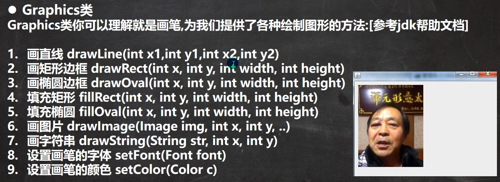

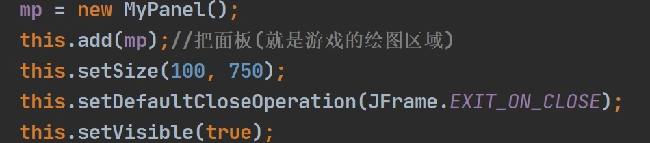

# 事件处理机制

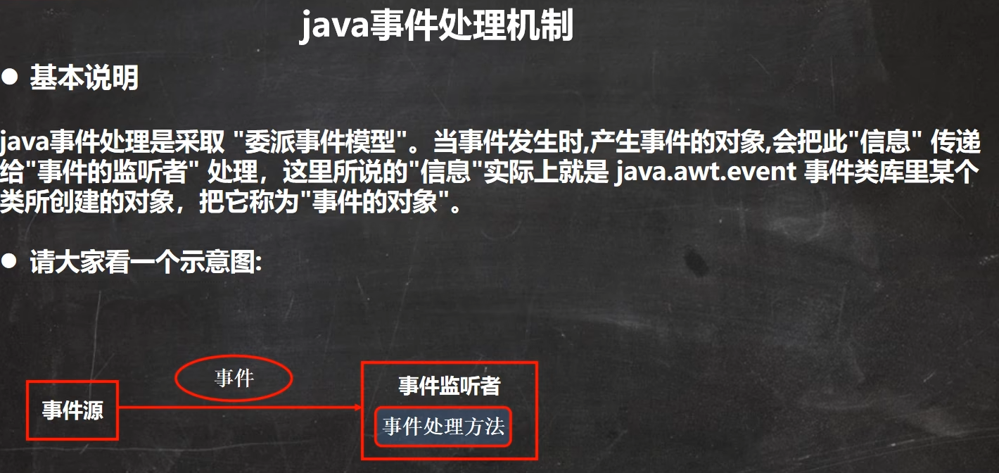

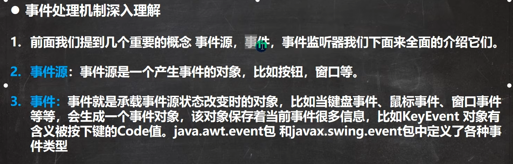

# 线程

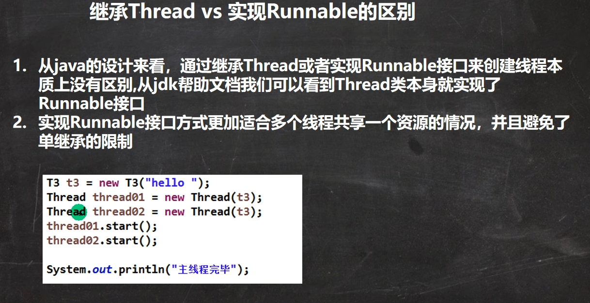

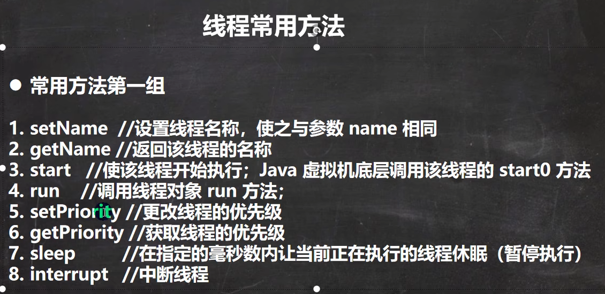

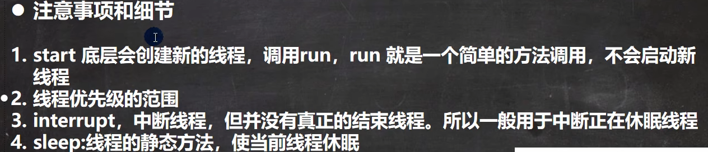

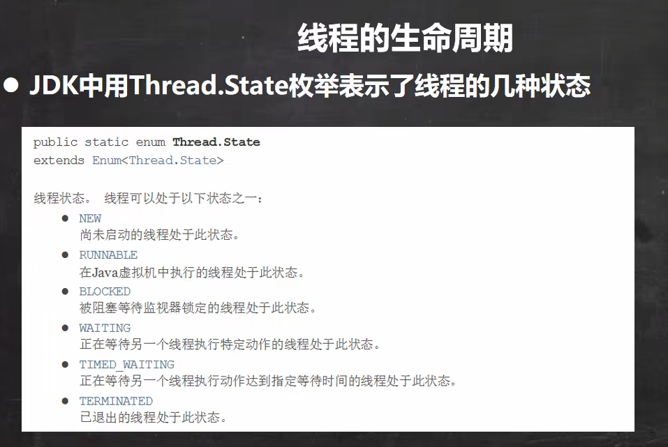

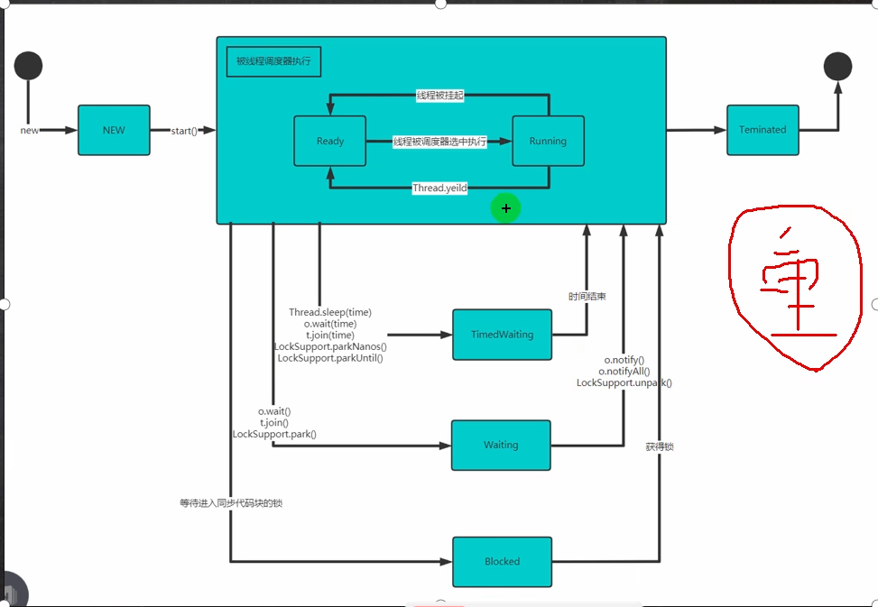

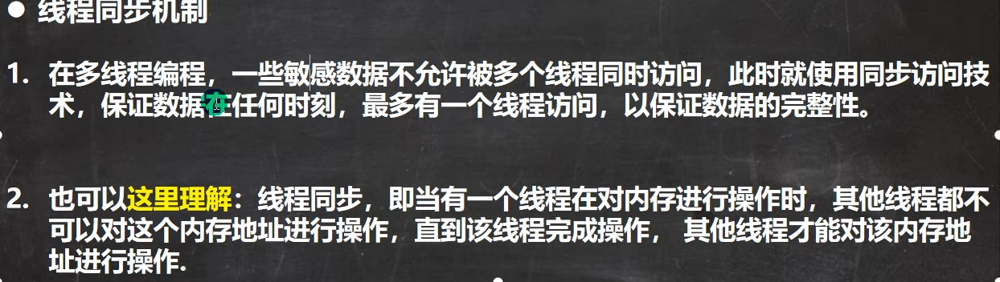

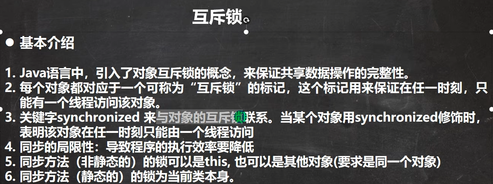


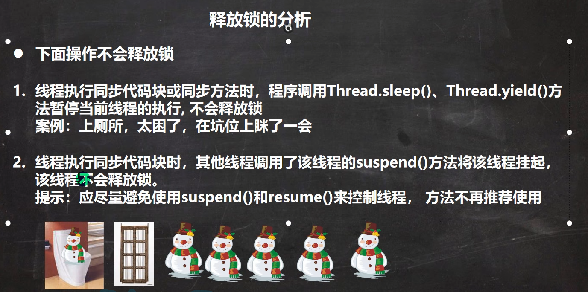

# IO流

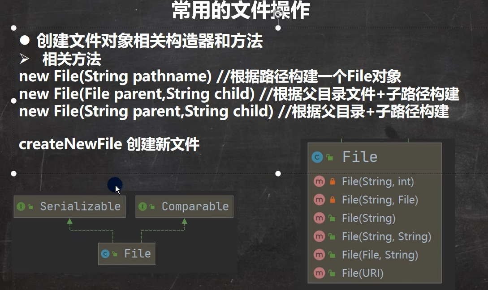

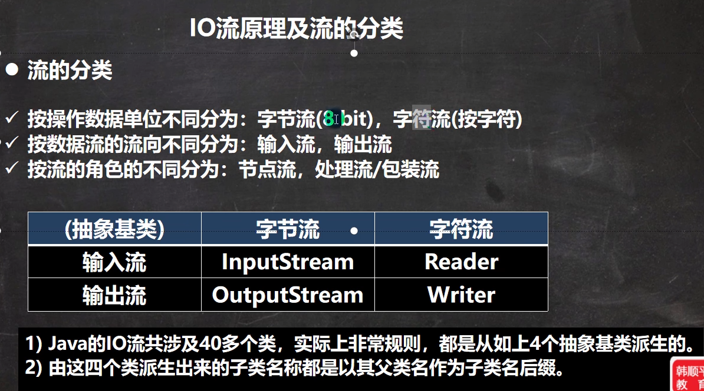

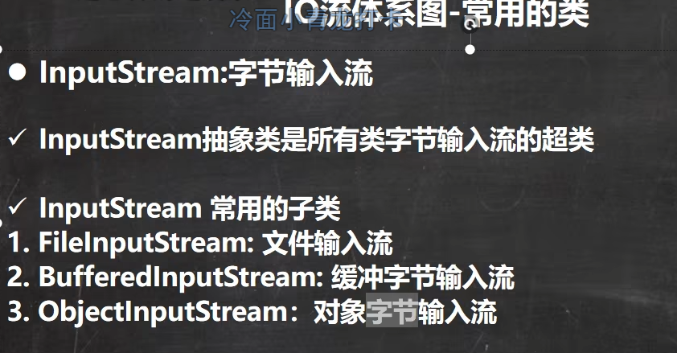

在Java中，字节流（**Byte Stream**）和字符流（**Character Stream**）是处理输入/输出的两种核心方式，分别针对二进制数据和文本数据。以下是常用类的用法详解，结合代码示例和场景说明：

---

### **一、字节流（Byte Stream）**
处理二进制数据（如图片、音频、视频、序列化对象等），核心基类为 **`InputStream`** 和 **`OutputStream`**。

#### **1. FileInputStream / FileOutputStream**
- **用途**：读写文件的字节数据。
- **关键方法**：
  - `int read()`：读取单个字节（返回`0-255`，文件末尾返回`-1`）。
  - `int read(byte[] buffer)`：批量读取字节到缓冲区。
  - `void write(byte[] buffer, int offset, int length)`：写入字节数组的指定部分。

**示例：文件复制**
```java
try (FileInputStream fis = new FileInputStream("source.jpg");
     FileOutputStream fos = new FileOutputStream("target.jpg")) {
    byte[] buffer = new byte[1024];
    int len;
    while ((len = fis.read(buffer)) != -1) {
        fos.write(buffer, 0, len); // 逐块读写，适合大文件
    }
} catch (IOException e) {
    e.printStackTrace();
}
```

---

#### **2. BufferedInputStream / BufferedOutputStream**
- **用途**：提供缓冲功能，减少直接磁盘操作次数，提升性能。
- **构造方法**：需包装一个基础流（如`FileInputStream`）。

**示例：带缓冲的文件复制**
```java
try (BufferedInputStream bis = new BufferedInputStream(new FileInputStream("source.jpg"));
     BufferedOutputStream bos = new BufferedOutputStream(new FileOutputStream("target.jpg"))) {
    byte[] buffer = new byte[8192]; // 更大的缓冲区
    int len;
    while ((len = bis.read(buffer)) != -1) {
        bos.write(buffer, 0, len);
    }
} catch (IOException e) {
    e.printStackTrace();
}
```

---

#### **3. ObjectInputStream / ObjectOutputStream**
- **用途**：序列化和反序列化对象（对象必须实现`Serializable`接口）。
- **关键方法**：
  - `void writeObject(Object obj)`：写入对象。
  - `Object readObject()`：读取对象。

**示例：对象序列化**
```java
// 序列化对象到文件
try (ObjectOutputStream oos = new ObjectOutputStream(new FileOutputStream("user.dat"))) {
    User user = new User("Alice", 25);
    oos.writeObject(user);
} catch (IOException e) {
    e.printStackTrace();
}

// 反序列化对象
try (ObjectInputStream ois = new ObjectInputStream(new FileInputStream("user.dat"))) {
    User user = (User) ois.readObject();
    System.out.println(user.getName()); // 输出: Alice
} catch (IOException | ClassNotFoundException e) {
    e.printStackTrace();
}
```

---

### **二、字符流（Character Stream）**
处理文本数据（如TXT、CSV、JSON文件），核心基类为 **`Reader`** 和 **`Writer`**，自动处理字符编码（如UTF-8）。

#### **1. FileReader / FileWriter**
- **用途**：读写文本文件，默认使用系统编码（可能需手动指定编码）。
- **关键方法**：
  - `int read()`：读取单个字符。
  - `void write(String str)`：写入字符串。

**示例：文本文件复制**
```java
try (FileReader fr = new FileReader("input.txt");
     FileWriter fw = new FileWriter("output.txt")) {
    int data;
    while ((data = fr.read()) != -1) {
        fw.write(data); // 逐字符读写（效率低，适合小文件）
    }
} catch (IOException e) {
    e.printStackTrace();
}
```

---

#### **2. BufferedReader / BufferedWriter**
- **用途**：提供缓冲功能，提升文本读写效率，支持按行读取。
- **关键方法**：
  - `String readLine()`：读取一行文本（返回`null`表示文件末尾）。
  - `void newLine()`：写入换行符。

**示例：逐行读取并处理文本**
```java
try (BufferedReader br = new BufferedReader(new FileReader("data.txt"));
     BufferedWriter bw = new BufferedWriter(new FileWriter("result.txt"))) {
    String line;
    while ((line = br.readLine()) != null) {
        // 处理每行数据（如过滤空行）
        if (!line.trim().isEmpty()) {
            bw.write(line.toUpperCase()); // 转大写写入
            bw.newLine(); // 换行
        }
    }
} catch (IOException e) {
    e.printStackTrace();
}
```

---

#### **3. InputStreamReader / OutputStreamWriter**
- **用途**：字节流与字符流的桥梁，可指定字符编码（如UTF-8、GBK）。
- **典型场景**：处理网络数据或非默认编码的文本文件。

**示例：读取UTF-8编码的文本文件**
```java
try (InputStreamReader isr = new InputStreamReader(
        new FileInputStream("data.txt"), StandardCharsets.UTF_8);
     BufferedReader br = new BufferedReader(isr)) {
    String line;
    while ((line = br.readLine()) != null) {
        System.out.println(line);
    }
} catch (IOException e) {
    e.printStackTrace();
}
```

---

### **三、字节流 vs 字符流对比**
| **特性**     | **字节流**                                | **字符流**                     |
| ------------ | ----------------------------------------- | ------------------------------ |
| **数据单位** | 字节（8-bit）                             | 字符（16-bit Unicode）         |
| **编码处理** | 无自动编码转换                            | 自动处理字符编码（如UTF-8）    |
| **适用场景** | 图片、视频、二进制文件                    | 文本文件（TXT、CSV、JSON等）   |
| **典型类**   | `FileInputStream`、`BufferedOutputStream` | `FileReader`、`BufferedWriter` |
| **性能优化** | 使用`BufferedInputStream`缓冲             | 使用`BufferedReader`按行读取   |

---

### **四、选择原则**
1. **处理二进制数据（非文本）** → 字节流（如`.jpg`, `.mp3`）。
2. **处理文本数据** → 字符流（自动处理编码，避免乱码）。
3. **需要高效读写** → 使用缓冲流（如`BufferedInputStream`、`BufferedReader`）。
4. **需要扩展功能** → 组合流（如用`BufferedReader`包装`InputStreamReader`）。

---

### **五、总结**
- **字节流**：通过`InputStream`和`OutputStream`处理原始字节，适合所有文件类型。
- **字符流**：通过`Reader`和`Writer`处理文本，解决编码问题。
- **常用组合**：基础流 + 缓冲流 + 转换流（如`FileInputStream` → `BufferedInputStream` → `InputStreamReader`）。

**示例：完整组合流（读取UTF-8编码文件）**
```java
try (BufferedReader br = new BufferedReader(
        new InputStreamReader(
            new FileInputStream("data.txt"), StandardCharsets.UTF_8))) {
    // 按行处理文本
} catch (IOException e) {
    e.printStackTrace();
}
```

## 字符流

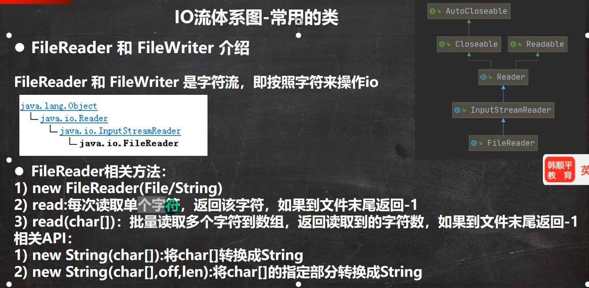

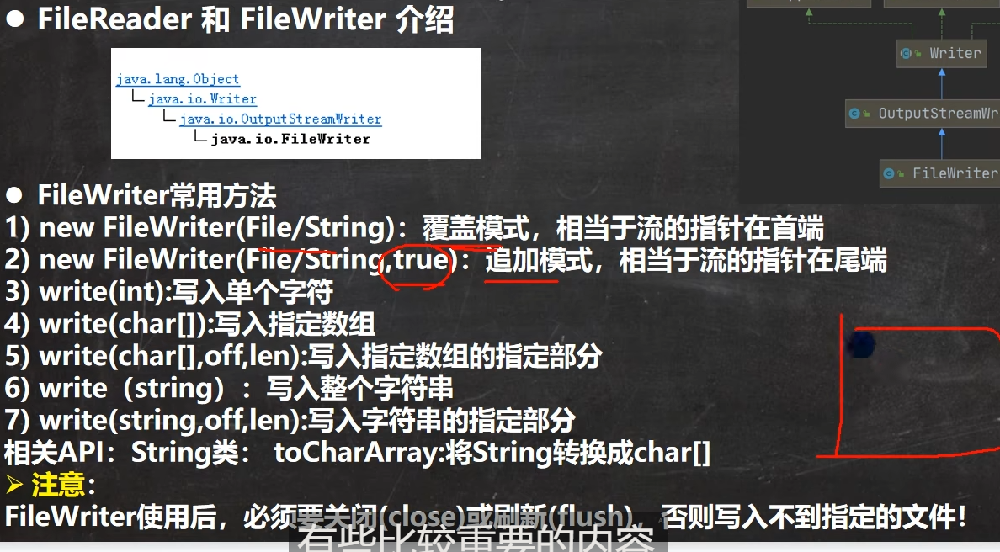

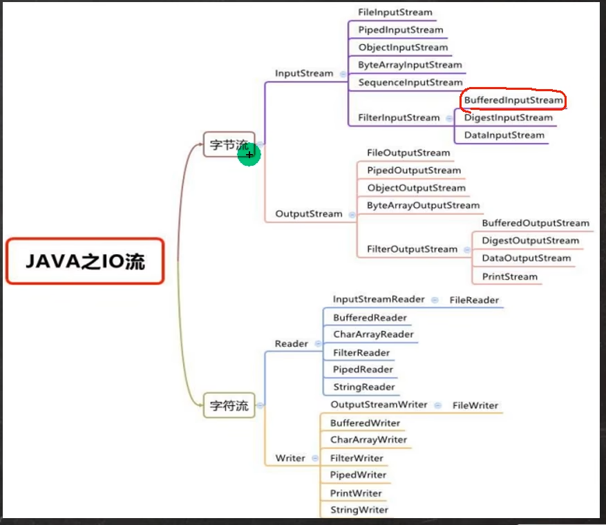

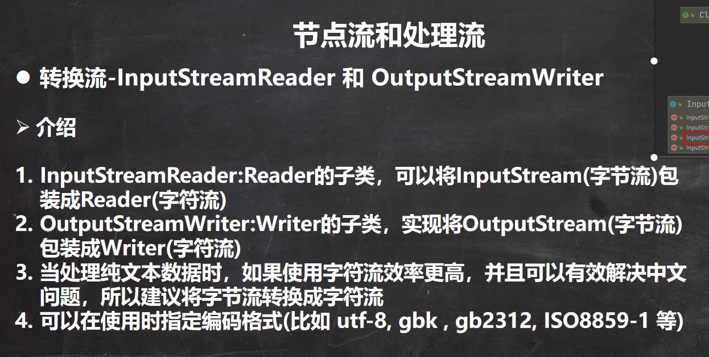

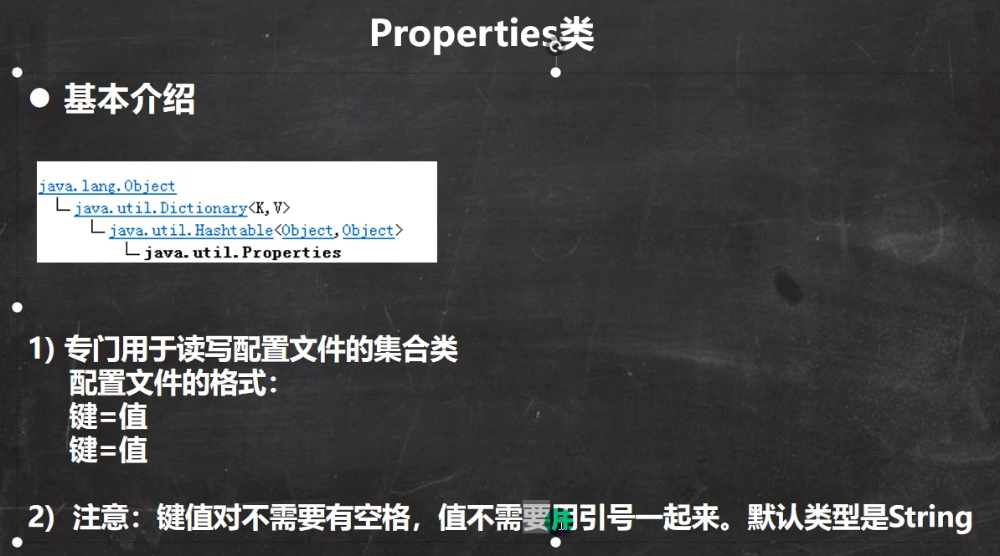

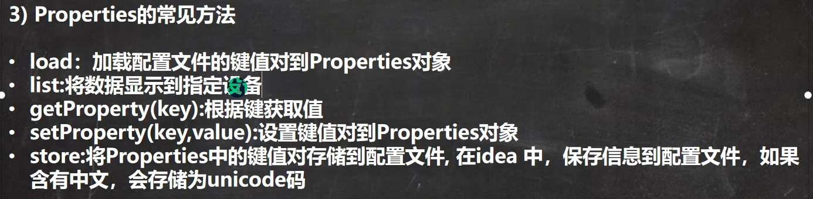

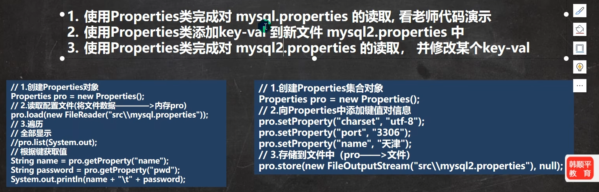

# 计算机网络

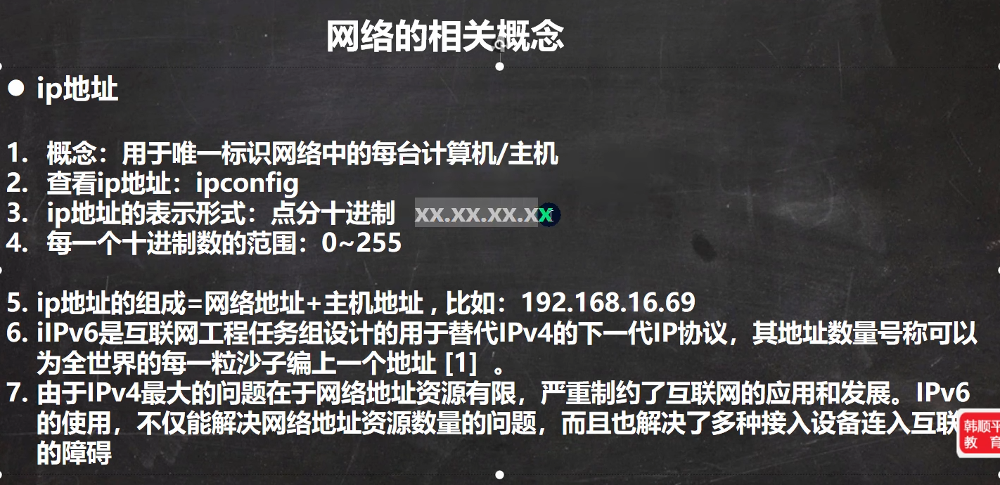

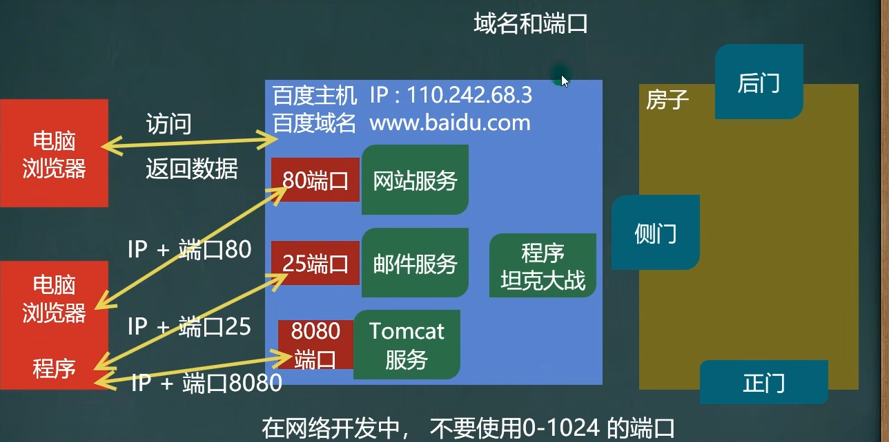

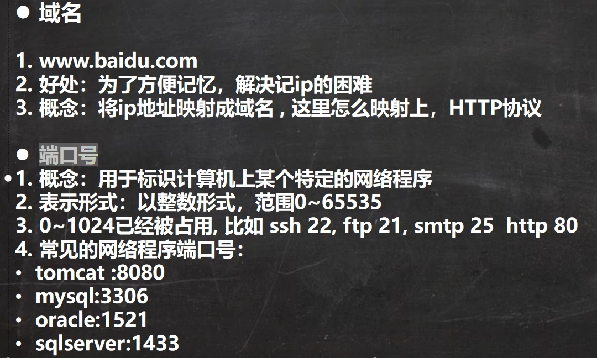

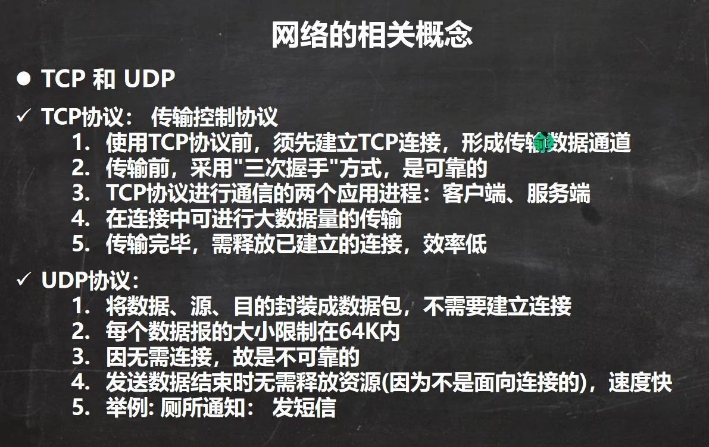

# 反射

### Java 反射总结

#### **反射的作用**  
反射（Reflection）是 Java 在运行时动态分析、检查和操作类、方法、属性等程序结构的能力，允许绕过编译时的静态绑定，直接通过类名、方法名等字符串形式进行操作。

---

#### **核心用途**  
1. **动态加载类**  
   - 根据类名字符串加载类（如`Class.forName("com.example.Demo")`），常用于配置化编程（如 JDBC 驱动加载）。
2. **运行时分析类结构**  
   - 获取类的字段、方法、注解等信息（IDE 的代码提示、Spring 的依赖注入）。
3. **动态调用方法或创建对象**  
   - 通过方法名字符串调用方法（如框架中的请求映射）。
4. **绕过访问权限检查**  
   - 强制访问私有成员（需调用`setAccessible(true)`）。
5. **实现通用工具或框架**  
   - 如 JSON 序列化库（通过反射遍历对象字段）、动态代理（如 Spring AOP）。

---

#### **核心类与方法**  
1. **`Class<T>`**  
   - 类的元数据入口，获取方式：  
     ```java
     Class<?> clazz = Object.class;          // 通过类字面量
     Class<?> clazz = obj.getClass();        // 通过对象实例
     Class<?> clazz = Class.forName("全类名");// 通过类名字符串
     ```
2. **`Constructor`/`Method`/`Field`**  
   
   - 分别对应构造方法、方法、字段，可通过`Class`对象获取：  
     ```java
     Constructor<?> constructor = clazz.getDeclaredConstructor();
     Method method = clazz.getDeclaredMethod("methodName", 参数类型.class);
     Field field = clazz.getDeclaredField("fieldName");
     ```
3. **操作对象**  
   - 创建实例：`Object obj = constructor.newInstance();`  
   - 调用方法：`method.invoke(obj, 参数);`  
   - 读写字段：`field.set(obj, value);` / `field.get(obj);`

---

#### **易错点与注意事项**  
1. **性能问题**  
   - 反射比直接调用慢约 10-100 倍，频繁调用时需缓存`Method`/`Field`对象。  
   - **替代方案**：LambdaMetafactory（方法句柄）、字节码生成（如 CGLIB）。
2. **访问权限限制**  
   - 访问私有成员需调用`setAccessible(true)`，但可能触发`SecurityException`（受安全管理器限制）。
3. **方法签名匹配**  
   - 调用方法时需严格匹配参数类型，否则抛出`NoSuchMethodException`。
4. **泛型类型擦除**  
   - 反射无法直接获取泛型的具体类型（如`List<String>`会被擦除为`List`），需通过`Type`接口或注解辅助。
5. **模块化系统（Java 9+）**  
   - 模块未`opens`的包无法被反射访问，需在`module-info.java`中添加：  
     ```java
     opens com.example.mypackage;
     ```
6. **破坏封装性**  
   - 反射可绕过 private 修饰符，滥用会导致代码安全性降低。
7. **版本兼容性**  
   - 若类结构变更（如删除方法），反射代码可能在运行时崩溃。

---

#### **典型应用场景**  
- **框架开发**：Spring（Bean 管理）、Hibernate（ORM 映射）。  
- **动态代理**：`InvocationHandler`结合反射实现 AOP。  
- **测试工具**：JUnit 通过反射调用测试方法。  
- **插件化架构**：动态加载外部类（如 IDE 插件系统）。

---

#### **总结**  
反射是 Java 动态能力的核心，但需谨慎使用。优先考虑直接调用或设计模式（如工厂模式），仅在必要时（如开发通用库、框架）使用反射，并注意性能、安全性和可维护性。