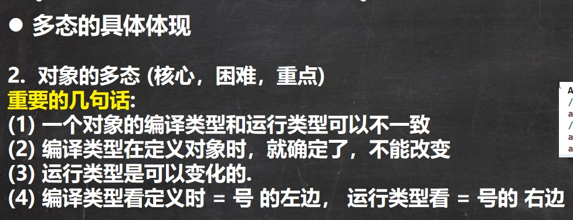
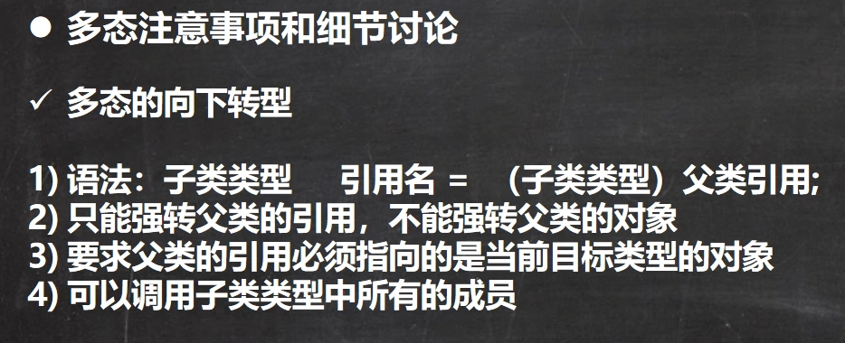
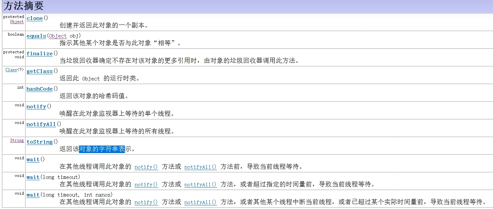
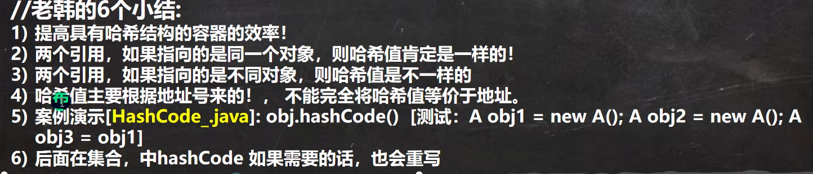
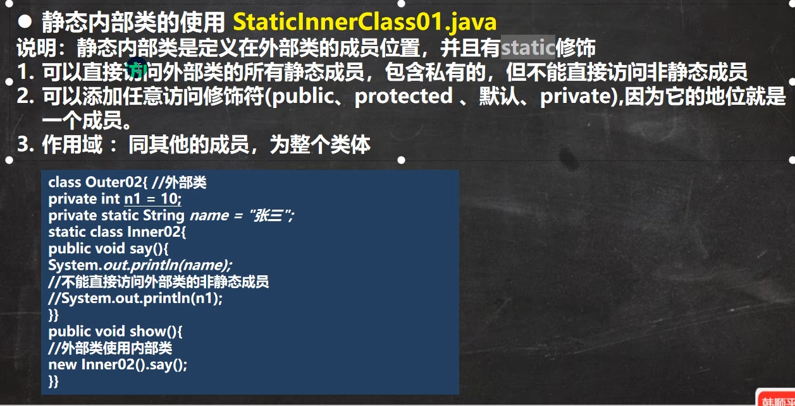
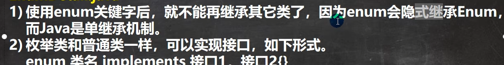
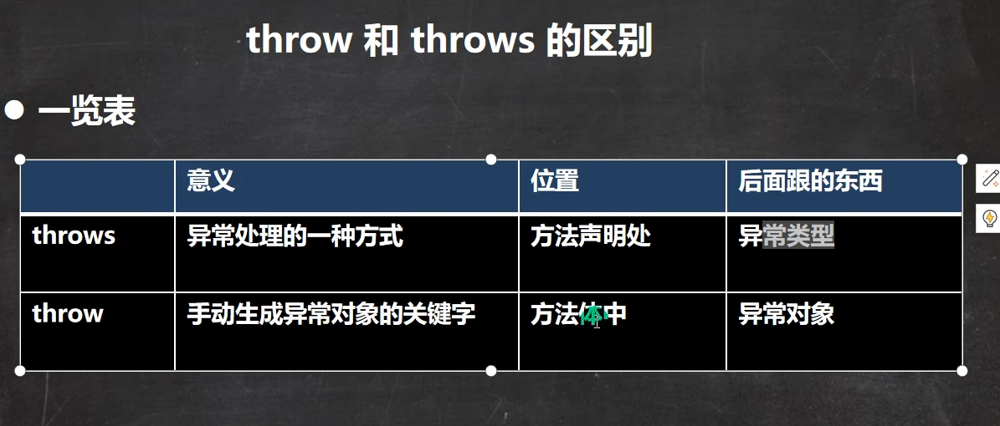
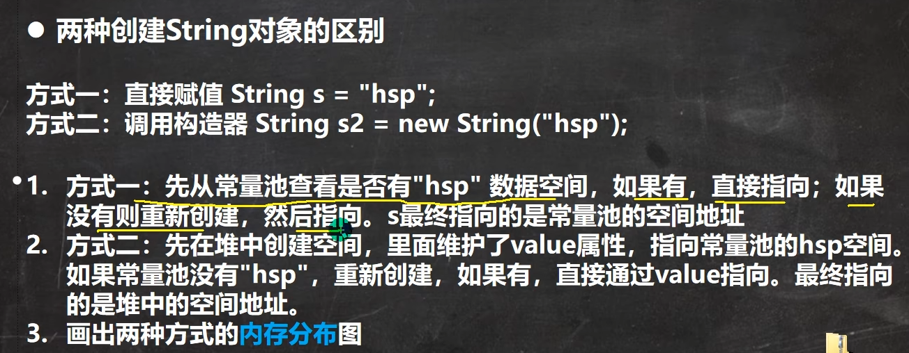
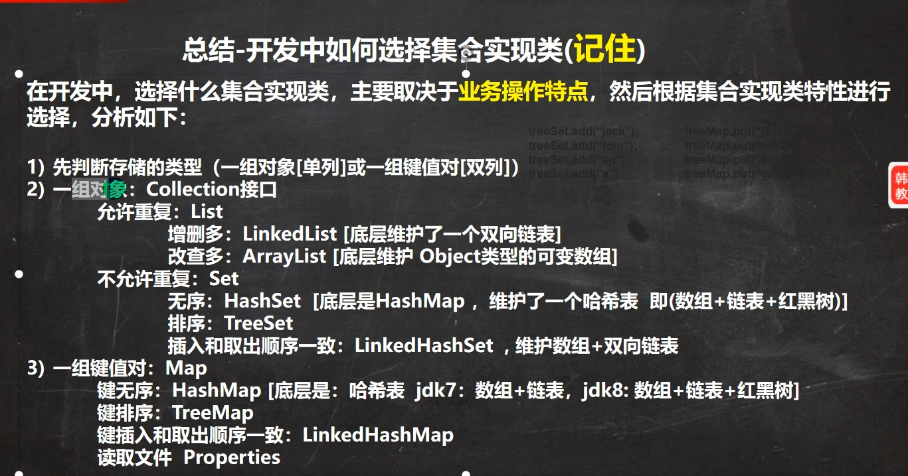

# **java的多态**

## 						多态快速入门

### **方法的多态**

```java
多态：多种状态

方法重载会体现多态

方法重写会体现多态
```

### **对象的多态**



## 多态的细节讨论

### 向上转型


==多态使代码的复用性变高==

在Java中，向上转型（将子类对象赋值给父类引用）不能调用子类的特有成员，主要原因如下：

1. **类型检查机制**：
   - Java是静态类型语言，方法调用在编译时进行类型检查。编译器只检查引用类型中定义的方法，而不考虑实际对象的类型。
   - 如果父类引用中没有定义子类特有的方法，编译器会报错，因为无法在编译时确认该方法的存在。
2. **类型安全性**：
   - 向上转型的设计是为了提高代码的灵活性和可扩展性，通过父类引用调用方法，可以处理多种子类对象。
   - 允许通过父类引用调用子类特有方法会破坏类型安全性，因为这可能导致运行时错误，例如当引用指向的不是该子类对象时。
3. **多态性原则**：
   - 多态性主要通过方法重写（override）实现，子类可以提供父类方法的不同实现。
   - 子类新增的方法不在父类的契约中，不应通过父类引用调用，以保持代码的清晰和可维护性。
4. **解决方法**：
   - 如果需要调用子类特有方法，可以进行向下转型（将父类引用转换为子类引用），但必须确保实际对象是该子类类型，否则会抛出`ClassCastException`。

主要针对方法重写

### **向下转型**



向下转型改变的是编译类型

向下转型使可以访问 原引用的 子类特有属性和方法


instanceOf 判断对象的运行类型  语法： xx instanceOf  xxx   xx是否为xxx的

运行类型看等号右边，编译类型看等号左边

**属性看编译，方法看运行**

属性从编译类型开始往上找,方法从运行类型开始往上找

**理解 : 向下转型是为了使用子类特有的方法和属性**

## 多态数组


# 动态绑定机制


个人理解动态绑定机制 是为了区分父类和子类的共同方法即方法重写

方法找运行              属性找编译

运行右      编译左

例子

```java
package com.project.detail;

public class Polydetail01 {
    public static void main(String[] args) {
        AA a =new BB();
        System.out.println(a.sum());
    }
}
//class CC
//{
//    int i=80;
//}
class AA {
//    int i=20;
//    public int sum()
//    {
//        return i+10;
//    }
}
class BB extends AA{
    int i=10;
    public int sum()
    {
        return i;
    }
}

```

**个人理解： 当向上取整使用对象的变量或方法时，如果父类没有该变量和方法(即编译类型时) 编译会报错**

# object类

## object类的方法



## equals 

### == 和 equals 的区别


equals 只能判断引用类型 默认判断的是地址是否相等，但一般子类都会重写equals 判断值是否相等

### 重写equals方法

**`例子代码`**

```Java
public boolean equals(Object person) {
        if(this == person) return true;
        if(this.getClass() == person.getClass()){
            Person p = (Person)person;
            return name.equals(p.getName()) && age == p.getAge();
        }
        return false;
    }
```

==关于为何可以在重写equals方法时使用equals 请详细理解Java的动态绑定机制==

**步骤**

1. **初步判断：**
   - 首先检查两个对象是否是同一个实例，使用 `this == person` 进行判断。如果是同一个实例，直接返回 `true`。
2. **类型判断**：
   - 接下来，需要判断两个对象是否属于同一类。使用 `getClass()` 方法获取对象的类，并使用 `==` 进行比较，即 `this.getClass() == person.getClass()`。这种方法可以确保两个对象属于完全相同的类，不包括子类。
3. **为什么不用 `instanceof`**：
   - 虽然 `instanceof` 可以检查对象是否是某个类或其子类的实例，但不建议在 `equals` 方法中使用。因为如果允许子类和父类之间比较，可能会导致不一致性和错误，特别是当子类有额外属性时。
4. **对称性和一致性**：
   - 使用 `getClass()` 确保两个对象属于同一类，可以避免对称性问题。例如，如果一个父类和子类实例通过 `instanceof` 比较，可能会导致比较不准确，因为子类可能有额外的属性。
5. **总结**：
   - 在 `equals` 方法中，使用 `getClass() == person.getClass()` 是最安全和普遍接受的做法。它确保两个对象属于同一类，然后再比较各自的属性，从而保证比较的准确性和一致性。

## hashCode





## toString


**当直接输出一个对象时,toString方法会默认调用**

## finalize


程序员可以重写finalize方法 完成业务逻辑

```java
Person p = new Person();
p = null;
```

例如这样 p 原来指向的空间的Person 就没有任何引用了

==注意:     不是一个对象变成垃圾就会立马回收==

System.gc() 主动运行垃圾回收器

# 断点调试


# 四种访问修饰符


# 类变量

1. 类变量可以用类名来访问 ————Child.count
2. 类变量被所有该类的对象共享     (共享一个存储空间)
3. 类变量在类加载时生成
4. 类变量时在类加载时生成的,所以即使没有创建类对象依然能够使用
5. 类变量的访问依然要遵守访问修饰符


# 类方法


注意事项


# main方法细节


# 代码块


代码块：无论调用哪个构造器都会在这之前调用代码块，代码块的优先级大于构造器


# 单例设计模式

单例：在类的整个生命周期中只有一个实例对象


# final 关键字


### Java 中的 `final` 关键字和 C 语言中的 `const` 的区别和相同点

#### 相同点：

1. **不可变性**：
   - **Java `final`**：当 `final` 修饰变量时，表示该变量一旦赋值后就不能被修改。
   - **C `const`**：`const` 修饰的变量在初始化后也不能被修改。
2. **常量声明**：
   - 两者都常用于声明常量，表示其值在程序运行期间不会改变。

#### 区别：

1. **作用范围**：
   - **Java `final`**：
     - 可以修饰类、方法和变量。
     - 修饰类时，表示该类不能被继承。
     - 修饰方法时，表示该方法不能被重写。
     - 修饰变量时，表示该变量一旦赋值后不能被修改。
   - **C `const`**：
     - 主要用于修饰变量和指针，表示其值不可修改。
     - 不能修饰类或函数。
2. **变量初始化**：
   - **Java `final`**：
     - `final` 变量必须在声明时或构造器中初始化。
     - 可以在运行时初始化。
   - **C `const`**：
     - `const` 变量通常在编译时初始化。
     - 可以在运行时初始化，但不能修改其值。
3. **指针和引用**：
   - **Java**：
     - Java 没有指针，`final` 不能修饰指针。
   - **C**：
     - `const` 可以用于指针，表示指针指向的数据不可修改，或者指针本身不可修改（取决于 `const` 的位置）。
4. **内存存储**：
   - **Java**：
     - `final` 变量的存储位置由 JVM 管理，不直接指定存储区域。
   - **C**：
     - `const` 变量通常存储在只读内存区域（如 .data 或 .rodata 段），试图修改 `const` 变量会导致编译错误或运行时错误。
5. **灵活性**：
   - **Java `final`**：
     - 提供了更广泛的用途，不仅限于变量，还包括类和方法的不可变性。
   - **C `const`**：
     - 功能相对单一，主要用于变量的常量性。
6. **多级修饰**：
   - **C**：
     - 可以通过指针和引用的组合使用 `const`，例如 `const int*`（指针所指的整数不可修改）和 `int* const`（指针本身不可修改）。
   - **Java**：
     - 没有指针，`final` 不能用于多级修饰。
7. **继承和多态**：
   - **Java `final`**：
     - 可以阻止类的继承和方法的重写。
   - **C `const`**：
     - 无相关概念，C 语言不支持面向对象的继承和多态。

### 总结

- **相同点**：都用于表示不可变性，确保某些值在程序运行期间不被修改。
- **区别**：Java 的 `final` 作用范围更广，可以修饰类、方法和变量，而 C 的 `const` 主要用于变量和指针，并且在内存管理和语言特性上有不同的实现方式。


非静态final变量无法在静态代码块中初始化


## final修饰数组的补充

在 Java 中，`final` 修饰数组时，表示数组的引用（即数组的地址）不能被修改，但数组中的元素值是可以被修改的。

具体来说：
- **数组引用不可变**：`final` 修饰的数组变量不能被重新赋值，即不能指向另一个数组对象。
- **数组元素可变**：数组中的元素值可以被修改。

### 示例
```java
final int[] array = new int[]{1, 2, 3};

// 合法：修改数组元素的值
array[0] = 10;

// 非法：不能修改数组引用
// array = new int[]{4, 5, 6}; // 编译错误
```

### 总结
- `final` 修饰数组时，数组的引用（地址）不可变。
- 数组中的元素值可以随意修改。

如果你希望数组元素也不可变，可以使用不可变集合（如 `Collections.unmodifiableList`）或其他方式来实现。

# 抽象类

父类方法的不确定性     当父类的某些方法需要声明但不确定该如何实现时可以将其声明为抽象方法，那么这个类就是抽象类


抽象方法不能用private，final，static修饰

# 接口  interface


在接口中 抽象方法可以省略abstract

## 接口与抽象类的区别和共同点

接口（Interface）和抽象类（Abstract Class）是面向对象编程中的两个重要概念，它们的主要区别如下：

接口（Interface）和抽象类（Abstract Class）是面向对象编程中的两个重要概念，它们有一些共同点，但也存在显著的区别。

### 共同点：
1. **抽象性**：
   - 两者都用于定义抽象行为，不能被实例化，只能被继承或实现。
   
2. **方法声明**：
   - 接口和抽象类都可以包含抽象方法（没有实现的方法），这些方法必须在子类或实现类中实现。

3. **成员变量**：
   - 接口和抽象类都可以定义成员变量，但接口中的变量默认是 `public static final`（常量），而抽象类可以有各种访问修饰符的变量。

4. **设计目的**：
   - 两者都用于定义类的行为规范，帮助实现代码的复用和扩展。

### 区别：

1. **方法实现**：
   - **接口**：接口中只能包含抽象方法（Java 8 以后可以有默认方法和静态方法，但不能有具体方法），实现类必须提供所有方法的具体实现。
   - **抽象类**：抽象类可以包含抽象方法和具体方法，子类可以选择性地实现抽象方法，具体方法可以直接继承使用。

2. **成员变量**：
   - **接口**：接口中只能定义 `public static final` 常量，不能有实例变量。
   - **抽象类**：抽象类可以定义各种类型的成员变量，包括实例变量和静态变量。

3. **继承与实现**：
   - **接口**：一个类可以实现多个接口，接口之间可以多继承（一个接口可以继承多个接口）。
   - **抽象类**：一个类只能继承一个抽象类，抽象类继承遵循单继承原则。

4. **构造方法**：
   - **接口**：接口不能有构造方法。
   - **抽象类**：抽象类可以有构造方法，用于初始化抽象类的成员变量。

5. **设计目的**：
   - **接口**：主要用于定义行为规范，强调“能做什么”，适合定义跨类的通用功能。
   - **抽象类**：主要用于代码复用和扩展，强调“是什么”，适合定义具有共同特征的类。

### 总结对比表：

| 特性     | 接口（Interface）                   | 抽象类（Abstract Class）     |
| -------- | ----------------------------------- | ---------------------------- |
| 方法实现 | 只能有抽象方法（默认方法除外）      | 可以有抽象方法和具体方法     |
| 成员变量 | 只能是常量（`public static final`） | 可以是实例变量和静态变量     |
| 继承     | 支持多继承（实现多个接口）          | 单继承（只能继承一个抽象类） |
| 构造方法 | 不能有构造方法                      | 可以有构造方法               |
| 设计目的 | 定义行为规范                        | 代码复用和扩展               |
| 适用场景 | 跨类的通用功能                      | 具有共同特征的类             |

### 示例：

- **接口**：
  ```java
  public interface Flyable {
      void fly();
  }
  ```
  
- **抽象类**：
  
  ```java
  public abstract class Animal {
      String name;
      
      public abstract void makeSound();
      
      public void sleep() {
          System.out.println("Sleeping...");
      }
  }
  ```

### 选择使用接口还是抽象类：
- **接口**：当你需要定义一组行为规范，并且允许多继承时，选择接口。
- **抽象类**：当你有一组相关类共享一些共同的代码和属性时，选择抽象类。

理解接口和抽象类的共同点和区别，有助于在设计类结构时做出更合适的选择。

## 接口细节

快捷键alt + enter

接口中的所有方法都是public


# 内部类

类的五大成员：属性，方法，构造器，代码块，内部类


## 局部内部类


## 匿名内部类


time: 2025 1.10 3:04

## 成员内部类


## 静态内部类



## 摘自大佬对内部类的笔记

这是我学习Java内部类的笔记  1.为什么使用内部类? 使用内部类最吸引人的原因是：每个内部类都能独立地继承一个（接口的）实现，所以无论外围类是否已经继承了某个（接口的）实现， 对于内部类都没有影响 1.1.使用内部类最大的优点就在于它能够非常好的解决多重继承的问题,使用内部类还能够为我们带来如下特性: (1)、内部类可以用多个实例，每个实例都有自己的状态信息，并且与其他外围对象的信息相互独。 (2)、在单个外围类中，可以让多个内部类以不同的方式实现同一个接口，或者继承同一个类。 (3)、创建内部类对象的时刻并不依赖于外围类对象的创建。 (4)、内部类并没有令人迷惑的“is-a”关系，他就是一个独立的实体。 (5)、内部类提供了更好的封装，除了该外围类，其他类都不能访问。 2.内部类分类: (一).成员内部类: public class Outer{
		private int age = 99;
		String name = "Coco";
		public class Inner{
			String name = "Jayden";
			public void show(){
				System.out.println(Outer.this.name);
				System.out.println(name);
				System.out.println(age);
			}
		}
		public Inner getInnerClass(){
			return new Inner();
		}
		public static void main(String[] args){
			Outer o = new Outer();
			Inner in = o.new Inner();
			in.show();
		}
	} 1.Inner 类定义在 Outer 类的内部，相当于 Outer 类的一个成员变量的位置，Inner 类可以使用任意访问控制符， 如 public 、 protected 、 private 等 2.Inner 类中定义的 show() 方法可以直接访问 Outer 类中的数据，而不受访问控制符的影响， 如直接访问 Outer 类中的私有属性age 3.定义了成员内部类后，必须使用外部类对象来创建内部类对象，而不能直接去 new 一个内部类对象， 即：内部类 对象名 = 外部类对象.new 内部类( ); 4.编译上面的程序后，会发现产生了两个 .class 文件: Outer.class,Outer$Inner.class{} 5.成员内部类中不能存在任何 static 的变量和方法,可以定义常量: (1).因为非静态内部类是要依赖于外部类的实例,而静态变量和方法是不依赖于对象的,仅与类相关, 简而言之:在加载静态域时,根本没有外部类,所在在非静态内部类中不能定义静态域或方法,编译不通过; 非静态内部类的作用域是实例级别 (2).常量是在编译器就确定的,放到所谓的常量池了 ★★友情提示: 1.外部类是不能直接使用内部类的成员和方法的，可先创建内部类的对象，然后通过内部类的对象来访问其成员变量和方法; 2.如果外部类和内部类具有相同的成员变量或方法，内部类默认访问自己的成员变量或方法，如果要访问外部类的成员变量， 可以使用 this 关键字,如:Outer.this.name (二).静态内部类: 是 static 修饰的内部类, 1.静态内部类不能直接访问外部类的非静态成员，但可以通过 new 外部类().成员 的方式访问  2.如果外部类的静态成员与内部类的成员名称相同，可通过“类名.静态成员”访问外部类的静态成员； 如果外部类的静态成员与内部类的成员名称不相同，则可通过“成员名”直接调用外部类的静态成员 3.创建静态内部类的对象时，不需要外部类的对象，可以直接创建 内部类 对象名 = new 内部类(); public class Outer{
			private int age = 99;
			static String name = "Coco";
			public static class Inner{
				String name = "Jayden";
				public void show(){
					System.out.println(Outer.name);
					System.out.println(name);					
				}
			}
			public static void main(String[] args){
				Inner i = new Inner();
				i.show();
			}
		} (三).方法内部类：其作用域仅限于方法内，方法外部无法访问该内部类 (1).局部内部类就像是方法里面的一个局部变量一样，是不能有 public、protected、private 以及 static 修饰符的 (2).只能访问方法中定义的 final 类型的局部变量,因为: 当方法被调用运行完毕之后，局部变量就已消亡了。但内部类对象可能还存在, 直到没有被引用时才会消亡。此时就会出现一种情况，就是内部类要访问一个不存在的局部变量; ==>使用final修饰符不仅会保持对象的引用不会改变,而且编译器还会持续维护这个对象在回调方法中的生命周期. 局部内部类并不是直接调用方法传进来的参数，而是内部类将传进来的参数通过自己的构造器备份到了自己的内部， 自己内部的方法调用的实际是自己的属性而不是外部类方法的参数; 防止被篡改数据,而导致内部类得到的值不一致    /*
		使用的形参为何要为 final???
		 在内部类中的属性和外部方法的参数两者从外表上看是同一个东西，但实际上却不是，所以他们两者是可以任意变化的，
		 也就是说在内部类中我对属性的改变并不会影响到外部的形参，而然这从程序员的角度来看这是不可行的，
		 毕竟站在程序的角度来看这两个根本就是同一个，如果内部类该变了，而外部方法的形参却没有改变这是难以理解
		 和不可接受的，所以为了保持参数的一致性，就规定使用 final 来避免形参的不改变
		 */
		public class Outer{
			public void Show(){
				final int a = 25;
				int b = 13;
				class Inner{
					int c = 2;
					public void print(){
						System.out.println("访问外部类:" + a);
						System.out.println("访问内部类:" + c);
					}
				}
				Inner i = new Inner();
				i.print();
			}
			public static void main(String[] args){
				Outer o = new Outer();
				o.show();
			}
		}    
      (3).注意:在JDK8版本之中,方法内部类中调用方法中的局部变量,可以不需要修饰为 final,匿名内部类也是一样的，主要是JDK8之后增加了 Effectively final 功能        http://docs.oracle.com/javase/tutorial/java/javaOO/localclasses.html        反编译jdk8编译之后的class文件,发现内部类引用外部的局部变量都是 final 修饰的        (四).匿名内部类:    (1).匿名内部类是直接使用 new 来生成一个对象的引用;  (2).对于匿名内部类的使用它是存在一个缺陷的，就是它仅能被使用一次，创建匿名内部类时它会立即创建一个该类的实例， 该类的定义会立即消失，所以匿名内部类是不能够被重复使用; (3).使用匿名内部类时，我们必须是继承一个类或者实现一个接口，但是两者不可兼得，同时也只能继承一个类或者实现一个接口; (4).匿名内部类中是不能定义构造函数的,匿名内部类中不能存在任何的静态成员变量和静态方法; (5).匿名内部类中不能存在任何的静态成员变量和静态方法,匿名内部类不能是抽象的,它必须要实现继承的类或者实现的接口的所有抽象方法 (6).匿名内部类初始化:使用构造代码块！利用构造代码块能够达到为匿名内部类创建一个构造器的效果   public class OuterClass {
            public InnerClass getInnerClass(final int   num,String str2){
                return new InnerClass(){
                    int number = num + 3;
                    public int getNumber(){
                        return number;
                    }
                };        /* 注意：分号不能省 */
            }
            public static void main(String[] args) {
                OuterClass out = new OuterClass();
                InnerClass inner = out.getInnerClass(2, "chenssy");
                System.out.println(inner.getNumber());
            }
        }
        interface InnerClass {
            int getNumber();
        }

# 枚举类 enum

类似单例设计模式的饿汉式

自己构造枚举类


使用enum关键字


enum 的常用方法


细节



# 注解


# 异常


快捷键crtl+alt+t

## 运行时异常

1. 
2. 
3. 
4. 
5. 

## 编译异常


## 异常处理


finally必须执行


## throws抛出异常


## 自定义异常


## throw和throws的区别



throw用于开发者显式地抛出异常

## 常见的异常种类

### 1. Exception

`Exception`是程序可以捕获并处理的异常，分为Checked Exception和Unchecked Exception。

- **Checked Exception**：
  - `IOException`：输入输出操作失败时抛出，如文件操作失败。
  - `SQLException`：数据库操作失败时抛出。
  - `FileNotFoundException`：文件未找到时抛出。
- **Unchecked Exception**（继承自`RuntimeException`）：
  - `NullPointerException`：访问空对象的属性或方法时抛出。
  - `ArrayIndexOutOfBoundsException`：访问数组越界时抛出。
  - `ClassCastException`：对象类型转换不兼容时抛出。
  - `IllegalArgumentException`：方法接收到非法参数时抛出。
  - `ArithmeticException`：算术运算错误，如除以零时抛出。
  - `NoSuchMethodException`：调用不存在的方法时抛出。
  - `NumberFormatException`：字符串转换为数字失败时抛出。

### 2. Error

`Error`表示Java虚拟机无法处理的严重错误，通常会导致程序崩溃。

- `OutOfMemoryError`：内存不足时抛出。
- `StackOverflowError`：栈溢出，通常由过深的递归调用引起。
- `NoClassDefFoundError`：类定义未找到时抛出。

### 其他常见异常

- **SecurityException**：安全权限不足时抛出。
- **InterruptedException**：线程被中断时抛出。

# 包装类


## 装箱和拆箱


## String类




### String常用方法

在Java中，`String`类提供了许多常用的方法来操作字符串。以下是一些常用的`String`方法：

#### 1. 获取字符串长度
- `int length()`
  - 返回字符串的长度。

#### 2. 字符访问
- `char charAt(int index)`
  - 返回指定索引处的字符。

#### 3. 字符串比较
- `boolean equals(Object anObject)`
  - 比较字符串的内容是否相等。
- `boolean equalsIgnoreCase(String anotherString)`
  - 忽略大小写比较字符串的内容。
- `int compareTo(String anotherString)`
  - 按字典顺序比较两个字符串。
- `boolean startsWith(String prefix)`
  - 检查字符串是否以指定前缀开始。
- `boolean endsWith(String suffix)`
  - 检查字符串是否以指定后缀结束。
- `boolean contains(CharSequence s)`
  - 检查字符串是否包含指定的字符序列。

#### 4. 查找子字符串
- `int indexOf(int ch)`
  - 返回指定字符第一次出现的索引。
- `int indexOf(int ch, int fromIndex)`
  - 从指定索引开始查找指定字符。
- `int indexOf(String substring)`
  - 返回指定子字符串第一次出现的索引。
- `int indexOf(String substring, int fromIndex)`
  - 从指定索引开始查找指定子字符串。
- `int lastIndexOf(int ch)`
  - 返回指定字符最后一次出现的索引。
- `int lastIndexOf(int ch, int fromIndex)`
  - 从指定索引开始反向查找指定字符。
- `int lastIndexOf(String substring)`
  - 返回指定子字符串最后一次出现的索引。

#### 5. 字符串截取
- `String substring(int beginIndex)`
  - 截取从指定索引开始到末尾的子字符串。
- `String substring(int beginIndex, int endIndex)`
  - 截取从开始索引到结束索引（不包括结束索引）的子字符串。

#### 6. 字符串转换
- `String toUpperCase()`
  - 将字符串转换为大写。
- `String toLowerCase()`
  - 将字符串转换为小写。
- `String trim()`
  - 去除字符串前后的空白字符。

#### 7. 字符串替换
- `String replace(char oldChar, char newChar)`
  - 替换所有指定字符为新的字符。
- `String replaceAll(String regex, String replacement)`
  - 使用正则表达式替换所有匹配的子字符串。
- `String replaceFirst(String regex, String replacement)`
  - 使用正则表达式替换第一个匹配的子字符串。

#### 8. 字符串分割
- `String[] split(String regex)`
  - 使用正则表达式分割字符串，并返回分割后的字符串数组。

#### 9. 字符串连接
- `String concat(String str)`
  - 连接指定的字符串。
- `static String join(CharSequence delimiter, CharSequence... elements)`
  - 使用指定的分隔符连接多个字符串。

#### 10. 转换为字符数组
- `char[] toCharArray()`
  - 将字符串转换为字符数组。

#### 11. 字符串格式化
- `static String format(String format, Object... args)`
  - 按照指定的格式格式化字符串。

#### 12. 检查字符串内容
- `boolean isEmpty()`
  - 检查字符串是否为空（长度为0）。

这些方法涵盖了大部分常见的字符串操作需求。通过这些方法，可以方便地对字符串进行各种操作。

### String StringBuffer StringBulider 区别

在Java中，String、StringBuffer和StringBuilder是处理字符串的三种不同方式，它们各有优缺点，适用于不同的场景。以下是它们之间的主要区别：

#### String
- **不可变性**：String对象一旦创建，其内容不可改变。任何对String的操作都会生成新的String对象。
- **线程安全**：由于不可变性，String是线程安全的。
- **性能**：适合少量字符串操作的场景，频繁修改会生成大量中间对象，影响性能。
- **内存管理**：利用字符串常量池优化内存使用。

#### StringBuffer
- **可变性**：StringBuffer对象的内容可以被修改，适合频繁修改字符串的场景。
- **线程安全**：方法同步，适合多线程环境使用，但同步机制影响性能。
- **性能**：在单线程环境下，由于同步机制，性能不如StringBuilder。
- **容量管理**：自动扩展容量，减少内存分配和复制操作。

#### StringBuilder
- **可变性**：StringBuilder对象的内容可以被修改，适合频繁修改字符串的场景。
- **线程不安全**：方法不同步，适合单线程环境使用，性能较高。
- **性能**：在单线程环境下，性能优于StringBuffer。
- **容量管理**：与StringBuffer类似，自动扩展容量。

### 选择建议
- **String**：适用于不需要频繁修改字符串的场景。
- **StringBuffer**：适用于需要频繁修改字符串且在多线程环境下的场景。
- **StringBuilder**：适用于需要频繁修改字符串且在单线程环境下的场景。

通过理解这些区别，开发者可以根据具体需求选择合适的类，以提高程序的性能和安全性。

### StringBuilder


## Math类

在Java中，`Math`类提供了大量静态方法用于数学运算，涵盖了基本数值操作、三角函数、指数运算、随机数等。以下是常用的`Math`方法分类总结：

---

### **1. 基本数值操作**
1. **绝对值**  
   - `Math.abs(int/double/float/long value)`  
     返回参数的绝对值。  
     ```java
     int a = Math.abs(-10);  // 结果：10
     ```

2. **最大值与最小值**  
   
   - `Math.max(a, b)`  
     返回两个数中的较大值。  
   - `Math.min(a, b)`  
     返回两个数中的较小值。  
     ```java
     int max = Math.max(3, 5);  // 结果：5
     ```
   
3. **幂运算**  
   - `Math.pow(double base, double exponent)`  
     返回 `base` 的 `exponent` 次方。  
     ```java
     double pow = Math.pow(2, 3);  // 结果：8.0
     ```

4. **平方根与立方根**  
   - `Math.sqrt(double value)`  
     返回平方根。  
   - `Math.cbrt(double value)`  
     返回立方根。  
     ```java
     double sqrt = Math.sqrt(9);   // 结果：3.0
     double cbrt = Math.cbrt(27);  // 结果：3.0
     ```

5. **符号函数**  
   - `Math.signum(double value)`  
     返回数值的符号（1.0 正数，-1.0 负数，0.0 零）。  
     
     ```java
     double sign = Math.signum(-5);  // 结果：-1.0
     ```

---

### **2. 四舍五入与取整**
1. **向上取整**  
   - `Math.ceil(double value)`  
     返回大于等于参数的最小整数（`double`类型）。  
     ```java
     double ceil = Math.ceil(3.2);  // 结果：4.0
     ```

2. **向下取整**  
   - `Math.floor(double value)`  
     返回小于等于参数的最大整数（`double`类型）。  
     ```java
     double floor = Math.floor(3.8);  // 结果：3.0
     ```

3. **四舍五入**  
   - `Math.round(float/double value)`  
     返回最接近参数的整数（`int`或`long`类型）。  
     ```java
     long round = Math.round(3.5);  // 结果：4
     ```

---

### **3. 三角函数（参数为弧度）**
1. **正弦、余弦、正切**  
   - `Math.sin(double radians)`  
   - `Math.cos(double radians)`  
   - `Math.tan(double radians)`  
     ```java
     double sin = Math.sin(Math.PI / 2);  // 结果：1.0
     ```

2. **反三角函数**  
   - `Math.asin(double value)`  
   - `Math.acos(double value)`  
   - `Math.atan(double value)`  
     返回弧度值。  

3. **角度与弧度转换**  
   - `Math.toRadians(double degrees)`  
     将角度转换为弧度。  
   - `Math.toDegrees(double radians)`  
     将弧度转换为角度。  

---

### **4. 指数与对数**
1. **自然对数**  
   - `Math.log(double value)`  
     返回以自然常数 `e` 为底的对数。  
     ```java
     double log = Math.log(Math.E);  // 结果：1.0
     ```

2. **以10为底的对数**  
   - `Math.log10(double value)`  
     ```java
     double log10 = Math.log10(100);  // 结果：2.0
     ```

3. **指数函数**  
   - `Math.exp(double exponent)`  
     返回 `e` 的 `exponent` 次方。  
     ```java
     double exp = Math.exp(1);  // 结果：2.71828...
     ```

---

### **5. 随机数**
- `Math.random()`  
  返回一个 `[0.0, 1.0)` 之间的伪随机 `double` 值。  
  生成指定范围的随机整数示例：  
  ```java
  int random = (int)(Math.random() * 100);  // 生成0~99的随机整数
  ```

---

### **6. 常量**
- `Math.PI`  
  圆周率 π 的近似值（3.141592653589793）。  
- `Math.E`  
  自然对数的底数 e 的近似值（2.718281828459045）。  

---

### **使用示例**
```java
public class MathExample {
    public static void main(String[] args) {
        // 最大值
        int max = Math.max(10, 20);  // 20
        
        // 幂运算
        double pow = Math.pow(2, 4);  // 16.0
        
        // 四舍五入
        long round = Math.round(3.6);  // 4
        
        // 随机数
        double rand = Math.random();  // [0.0, 1.0)
    }
}
```

---

### **注意事项**
1. **静态方法**：所有方法通过 `Math.方法名()` 直接调用。
2. **精度问题**：浮点运算可能存在精度误差（如 `0.1 + 0.2 ≠ 0.3`），需注意处理。
3. **线程安全**：`Math` 类的方法是线程安全的。

合理使用这些方法可以简化数值计算，避免重复造轮子！

## Arrays常用方法

在Java中，`java.util.Arrays` 类提供了大量静态方法用于操作数组（如排序、搜索、填充、转换等）。以下是 **Arrays类常用方法**的总结：

---

### **1. 数组排序**
- **`sort()`**  
  对数组进行升序排序（支持基本类型和对象数组）。  
  ```java
  int[] arr = {3, 1, 4};
  Arrays.sort(arr);  // 结果：[1, 3, 4]
  ```

- **`parallelSort()`**  
  并行排序（Java 8+），适用于大数据量。  
  ```java
  int[] arr = {5, 2, 9};
  Arrays.parallelSort(arr);  // 结果：[2, 5, 9]
  ```

---

### **2. 数组查找**
- **`binarySearch()`**  
  在已排序的数组中二分查找元素，返回索引（未找到返回负数）。  
  ```java
  int[] arr = {1, 3, 5};
  int index = Arrays.binarySearch(arr, 3);  // 结果：1
  ```

---

### **3. 数组填充**
- **`fill()`**  
  将数组的所有元素填充为指定值。  
  ```java
  int[] arr = new int[3];
  Arrays.fill(arr, 5);  // 结果：[5, 5, 5]
  ```

---

### **4. 数组复制**
- **`copyOf()`**  
  复制数组并指定新长度（超出部分填充默认值）。  
  ```java
  int[] arr = {1, 2, 3};
  int[] newArr = Arrays.copyOf(arr, 5);  // 结果：[1, 2, 3, 0, 0]
  ```

- **`copyOfRange()`**  
  复制数组的指定范围。  
  ```java
  int[] arr = {1, 2, 3, 4};
  int[] subArr = Arrays.copyOfRange(arr, 1, 3);  // 结果：[2, 3]
  ```

---

### **5. 数组比较**
- **`equals()`**  
  比较两个数组内容是否相等。  
  ```java
  int[] a = {1, 2};
  int[] b = {1, 2};
  boolean isEqual = Arrays.equals(a, b);  // 结果：true
  ```

- **`deepEquals()`**  
  深度比较多维数组内容。  
  ```java
  int[][] a = {{1}, {2}};
  int[][] b = {{1}, {2}};
  boolean isDeepEqual = Arrays.deepEquals(a, b);  // 结果：true
  ```

---

### **6. 数组转字符串**
- **`toString()`**  
  将数组转换为可读的字符串。  
  ```java
  int[] arr = {1, 2, 3};
  String str = Arrays.toString(arr);  // 结果："[1, 2, 3]"
  ```

- **`deepToString()`**  
  将多维数组转换为字符串。  
  ```java
  int[][] arr = {{1}, {2, 3}};
  String str = Arrays.deepToString(arr);  // 结果："[[1], [2, 3]]"
  ```

---

### **7. 数组转换为列表**
- **`asList()`**  
  将数组转换为固定大小的列表（仅支持对象类型数组）。  
  ```java
  String[] arr = {"a", "b"};
  List<String> list = Arrays.asList(arr);  // 结果：["a", "b"]
  ```

---

### **8. 数组生成流**
- **`stream()`**  
  将数组转换为流（Java 8+）。  
  ```java
  int[] arr = {1, 2, 3};
  IntStream stream = Arrays.stream(arr);
  ```

---

### **9. 数组哈希值**
- **`hashCode()`**  
  计算数组的哈希值。  
  
  ```java
  int[] arr = {1, 2};
  int hash = Arrays.hashCode(arr);
  ```
  
- **`deepHashCode()`**  
  计算多维数组的深度哈希值。  

---

### **10. 其他方法**
- **`setAll()`**  
  使用函数式接口为数组赋值（Java 8+）。  
  ```java
  int[] arr = new int[3];
  Arrays.setAll(arr, i -> i * 2);  // 结果：[0, 2, 4]
  ```

- **`parallelPrefix()`**  
  并行计算数组的前缀累积值（如累加）。  
  ```java
  int[] arr = {1, 2, 3};
  Arrays.parallelPrefix(arr, (a, b) -> a + b);  // 结果：[1, 3, 6]
  ```

---

### **使用示例**
```java
import java.util.Arrays;

public class ArraysExample {
    public static void main(String[] args) {
        int[] arr = {5, 3, 9};
        Arrays.sort(arr);  // 排序
        System.out.println(Arrays.toString(arr));  // 输出：[3, 5, 9]
        
        // 转换为列表
        String[] strArr = {"A", "B"};
        List<String> list = Arrays.asList(strArr);
    }
}
```

---

### **总结**
| **需求**     | **推荐方法**                       |
| ------------ | ---------------------------------- |
| 数组排序     | `sort()`, `parallelSort()`         |
| 查找元素     | `binarySearch()`                   |
| 填充数组     | `fill()`                           |
| 复制数组     | `copyOf()`, `copyOfRange()`        |
| 比较数组内容 | `equals()`, `deepEquals()`         |
| 数组转列表   | `asList()`                         |
| 多维数组操作 | `deepToString()`, `deepHashCode()` |

---

### **注意事项**
1. **`asList()`** 返回的列表是固定长度的，不可增删元素。
2. **`parallelSort()`** 在数据量较小时可能不如 `sort()` 高效。
3. **`binarySearch()`** 必须在已排序的数组中使用，否则结果未定义。

## 日期类          用到自己查表

# **集合**


## Arraylist的扩容机制

在Java中，`ArrayList` 是基于数组实现的动态列表，其**扩容机制**的核心设计是为了平衡内存占用与性能开销。以下是其扩容机制的详细说明：

---

### **1. 扩容触发条件**
当向`ArrayList`中添加元素时，若当前数组已满（即 `size == capacity`），则会触发扩容。  
**具体场景**：

- 调用 `add(E e)` 添加元素时。
- 调用 `addAll(Collection<? extends E> c)` 添加多个元素，且剩余空间不足。

---

### **2. 扩容步骤**
#### **(1) 计算新容量**
- **默认扩容规则**：新容量 = 旧容量 * 1.5（即 **原容量的1.5倍**）。
- **特殊处理**：
  - 若旧容量为0（如通过 `new ArrayList<>(0)` 创建），则新容量直接设为 `DEFAULT_CAPACITY`（默认10）。
  - 若扩容后仍不满足需求（如通过 `addAll` 添加大量元素），则直接按所需的最小容量扩容。

#### **(2) 创建新数组**
- 根据新容量创建一个更大的新数组。
- **底层实现**：
  ```java
  private Object[] grow(int minCapacity) {
      int oldCapacity = elementData.length;
      if (oldCapacity > 0) {
          int newCapacity = ArraysSupport.newLength(oldCapacity, minCapacity - oldCapacity, oldCapacity >> 1); // oldCapacity >> 1 即 oldCapacity / 2
          return elementData = Arrays.copyOf(elementData, newCapacity);
      } else {
          return elementData = new Object[Math.max(DEFAULT_CAPACITY, minCapacity)];
      }
  }
  ```

#### **(3) 数据迁移**
- 将旧数组中的元素复制到新数组中（`Arrays.copyOf`）。
- **时间复杂度**：O(n)，性能开销较高。

---

### **3. 关键参数**
| **参数**           | **默认值**            | **说明**                                               |
| ------------------ | --------------------- | ------------------------------------------------------ |
| `DEFAULT_CAPACITY` | 10                    | 默认初始容量（若未显式指定容量且首次添加元素时触发）。 |
| `MAX_ARRAY_SIZE`   | Integer.MAX_VALUE - 8 | 数组最大容量（部分JVM实现会预留空间）。                |

---

### **4. 扩容示例**
假设初始容量为10：
1. 添加第11个元素时，触发扩容，容量变为 `10 * 1.5 = 15`。
2. 添加第16个元素时，容量变为 `15 * 1.5 = 22`（实际为22.5，向下取整）。
3. 依此类推，直到接近 `MAX_ARRAY_SIZE`。

---

### **5. 性能优化建议**
1. **预分配容量**：  
   若已知数据量较大，初始化时直接指定容量，避免多次扩容：
   ```java
   ArrayList<Integer> list = new ArrayList<>(1000); // 初始容量1000
   ```
2. **避免频繁扩容**：  
   批量添加数据时优先使用 `addAll()`，而非多次调用 `add()`。

---

### **6. 源码分析**
`ArrayList` 的扩容逻辑在 `grow()` 方法中实现：
```java
private Object[] grow(int minCapacity) {
    int oldCapacity = elementData.length;
    if (oldCapacity > 0) {
        int newCapacity = ArraysSupport.newLength(
            oldCapacity,
            minCapacity - oldCapacity, // 最小增量
            oldCapacity >> 1           // 首选增量（旧容量的一半）
        );
        return elementData = Arrays.copyOf(elementData, newCapacity);
    } else {
        return elementData = new Object[Math.max(DEFAULT_CAPACITY, minCapacity)];
    }
}
```
- `newLength()` 方法确保新容量满足 `minCapacity`，并尽可能按1.5倍增长。

---

### **7. 注意事项**
- **内存浪费**：扩容后可能有未使用的空间（如容量15时只用了11个位置）。
- **线程不安全**：扩容过程非原子操作，多线程环境下需外部同步。

---

### **总结**
`ArrayList` 的扩容机制通过 **1.5倍动态增长** 平衡了内存和性能：  
- **优点**：减少频繁扩容带来的性能损耗。  
- **缺点**：存在内存冗余。  

理解其扩容机制有助于在实际开发中优化集合操作效率！


## vector


## linked list

底层使双向链表

## Hash Set


## Map


### Map的遍历方式和核心方法


---

### **Map的三个键值对操作方法归纳总结**

Java中`Map`接口提供了三个核心方法用于操作键值对：**`keySet()`、`entrySet()`** 和 **`values()`**。它们分别针对键、键值对和值进行操作，返回集合视图（Collection View），并具有不同的适用场景和特性。

---

### **1. `keySet()`：操作键的集合**
- **作用**  
  返回Map中所有键（Key）的集合视图（`Set<K>`）。
- **典型场景**  
  - 仅需要遍历或操作键。
  - 通过键间接操作值（需结合`get(key)`）。
- **示例**  
  
  ```java
  Map<String, Integer> map = new HashMap<>();
  map.put("A", 1);
  map.put("B", 2);
  
  // 遍历所有键
  for (String key : map.keySet()) {
      System.out.println(key); // 输出：A, B
  }
  
  // 通过键删除键值对
  map.keySet().removeIf(key -> key.equals("A")); // 删除键为"A"的条目
  ```
- **特点**  
  - 键唯一，返回`Set`集合。
  - 修改集合（如删除键）会同步到原Map。
  - **缺点**：需通过`get(key)`获取值，效率较低。

---

### **2. `entrySet()`：操作键值对的集合（推荐）**
- **作用**  
  返回Map中所有键值对（`Map.Entry<K, V>`）的集合视图（`Set<Map.Entry<K, V>>`）。
- **典型场景**  
  - 同时操作键和值（如遍历、修改值、删除键值对）。
  - 需要高效访问键值对（避免多次调用`get(key)`）。
- **示例**  
  ```java
  // 遍历键值对
  for (Map.Entry<String, Integer> entry : map.entrySet()) {
      String key = entry.getKey();
      Integer value = entry.getValue();
      System.out.println(key + ": " + value); // 输出：A: 1, B: 2
  }
  
  // 修改值
  map.entrySet().forEach(entry -> entry.setValue(entry.getValue() * 10));
  
  // 删除键值对（推荐方式）
  map.entrySet().removeIf(entry -> entry.getValue() < 10);
  ```
- **特点**  
  - 直接操作键值对，性能高。
  - 支持通过`Entry.setValue()`修改值。
  - 唯一安全删除键值对的方式（通过迭代器或`removeIf`）。

---

### **3. `values()`：操作值的集合**
- **作用**  
  返回Map中所有值（Value）的集合视图（`Collection<V>`）。
- **典型场景**  
  - 仅需操作值（如统计、过滤值）。
  - 不关心键的信息。
- **示例**  
  ```java
  // 遍历所有值
  for (Integer value : map.values()) {
      System.out.println(value); // 输出：1, 2
  }
  
  // 统计所有值的总和
  int sum = map.values().stream().mapToInt(Integer::intValue).sum();
  
  // 删除值对应的键值对
  map.values().removeIf(value -> value < 10);
  ```
- **特点**  
  - 值可重复（取决于Map实现）。
  - 修改集合（如删除值）会同步到原Map。
  - **缺点**：无法直接获取键。

---

### **对比总结**
| 方法         | 返回类型              | 核心用途               | 性能  | 适用场景               |
| ------------ | --------------------- | ---------------------- | ----- | ---------------------- |
| `keySet()`   | `Set<K>`              | 操作键或间接操作值     | 中/低 | 仅需键或少量操作值     |
| `entrySet()` | `Set<Map.Entry<K,V>>` | 直接操作键值对（推荐） | 高    | 同时操作键和值         |
| `values()`   | `Collection<V>`       | 仅操作值               | 高    | 仅需值（如统计、过滤） |

---

### **最佳实践**
1. **优先使用`entrySet()`**  
   在需要同时操作键和值时，`entrySet()`是最优选择，避免多次调用`get(key)`，提升性能。
2. **按需选择方法**  
   - 仅需键：`keySet()`。
   - 仅需值：`values()`。
3. **删除元素时用迭代器**  
   通过`iterator.remove()`或`removeIf`安全删除，避免`ConcurrentModificationException`。
4. **使用泛型保证类型安全**  
   ```java
   Map<String, Integer> map = new HashMap<>(); // 明确泛型类型
   ```

---

### **代码示例：综合应用**
```java
Map<String, Integer> map = new HashMap<>();
map.put("Apple", 10);
map.put("Banana", 5);
map.put("Cherry", 8);

// 1. 使用entrySet()遍历并修改值
map.entrySet().forEach(entry -> {
    if (entry.getKey().startsWith("A")) {
        entry.setValue(20); // 修改值为20
    }
});

// 2. 使用keySet()删除键为"Banana"的条目
map.keySet().remove("Banana");

// 3. 使用values()统计剩余值的总和
int total = map.values().stream().reduce(0, Integer::sum);
System.out.println(total); // 输出：28 (20 + 8)
```

---

### **总结**
`keySet()`、`entrySet()`和`values()`是Map操作键值对的三大核心方法，分别针对键、键值对和值提供高效访问方式。理解它们的差异和使用场景，能够帮助开发者编写更简洁、高效的集合操作代码。


## table


## 集合总结



## colletions常用工具类


## 集合常用方法总结

Java集合框架提供了丰富的接口和类，以下是各类集合的常用方法分类整理：

---

### **一、List接口（如ArrayList、LinkedList）**
1. **`add(E e)`**  
   添加元素到列表末尾，返回`boolean`。
2. **`add(int index, E e)`**  
   在指定索引插入元素。
3. **`remove(int index)`**  
   删除指定索引的元素，返回被删除的元素。
4. **`remove(Object o)`**  
   删除首次出现的指定元素，返回`boolean`。
5. **`get(int index)`**  
   获取指定索引的元素。
6. **`set(int index, E e)`**  
   替换指定索引的元素，返回旧值。
7. **`size()`**  
   返回列表元素数量。
8. **`isEmpty()`**  
   判断列表是否为空。
9. **`contains(Object o)`**  
   判断是否包含指定元素。
10. **`indexOf(Object o)`**  
    返回元素首次出现的索引，未找到返回`-1`。
11. **`subList(int from, int to)`**  
    返回子列表（左闭右开区间）。
12. **`clear()`**  
    清空列表。
13. **`iterator()`**  
    返回迭代器。

---

### **二、Set接口（如HashSet、TreeSet）**
1. **`add(E e)`**  
   添加元素，成功返回`true`（元素不重复时）。
2. **`remove(Object o)`**  
   删除指定元素，返回`boolean`。
3. **`contains(Object o)`**  
   判断是否包含元素。
4. **`size()`**  
   返回元素数量。
5. **`isEmpty()`**  
   判断集合是否为空。
6. **`clear()`**  
   清空集合。
7. **`iterator()`**  
   返回迭代器。

---

### **三、Map接口（如HashMap、TreeMap）**
1. **`put(K key, V value)`**  
   添加键值对，若键已存在则替换旧值。
2. **`get(Object key)`**  
   根据键获取值，不存在返回`null`。
3. **`remove(Object key)`**  
   删除指定键的键值对，返回被删除的值。
4. **`containsKey(Object key)`**  
   判断是否包含指定键。
5. **`containsValue(Object value)`**  
   判断是否包含指定值。
6. **`keySet()`**  
   返回所有键的`Set`集合。
7. **`values()`**  
   返回所有值的`Collection`集合。
8. **`entrySet()`**  
   返回所有键值对的`Set<Map.Entry>`集合。
9. **`size()`**  
   返回键值对数量。
10. **`clear()`**  
    清空Map。

---

### **四、迭代集合的方式**
1. **Iterator迭代器**  
   ```java
   Iterator<String> it = list.iterator();
   while (it.hasNext()) {
       String s = it.next();
   }
   ```
2. **增强for循环**  
   ```java
   for (String s : list) { ... }
   ```
3. **Java 8+ forEach**  
   ```java
   list.forEach(s -> System.out.println(s));
   ```

---

### **五、工具类`Collections`的常用方法**
1. **`sort(List<T> list)`**  
   对列表排序（自然顺序）。
2. **`reverse(List<?> list)`**  
   反转列表元素顺序。
3. **`shuffle(List<?> list)`**  
   随机打乱列表。
4. **`max(Collection<T> coll)`**  
   返回集合中的最大值。
5. **`min(Collection<T> coll)`**  
   返回集合中的最小值。
6. **`copy(List<T> dest, List<T> src)`**  
   将源列表复制到目标列表。
7. **`synchronizedXXX(Collection c)`**  
   返回线程安全的集合包装（如`synchronizedList`）。

---

### **注意事项**
- **List允许重复元素**，可通过索引直接访问。
- **Set不允许重复元素**，判断重复依赖`equals()`和`hashCode()`。
- **Map键唯一**，值可重复，键的哈希决定存储位置。

掌握这些方法可覆盖日常开发中90%的集合操作需求！

# 泛型


