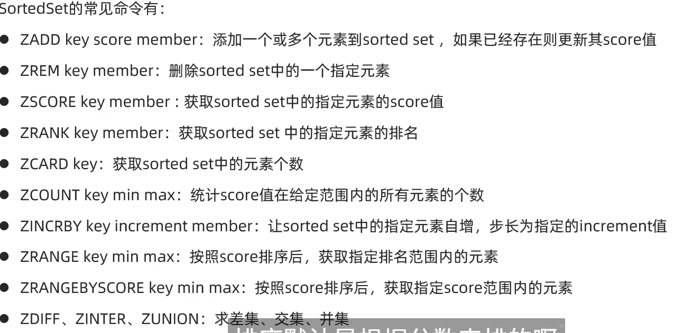
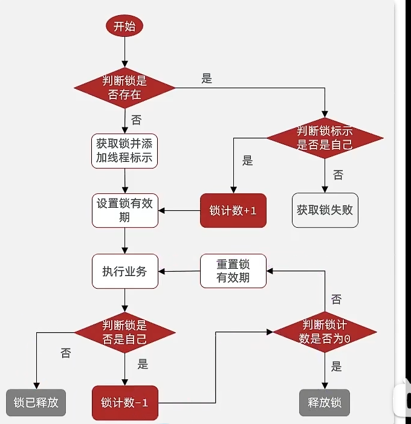

# 五种基本数据类型


## 常用通用命令

1. keys  名字表达式   *表示任意多个字符  ？表示一个字符
2. del  名字  删除一个指定的key 可以删除多个key
3. exists 判断某个key是否存在
4. expire  


## 字符串String类型

value根据类型不同可以分成三类

- string: 普通字符串
- int: 整数类型,可以做自增自减操作
- float: 浮点类型. 也可以做自增自减

string常见命令:

1. set 添加或修改已经存在的一个String类型的键值对
2. get: 根据key获取String类型的value
3. mset : 批量添加多个String类型键值对
4. mget : 根据key 获取多个value值
5. incr : 根据让一个整形key 自增1  注意(浮点数不可以!!!)
6. incrby : 让一个整数key自增并指定步长    可以为负数
7. incrbyfloat: 让一个浮点数key自增并指定步长
8. setnx 设置一个String键值对 前提是这个key不存在
9. setex 设置一个String键值对,并指定有效期

## key的层级

项目名:业务名:类型名:字段名

例如 s-pay-mall:login: id:1

## hash类型

常用命令:

- hset key filed value   添加或修改hash类型key的filed的值
- hget key filed 根据key 和filed获取值
- hmget 批量获取一个hash中多个filed对应的value
- hgetall 获取一个hash中所有filed value键值对
- hkeys 获取一个hash中所有filed
- hvals 获取一个hash中所有values
- hincrby key filed increment 让一个hash中的filed自增并指定步长
- hsetnx 添加一个hash类型key的filed值,前提是这个filed不存在

## list类型

特点

1. 有序
2. 元素可以重复
3. 插入和删除快
4. 查询速度一般

常用命令:

1. lpush key value  向key列表左侧插入一个或多个元素
2. lpop key 移除并返回key列表左侧的元素 可以后面跟数字指定移除元素个数 默认是1 ,如果列表没有元素返回nil
3. rpush …… 同理
4. rpop 同理
5. lrange key start end 指定key 和开始结束的角标,按顺序返回元素,从左边开始

## set类型

特征：

1. 无序
2. 不可重复
3. 查找快

常用命令：

1. sadd key value 向set中添加一个或多个元素
2. srem key value 移除set中的指定元素可以多个
3. scard key 返回set中元素个数
4. sismember key value 判断set中是否有指定元素
5. smembers key 获取set中所有元素
6. sinter key1 key2 获取两个set集合的交集
7. sdiff key1 key2 获取差集
8. sunion 获取并集

## sortedset类型

特征：

1. 可排序
2. 元素不重复
3. 查询速度快



# Java客户端

## jedis


1. 引包

   ```xml
   <dependency>
       <groupId>redis.clients</groupId>
       <artifactId>jedis</artifactId>
       <version>3.9.0</version>
   </dependency>
   ```

2. 连接数据库

   ```java
   jedis = new Jedis("47.94.214.84", 6379);
   jedis.auth("123456");
   jedis.select(0);
   ```

3. 运行

   ```java
   jedis.set("name4","ywz");
   String name = jedis.get("name3");
   System.out.println(name);
   ```


# Redis中级


## 缓存穿透

问题：有人恶意制造大量请求redis缓存和mysql数据库中都没有的数据 这时因为MySQL中没有这样的数据所以也不会缓存到redis中 ，请求都会达到数据库中 造成数据库拥堵，性能降低

解决方案：对于请求redis和MySQL都没有的数据，在第一次到达时为该数据设置一个null值，并设置一个比较短的过期时间

并加入判断逻辑，使第二次及以后的请求不会达到数据库中

## 缓存雪崩

问题：由于redis缓存中大量key突然集体失效或redis宕机导致请求大量到达数据库，造成拥堵，

解决方案：

1. 为redis缓存设置随机的过期时间防止集体大量失效
2. redis集群 //TODO

## 缓存击穿

问题：一个被时刻大量访问的资源在redis中的缓存失效，查询数据的操作一般是先查redis中 如果没有再查数据库然后将数据写入缓存。由于写入缓存和查数据库这一步耗时比查redis慢许多，导致一瞬间有许多请求到达redis时发现没有该缓存

然后都去数据库中查找，导致数据库堵塞

解决方案：

1. 对查询数据库这一步操作设置一个锁，确保同一时间只能有一个请求到达数据库更新缓存，
   好处是能解决缓存击穿问题，坏处是其他请求都在等待

2. 逻辑过期 在缓存数据的同时不显示设置过期时间，在缓存中加一个ttl代表逻辑过期时间，当时间超过逻辑过期时间时，
   依然会争抢锁 然后只有一个请求操作数据库更新缓存，但与第一种不同的是，所有请求不会等待而是直接返回旧数据

   包括抢到锁的请求它会再开一个线程去操作数据库，它本身会直接返回旧数据
   好处是 不会存在请求都在等待的情况提升用户体验，坏处是 丧失了一致性


# 用redis实现分布式锁 version 1.0

通过setnx命令  只有在key不存在时才能设置

分布式锁解决多节点 多线程并发请求服务器时导致同一用户购买单一商品多个


当操作大致为一个 “查询——判断——修改” 流程时，

在多线程环境下，往往要考虑 是否会有线程 在判断 和修改之间插入 造成bug


在查询库存，判断库存，修改库存处加锁

在查询用户id和订单id是否同步出现以及后续判断加锁


redisson实现可重入锁机制




# redis在Java代码中调用的常见api

## StringRedisTemplate.opsForZSet()

以下是 `StringRedisTemplate.opsForZSet()` 的常用命令及其功能说明，适用于操作 Redis 的有序集合（Sorted Set/ZSet）。每个方法均附有 Java 代码示例和对应 Redis 原生命令的映射。

---

### **1. 添加元素**
#### **`add(K key, V value, double score)`**
- **功能**: 向有序集合添加元素，并指定分数（score）。
- **返回值**: `Boolean`，表示是否成功添加（若元素已存在则更新分数）。
- **Redis 命令**: `ZADD`
```java
String key = "leaderboard";
Boolean isAdded = stringRedisTemplate.opsForZSet().add(
    key, "user1", 100.0
);
```

---

### **2. 查询元素**
#### **`range(K key, long start, long end)`**
- **功能**: 按索引范围返回有序集合中的元素（默认升序）。
- **参数**: 
  - `start`: 起始索引（从 0 开始）。
  - `end`: 结束索引（-1 表示末尾）。
- **Redis 命令**: `ZRANGE`
```java
// 获取前10名（升序）
Set<String> top10 = stringRedisTemplate.opsForZSet().range(key, 0, 9);
```

#### **`rangeWithScores(K key, long start, long end)`**
- **功能**: 按索引范围返回元素及其分数。
- **返回值**: `Set<TypedTuple<String>>`（包含值和分数）。
- **Redis 命令**: `ZRANGE WITHSCORES`
```java
Set<ZSetOperations.TypedTuple<String>> top10WithScores = 
    stringRedisTemplate.opsForZSet().rangeWithScores(key, 0, 9);
top10WithScores.forEach(tuple -> 
    System.out.println(tuple.getValue() + ": " + tuple.getScore())
);
```

---

### **3. 删除元素**
#### **`remove(K key, Object... values)`**
- **功能**: 从有序集合中删除指定元素。
- **返回值**: `Long`，表示成功删除的元素数量。
- **Redis 命令**: `ZREM`
```java
Long removedCount = stringRedisTemplate.opsForZSet().remove(key, "user1", "user2");
```

---

### **4. 分数操作**
#### **`incrementScore(K key, V value, double delta)`**
- **功能**: 增加元素的分数（原子操作）。
- **返回值**: `Double`，更新后的分数。
- **Redis 命令**: `ZINCRBY`
```java
Double newScore = stringRedisTemplate.opsForZSet()
    .incrementScore(key, "user1", 50.0); // 将 user1 的分数增加50
```

---

### **5. 排名查询**
#### **`rank(K key, Object value)`**
- **功能**: 获取元素的升序排名（从 0 开始）。
- **Redis 命令**: `ZRANK`
```java
Long rank = stringRedisTemplate.opsForZSet().rank(key, "user1");
```

#### **`reverseRank(K key, Object value)`**
- **功能**: 获取元素的降序排名（从 0 开始）。
- **Redis 命令**: `ZREVRANK`
```java
Long reverseRank = stringRedisTemplate.opsForZSet().reverseRank(key, "user1");
```

---

### **6. 按分数范围查询**
#### **`rangeByScore(K key, double min, double max)`**
- **功能**: 返回分数在 `[min, max]` 范围内的元素（升序）。
- **Redis 命令**: `ZRANGEBYSCORE`
```java
Set<String> users = stringRedisTemplate.opsForZSet()
    .rangeByScore(key, 80.0, 200.0);
```

#### **`reverseRangeByScore(K key, double min, double max)`**
- **功能**: 返回分数在 `[min, max]` 范围内的元素（降序）。
- **Redis 命令**: `ZREVRANGEBYSCORE`
```java
Set<String> users = stringRedisTemplate.opsForZSet()
    .reverseRangeByScore(key, 80.0, 200.0);
```

---

### **7. 统计操作**
#### **`count(K key, double min, double max)`**
- **功能**: 统计分数在 `[min, max]` 范围内的元素数量。
- **Redis 命令**: `ZCOUNT`
```java
Long count = stringRedisTemplate.opsForZSet()
    .count(key, 100.0, 500.0);
```

#### **`size(K key)`**
- **功能**: 返回有序集合的元素总数。
- **Redis 命令**: `ZCARD`
```java
Long total = stringRedisTemplate.opsForZSet().size(key);
```

---

### **8. 集合运算**
#### **`unionAndStore(K key, K otherKey, K destKey)`**
- **功能**: 计算两个有序集合的并集，结果存入 `destKey`。
- **返回值**: `Long`，结果集合的元素数量。
- **Redis 命令**: `ZUNIONSTORE`
```java
Long resultSize = stringRedisTemplate.opsForZSet()
    .unionAndStore("leaderboard1", "leaderboard2", "combined_leaderboard");
```

#### **`intersectAndStore(K key, K otherKey, K destKey)`**
- **功能**: 计算两个有序集合的交集，结果存入 `destKey`。
- **Redis 命令**: `ZINTERSTORE`
```java
Long resultSize = stringRedisTemplate.opsForZSet()
    .intersectAndStore("leaderboard1", "leaderboard2", "common_leaderboard");
```

---

### **9. 删除范围元素**
#### **`removeRangeByScore(K key, double min, double max)`**
- **功能**: 删除分数在 `[min, max]` 范围内的元素。
- **Redis 命令**: `ZREMRANGEBYSCORE`
```java
Long removed = stringRedisTemplate.opsForZSet()
    .removeRangeByScore(key, 0.0, 50.0);
```

---

### **典型应用场景**
1. **排行榜**  
   ```java
   // 获取前10名（降序）
   Set<String> top10 = stringRedisTemplate.opsForZSet()
       .reverseRange(key, 0, 9);
   ```

2. **实时积分更新**  
   ```java
   // 用户完成任务，增加积分
   Double newScore = stringRedisTemplate.opsForZSet()
       .incrementScore("user_scores", "user123", 50.0);
   ```

3. **数据过滤**  
   ```java
   // 查询积分在 100~500 的用户（按升序）
   Set<String> filteredUsers = stringRedisTemplate.opsForZSet()
       .rangeByScore("user_scores", 100.0, 500.0);
   ```

---

### **注意事项**
1. **分数精度**  
   Redis 使用双精度浮点数存储分数，可能存在精度丢失问题（如 `100.0` 可能存储为 `100`）。

2. **性能优化**  
   - 避免对大集合频繁执行 `ZUNIONSTORE` 或 `ZINTERSTORE`，可能导致阻塞。
   - 对高频更新的场景，优先使用 `incrementScore` 而非删除后重新插入。

3. **分页查询**  
   结合 `range` 和 `reverseRange` 实现分页：
   ```java
   // 分页查询（每页10条，第2页）
   int page = 2, pageSize = 10;
   Set<String> pageData = stringRedisTemplate.opsForZSet()
       .reverseRange(key, (page-1)*pageSize, page*pageSize-1);
   ```

## StringRedisTemplate.opsForHash()

以下是 `StringRedisTemplate.opsForHash()` 的常用命令及功能说明，用于操作 Redis 的 Hash 结构（键值对集合）。每个方法对应 Redis 的 Hash 原生命令，并附 Java 代码示例。

---

### **1. 添加或更新字段值**
#### **`put(K key, HK hashKey, HV value)`**
- **功能**：向 Hash 中添加或更新一个字段（`hashKey`）的值。
- **Redis 命令**：`HSET`
- **示例**：
  ```java
  String key = "user:1001";
  stringRedisTemplate.opsForHash().put(key, "name", "Alice");
  stringRedisTemplate.opsForHash().put(key, "age", "25");
  ```

#### **`putAll(K key, Map<? extends HK, ? extends HV> map)`**
- **功能**：批量添加多个字段到 Hash 中。
- **Redis 命令**：`HMSET`
- **示例**：
  ```java
  Map<String, String> userData = new HashMap<>();
  userData.put("name", "Bob");
  userData.put("email", "bob@example.com");
  stringRedisTemplate.opsForHash().putAll(key, userData);
  ```

---

### **2. 获取字段值**
#### **`get(K key, Object hashKey)`**
- **功能**：获取 Hash 中指定字段的值。
- **Redis 命令**：`HGET`
- **示例**：
  ```java
  String name = (String) stringRedisTemplate.opsForHash().get(key, "name");
  System.out.println(name); // 输出 "Alice"
  ```

#### **`entries(K key)`**
- **功能**：获取 Hash 中所有字段和值。
- **Redis 命令**：`HGETALL`
- **示例**：
  ```java
  Map<Object, Object> allFields = stringRedisTemplate.opsForHash().entries(key);
  allFields.forEach((k, v) -> System.out.println(k + ": " + v));
  ```

---

### **3. 删除字段**
#### **`delete(K key, Object... hashKeys)`**
- **功能**：删除 Hash 中的一个或多个字段。
- **Redis 命令**：`HDEL`
- **示例**：
  ```java
  Long deletedCount = stringRedisTemplate.opsForHash().delete(key, "age", "email");
  System.out.println("删除字段数量：" + deletedCount);
  ```

---

### **4. 判断字段是否存在**
#### **`hasKey(K key, Object hashKey)`**
- **功能**：检查 Hash 中是否包含某个字段。
- **Redis 命令**：`HEXISTS`
- **示例**：
  ```java
  boolean hasName = stringRedisTemplate.opsForHash().hasKey(key, "name");
  System.out.println("是否包含 name 字段：" + hasName); // 输出 true
  ```

---

### **5. 获取所有字段或值**
#### **`keys(K key)`**
- **功能**：获取 Hash 中所有字段名。
- **Redis 命令**：`HKEYS`
- **示例**：
  ```java
  Set<Object> fields = stringRedisTemplate.opsForHash().keys(key);
  System.out.println("所有字段：" + fields); // 输出 [name, age, email]
  ```

#### **`values(K key)`**
- **功能**：获取 Hash 中所有字段值。
- **Redis 命令**：`HVALS`
- **示例**：
  ```java
  List<Object> values = stringRedisTemplate.opsForHash().values(key);
  System.out.println("所有值：" + values); // 输出 [Alice, 25, bob@example.com]
  ```

---

### **6. 数值增减**
#### **`increment(K key, HK hashKey, long delta)`**
- **功能**：对 Hash 中的数值字段进行增减操作（整数类型）。
- **Redis 命令**：`HINCRBY`
- **示例**：
  ```java
  // 将 age 字段增加 1
  Long newAge = stringRedisTemplate.opsForHash().increment(key, "age", 1);
  System.out.println("更新后的年龄：" + newAge); // 输出 26
  ```

#### **`increment(K key, HK hashKey, double delta)`**
- **功能**：对 Hash 中的数值字段进行增减操作（浮点数类型）。
- **Redis 命令**：`HINCRBYFLOAT`
- **示例**：
  ```java
  // 将 score 字段增加 0.5
  Double newScore = stringRedisTemplate.opsForHash().increment(key, "score", 0.5);
  System.out.println("更新后的分数：" + newScore); // 输出 90.5
  ```

---

### **7. 批量获取字段值**
#### **`multiGet(K key, Collection<HK> hashKeys)`**
- **功能**：批量获取 Hash 中多个字段的值。
- **Redis 命令**：`HMGET`
- **示例**：
  ```java
  List<Object> values = stringRedisTemplate.opsForHash().multiGet(
      key, Arrays.asList("name", "age")
  );
  System.out.println("批量获取结果：" + values); // 输出 [Alice, 26]
  ```

---

### **8. 字段数量统计**
#### **`size(K key)`**
- **功能**：获取 Hash 中的字段总数。
- **Redis 命令**：`HLEN`
- **示例**：
  ```java
  Long fieldCount = stringRedisTemplate.opsForHash().size(key);
  System.out.println("字段总数：" + fieldCount); // 输出 3
  ```

---

### **典型应用场景**
#### **存储用户信息**
```java
// 存储用户数据
String userId = "user:1002";
stringRedisTemplate.opsForHash().put(userId, "name", "Charlie");
stringRedisTemplate.opsForHash().put(userId, "role", "admin");

// 获取用户角色
String role = (String) stringRedisTemplate.opsForHash().get(userId, "role");
System.out.println("用户角色：" + role); // 输出 "admin"
```

---

### **注意事项**
1. **性能优化**  
   - `entries` 和 `values` 会返回所有数据，若 Hash 较大可能影响性能，建议分页或按需获取。  
   - 批量操作（如 `putAll`、`multiGet`）比单次操作更高效。

2. **类型安全**  
   - `HashOperations` 的泛型需与 `StringRedisTemplate` 的序列化器一致（默认 `String` 类型键值）。

3. **字段过期**  
   Redis Hash 不支持单个字段的过期时间，需整体设置或改用 String 结构。

## stringRedisTemplate.opsForSet()

以下是 `StringRedisTemplate.opsForSet()` 的常用方法及说明，用于操作 Redis 的 **Set 集合**。每个方法均附 Java 代码示例和对应 Redis 命令的映射。

---

### **1. 添加元素**
#### **`add(K key, V... values)`**
- **功能**: 向 Set 中添加一个或多个元素。
- **返回值**: `Long`，表示成功添加的元素数量（重复元素不计数）。
- **Redis 命令**: `SADD`
```java
String key = "tags";
Long addedCount = stringRedisTemplate.opsForSet().add(key, "java", "redis", "spring");
// 输出: 3 (若元素均未存在)
```

---

### **2. 删除元素**
#### **`remove(K key, Object... values)`**
- **功能**: 从 Set 中删除一个或多个元素。
- **返回值**: `Long`，表示成功删除的元素数量。
- **Redis 命令**: `SREM`
```java
Long removedCount = stringRedisTemplate.opsForSet().remove(key, "java", "python");
// 输出: 1 (若 "java" 存在，"python" 不存在)
```

---

### **3. 查询元素**
#### **`members(K key)`**
- **功能**: 返回 Set 中所有元素。
- **Redis 命令**: `SMEMBERS`
```java
Set<String> elements = stringRedisTemplate.opsForSet().members(key);
// 输出: ["redis", "spring", ...]
```

#### **`isMember(K key, Object value)`**
- **功能**: 检查元素是否在 Set 中。
- **返回值**: `Boolean`
- **Redis 命令**: `SISMEMBER`
```java
boolean exists = stringRedisTemplate.opsForSet().isMember(key, "redis");
// 输出: true
```

---

### **4. 随机获取元素**
#### **`randomMember(K key)`**
- **功能**: 随机返回一个元素（可能重复）。
- **Redis 命令**: `SRANDMEMBER`
```java
String randomElement = stringRedisTemplate.opsForSet().randomMember(key);
```

#### **`distinctRandomMembers(K key, long count)`**
- **功能**: 随机返回多个 **不重复** 的元素。
- **Redis 命令**: `SRANDMEMBER count`
```java
Set<String> randomElements = stringRedisTemplate.opsForSet()
    .distinctRandomMembers(key, 2);
// 输出: ["redis", "spring"]
```

---

### **5. 集合运算**
#### **`intersect(K key, K otherKey)`**
- **功能**: 返回两个 Set 的交集。
- **Redis 命令**: `SINTER`
```java
Set<String> intersection = stringRedisTemplate.opsForSet()
    .intersect("set1", "set2");
// 输出: 公共元素集合
```

#### **`union(K key, K otherKey)`**
- **功能**: 返回两个 Set 的并集。
- **Redis 命令**: `SUNION`
```java
Set<String> union = stringRedisTemplate.opsForSet()
    .union("set1", "set2");
// 输出: 合并后去重的元素集合
```

#### **`difference(K key, K otherKey)`**
- **功能**: 返回属于第一个 Set 但不属于第二个 Set 的元素（差集）。
- **Redis 命令**: `SDIFF`
```java
Set<String> diff = stringRedisTemplate.opsForSet()
    .difference("set1", "set2");
// 输出: set1 中有但 set2 中没有的元素
```

---

### **6. 移动元素**
#### **`move(K sourceKey, V value, K destKey)`**
- **功能**: 将元素从一个 Set 移动到另一个 Set。
- **返回值**: `Boolean`，表示是否移动成功。
- **Redis 命令**: `SMOVE`
```java
boolean isMoved = stringRedisTemplate.opsForSet()
    .move("sourceSet", "redis", "destSet");
// 输出: true（若元素存在且移动成功）
```

---

### **7. 集合大小**
#### **`size(K key)`**
- **功能**: 返回 Set 的元素总数。
- **Redis 命令**: `SCARD`
```java
Long total = stringRedisTemplate.opsForSet().size("tags");
// 输出: 2
```

---

### **8. 集合存储运算结果**
#### **`intersectAndStore(K key, K otherKey, K destKey)`**
- **功能**: 计算两个 Set 的交集，并将结果存储到 `destKey`。
- **返回值**: `Long`，结果集合的元素数量。
- **Redis 命令**: `SINTERSTORE`
```java
Long count = stringRedisTemplate.opsForSet()
    .intersectAndStore("set1", "set2", "commonSet");
// 输出: 交集元素数量
```

---

### **典型应用场景**
#### **标签系统**
```java
// 为用户添加标签
stringRedisTemplate.opsForSet().add("user:1001:tags", "java", "backend");
// 检查用户是否有某标签
boolean hasTag = stringRedisTemplate.opsForSet()
    .isMember("user:1001:tags", "java");
// 获取用户所有标签
Set<String> tags = stringRedisTemplate.opsForSet()
    .members("user:1001:tags");
```

---

### **注意事项**
1. **唯一性**  
   Set 自动去重，重复添加同一元素不会增加集合大小。
2. **无序性**  
   Set 中的元素无固定顺序，`members` 返回的结果顺序不固定。
3. **性能优化**  
   - 避免对大集合频繁执行 `members`，改用 `scan` 分页遍历。  
   - 集合运算（如 `union`）复杂度为 O(N)，需控制集合规模。


## stringRedisTemplate.opsForValue()

以下是 `StringRedisTemplate.opsForValue()` 的常用方法及说明，适用于 Redis 的 **字符串（String）类型** 操作。每个方法均提供 Java 代码示例和对应的 Redis 原生命令。

---

### **1. 设置键值对**
#### **`set(K key, V value)`**
- **功能**: 设置键值对（覆盖旧值）。
- **Redis 命令**: `SET`
```java
stringRedisTemplate.opsForValue().set("username", "admin");
```

#### **`set(K key, V value, Duration timeout)`**
- **功能**: 设置键值对并指定过期时间。
- **Redis 命令**: `SETEX` 或 `SET` + `EXPIRE`
```java
// 设置值，并设置 30 秒后过期
stringRedisTemplate.opsForValue().set(
    "temp_token", "abc123", Duration.ofSeconds(30)
);
```

---

### **2. 获取值**
#### **`get(K key)`**
- **功能**: 根据键获取值（键不存在返回 `null`）。
- **Redis 命令**: `GET`
```java
String value = stringRedisTemplate.opsForValue().get("username");
System.out.println(value); // 输出 "admin"
```

---

### **3. 原子性增减操作**
#### **`increment(K key, long delta)`**
- **功能**: 对整数值进行原子性增加（支持负数）。
- **Redis 命令**: `INCRBY`
```java
// 初始值为 0 → 增加 5 → 结果为 5
Long newValue = stringRedisTemplate.opsForValue().increment("counter", 5);
```

#### **`increment(K key, double delta)`**
- **功能**: 对浮点数值进行原子性增加（需 Redis 2.6+）。
- **Redis 命令**: `INCRBYFLOAT`
```java
// 初始值为 10.5 → 增加 2.3 → 结果为 12.8
Double newValue = stringRedisTemplate.opsForValue().increment("price", 2.3);
```

---

### **4. 条件性设置值**
#### **`setIfAbsent(K key, V value)`**
- **功能**: 仅当键不存在时设置值（类似分布式锁）。
- **Redis 命令**: `SETNX`
```java
Boolean isSet = stringRedisTemplate.opsForValue().setIfAbsent("lock", "1");
System.out.println(isSet); // 输出 true（首次设置成功）
```

#### **`setIfPresent(K key, V value)`**
- **功能**: 仅当键存在时覆盖其值。
- **Redis 命令**: `SET` + `XX` 参数
```java
Boolean isUpdated = stringRedisTemplate.opsForValue().setIfPresent("lock", "2");
System.out.println(isUpdated); // 输出 true（键存在时更新成功）
```

---

### **5. 批量操作**
#### **`multiSet(Map<? extends K, ? extends V> map)`**
- **功能**: 批量设置多个键值对。
- **Redis 命令**: `MSET`
```java
Map<String, String> data = new HashMap<>();
data.put("config1", "value1");
data.put("config2", "value2");
stringRedisTemplate.opsForValue().multiSet(data);
```

#### **`multiGet(List<K> keys)`**
- **功能**: 批量获取多个键的值。
- **Redis 命令**: `MGET`
```java
List<String> values = stringRedisTemplate.opsForValue().multiGet(
    Arrays.asList("config1", "config2")
);
// 输出: ["value1", "value2"]
```

---

### **6. 位操作**
#### **`setBit(K key, long offset, boolean value)`**
- **功能**: 设置二进制位的值（`true`=1，`false`=0）。
- **Redis 命令**: `SETBIT`
```java
// 将第 7 位设为 1（偏移量从 0 开始）
stringRedisTemplate.opsForValue().setBit("bitmap", 7, true);
```

#### **`getBit(K key, long offset)`**
- **功能**: 获取二进制位的值。
- **Redis 命令**: `GETBIT`
```java
Boolean bit = stringRedisTemplate.opsForValue().getBit("bitmap", 7);
System.out.println(bit); // 输出 true
```

---

### **7. 其他实用方法**
#### **`append(K key, String value)`**
- **功能**: 向键的字符串末尾追加内容。
- **Redis 命令**: `APPEND`
```java
Integer newLength = stringRedisTemplate.opsForValue().append("log", "error");
// 返回追加后的字符串长度
```

#### **`size(K key)`**
- **功能**: 获取字符串值的长度。
- **Redis 命令**: `STRLEN`
```java
Long length = stringRedisTemplate.opsForValue().size("log");
System.out.println(length); // 输出 5（假设值为 "error"）
```

---

### **典型应用场景**
#### **缓存数据**
```java
// 缓存用户信息（30分钟过期）
stringRedisTemplate.opsForValue().set(
    "user:1001", 
    "{'name':'Alice','age':25}", 
    Duration.ofMinutes(30)
);

// 读取缓存
String userJson = stringRedisTemplate.opsForValue().get("user:1001");
```

#### **分布式计数器**
```java
// 初始化计数器
stringRedisTemplate.opsForValue().set("page_views", "0");

// 每次访问增加计数
Long views = stringRedisTemplate.opsForValue().increment("page_views");
System.out.println("总访问量: " + views);
```

---

### **注意事项**
1. **值类型限制**  
   - `increment` 方法要求键的值必须是数字（整数或浮点数字符串）。
   - 非数字字符串使用 `increment` 会抛出异常。

2. **二进制安全**  
   Redis 字符串可存储任意二进制数据（如图片字节），但 `StringRedisTemplate` 默认使用 UTF-8 编码。

3. **性能优化**  
   - 批量操作（`multiSet`/`multiGet`）比单次操作更高效。  
   - 频繁的小数据读写适合用字符串类型，大文本建议分块或使用 Hash 结构。

---

通过掌握这些方法，可以高效利用 Redis 字符串类型实现缓存、计数器、分布式锁等常见功能。

## StringRedisTemplate.opsForList()

以下是 `StringRedisTemplate.opsForList()` 的常用方法及说明，用于操作 Redis 的 **列表（List）结构**。每个方法均附 Java 代码示例和对应的 Redis 原生命令。

---

### **1. 添加元素**
#### **`leftPush(K key, V value)`**
- **功能**: 在列表的 **头部（左侧）** 插入一个元素。
- **Redis 命令**: `LPUSH`
- **返回值**: 插入后列表的长度。
```java
Long length = stringRedisTemplate.opsForList().leftPush("tasks", "task1");
// 结果: 列表长度变为 1
```

#### **`rightPush(K key, V value)`**
- **功能**: 在列表的 **尾部（右侧）** 插入一个元素。
- **Redis 命令**: `RPUSH`
```java
Long length = stringRedisTemplate.opsForList().rightPush("messages", "msg1");
// 结果: 列表长度变为 1
```

---

### **2. 获取元素**
#### **`range(K key, long start, long end)`**
- **功能**: 获取列表中指定索引范围的元素（包含头尾）。
- **Redis 命令**: `LRANGE`
- **参数**:
  - `start`: 起始索引（从 0 开始）。
  - `end`: 结束索引（-1 表示末尾）。
```java
List<String> tasks = stringRedisTemplate.opsForList().range("tasks", 0, -1);
// 结果: ["task1", "task2", "task3"]
```

#### **`index(K key, long index)`**
- **功能**: 获取列表中指定索引位置的元素。
- **Redis 命令**: `LINDEX`
```java
String firstTask = stringRedisTemplate.opsForList().index("tasks", 0);
// 结果: "task1"
```

---

### **3. 删除元素**
#### **`leftPop(K key)`**
- **功能**: 移除并返回列表 **头部（左侧）** 的第一个元素。
- **Redis 命令**: `LPOP`
```java
String firstTask = stringRedisTemplate.opsForList().leftPop("tasks");
// 结果: "task1"（列表变为 ["task2", "task3"]）
```

#### **`rightPop(K key)`**
- **功能**: 移除并返回列表 **尾部（右侧）** 的最后一个元素。
- **Redis 命令**: `RPOP`
```java
String lastTask = stringRedisTemplate.opsForList().rightPop("tasks");
// 结果: "task3"（列表变为 ["task2"]）
```

#### **`remove(K key, long count, Object value)`**
- **功能**: 删除列表中指定数量的匹配元素。
- **Redis 命令**: `LREM`
- **参数**:
  - `count > 0`: 从头部开始删除 `count` 个匹配项。
  - `count < 0`: 从尾部开始删除 `count` 个匹配项。
  - `count = 0`: 删除所有匹配项。
```java
Long removedCount = stringRedisTemplate.opsForList().remove("tasks", 1, "task2");
// 结果: 1（列表变为空）
```

---

### **4. 列表修剪**
#### **`trim(K key, long start, long end)`**
- **功能**: 保留列表中指定索引范围的元素，删除范围外的元素。
- **Redis 命令**: `LTRIM`
```java
stringRedisTemplate.opsForList().trim("tasks", 0, 1);
// 结果: 仅保留前两个元素
```

---

### **5. 列表长度**
#### **`size(K key)`**
- **功能**: 返回列表的元素数量。
- **Redis 命令**: `LLEN`
```java
Long size = stringRedisTemplate.opsForList().size("tasks");
// 结果: 3
```

---

### **6. 阻塞操作**
#### **`leftPop(K key, Duration timeout)`**
- **功能**: 阻塞地从列表头部移除并返回元素，若列表为空则等待指定时间。
- **Redis 命令**: `BLPOP`
```java
String task = stringRedisTemplate.opsForList().leftPop("tasks", Duration.ofSeconds(10));
// 结果: 若 10 秒内有元素，返回元素；否则返回 null
```

#### **`rightPop(K key, Duration timeout)`**
- **功能**: 阻塞地从列表尾部移除并返回元素，若列表为空则等待指定时间。
- **Redis 命令**: `BRPOP`
```java
String task = stringRedisTemplate.opsForList().rightPop("tasks", Duration.ofSeconds(10));
```

---

### **7. 插入元素到指定位置**
#### **`set(K key, long index, V value)`**
- **功能**: 修改列表中指定索引位置的元素。
- **Redis 命令**: `LSET`
```java
stringRedisTemplate.opsForList().set("tasks", 0, "newTask1");
// 结果: 索引 0 的元素被更新为 "newTask1"
```

---

### **典型应用场景**
#### **消息队列（生产者-消费者模型）**
```java
// 生产者推送消息到队列尾部
stringRedisTemplate.opsForList().rightPush("message_queue", "msg1");

// 消费者从队列头部获取消息
String message = stringRedisTemplate.opsForList().leftPop("message_queue");
```

#### **最新消息列表**
```java
// 插入新消息到头部，保留最近 10 条
stringRedisTemplate.opsForList().leftPush("latest_news", "news1");
stringRedisTemplate.opsForList().trim("latest_news", 0, 9);
```

---

### **注意事项**
1. **索引范围**  
   Redis 列表索引从 `0` 开始，负数表示从末尾计算（如 `-1` 表示最后一个元素）。

2. **性能优化**  
   - 避免对大列表频繁执行 `range(0, -1)`，改用分页查询。
   - `LPUSH`/`RPUSH` 的时间复杂度为 O(1)，适合高频插入。

3. **阻塞操作**  
   - `leftPop`/`rightPop` 的阻塞版本适用于实现简单的消息队列，但需注意线程安全。

---

通过上述方法，可以灵活操作 Redis 列表实现队列、栈、实时日志存储等功能。


# geo命令及在Java中的使用

Redis 的 **GEO** 功能用于存储和操作地理位置信息，支持计算距离、查询附近位置等场景。它基于有序集合（Sorted Set）实现，通过 **Geohash** 算法将经纬度编码为分数，从而高效支持地理空间查询。以下是详细介绍及 Java 中的使用方法：

---

### **一、Redis GEO 核心命令**
| 命令                | 功能                                      | 示例                                      |
| ------------------- | ----------------------------------------- | ----------------------------------------- |
| `GEOADD`            | 添加地理位置（经度、纬度、成员）          | `GEOADD cities 116.40 39.90 beijing`      |
| `GEOPOS`            | 获取成员的经纬度                          | `GEOPOS cities beijing`                   |
| `GEODIST`           | 计算两个成员间的距离（单位：米/千米等）   | `GEODIST cities beijing shanghai km`      |
| `GEORADIUS`         | 查询某经纬度半径内的成员                  | `GEORADIUS cities 116 39 100 km`          |
| `GEORADIUSBYMEMBER` | 查询某成员半径内的其他成员                | `GEORADIUSBYMEMBER cities beijing 200 km` |
| `GEOHASH`           | 获取成员的 Geohash 编码（缩短位置字符串） | `GEOHASH cities beijing`                  |

---

### **二、Java 中使用 Redis GEO（以 Jedis 为例）**
以下是 `StringRedisTemplate.opsForGeo()` 的常用方法及说明，用于操作 Redis 的地理位置（GEO）功能。每个方法均附 Java 代码示例和对应的 Redis 原生命令。

---

### **1. 添加地理位置**
#### **`geoAdd(K key, Point point, String member)`**
- **功能**: 向指定键添加地理位置（成员名称 + 经纬度）。
- **Redis 命令**: `GEOADD`
```java
String key = "cities";
// 添加北京（经度 116.40，纬度 39.90）
stringRedisTemplate.opsForGeo().add(
    key, 
    new Point(116.40, 39.90), 
    "beijing"
);
```

---

### **2. 获取地理位置**
#### **`geoPos(K key, String... members)`**
- **功能**: 获取成员的经纬度坐标。
- **Redis 命令**: `GEOPOS`
```java
List<Point> positions = stringRedisTemplate.opsForGeo().position(key, "beijing");
if (!positions.isEmpty()) {
    Point point = positions.get(0);
    System.out.println("北京坐标: 经度=" + point.getX() + ", 纬度=" + point.getY());
}
```

---

### **3. 计算两地距离**
#### **`geoDist(K key, String member1, String member2, Metric metric)`**
- **功能**: 计算两个成员间的距离（支持单位：米、千米等）。
- **Redis 命令**: `GEODIST`
```java
Distance distance = stringRedisTemplate.opsForGeo().distance(
    key, 
    "beijing", 
    "shanghai", 
    Metrics.KILOMETERS
);
System.out.println("北京到上海距离: " + distance.getValue() + " 公里");
```

---

### **4. 搜索附近位置**
#### **`geoRadius(K key, Circle within)`**
- **功能**: 以指定经纬度为中心，搜索半径内的成员。
- **Redis 命令**: `GEORADIUS`
```java
// 定义中心点（经度 116.40，纬度 39.90）和半径 500 公里
Circle circle = new Circle(new Point(116.40, 39.90), new Distance(500, Metrics.KILOMETERS));

// 查询并返回成员、距离、坐标
GeoResults<GeoLocation<String>> results = stringRedisTemplate.opsForGeo().radius(
    key, 
    circle,
    RedisGeoCommands.GeoRadiusCommandArgs.newGeoRadiusArgs()
        .includeDistance()  // 包含距离
        .includeCoordinates() // 包含坐标
        .sortAscending()    // 按距离升序排序
        .limit(10)          // 限制返回数量
);

results.forEach(geoResult -> {
    GeoLocation<String> location = geoResult.getContent();
    Distance distance = geoResult.getDistance();
    System.out.printf(
        "成员: %s, 距离: %.2f km, 坐标: (%.4f, %.4f)\n",
        location.getName(), 
        distance.getValue(),
        location.getPoint().getX(),
        location.getPoint().getY()
    );
});
```

#### **`geoRadiusByMember(K key, String member, Distance distance)`**
- **功能**: 以某个成员为中心，搜索半径内的其他成员。
- **Redis 命令**: `GEORADIUSBYMEMBER`
```java
// 搜索北京周围 1000 公里内的城市
GeoResults<GeoLocation<String>> results = stringRedisTemplate.opsForGeo().radius(
    key, 
    "beijing", 
    new Distance(1000, Metrics.KILOMETERS),
    RedisGeoCommands.GeoRadiusCommandArgs.newGeoRadiusArgs()
        .includeDistance()
        .sortAscending()
);
```

---

### **5. 获取 Geohash**
#### **`geoHash(K key, String... members)`**
- **功能**: 获取成员的 Geohash 编码（缩短位置字符串）。
- **Redis 命令**: `GEOHASH`
```java
List<String> geohashes = stringRedisTemplate.opsForGeo().hash(key, "beijing");
System.out.println("北京 Geohash: " + geohashes.get(0)); // 输出如 "wx4g0b7xrt0"
```

---

### **6. 删除地理位置**
#### **`geoRemove(K key, String... members)`**
- **功能**: 删除指定成员的地理位置信息。
- **Redis 命令**: `ZREM`（GEO 数据实际存储在 Sorted Set 中）
```java
Long removedCount = stringRedisTemplate.opsForGeo().remove(key, "beijing");
System.out.println("删除成员数量: " + removedCount);
```

---

### **典型应用场景**
#### **附近商家查询**
```java
// 用户当前位置（经度 116.40，纬度 39.90）
Point userLocation = new Point(116.40, 39.90);

// 搜索 5 公里内的商家
Circle radius = new Circle(userLocation, new Distance(5, Metrics.KILOMETERS));
GeoResults<GeoLocation<String>> shops = stringRedisTemplate.opsForGeo().radius(
    "shops", 
    radius,
    RedisGeoCommands.GeoRadiusCommandArgs.newGeoRadiusArgs()
        .includeDistance()
        .sortAscending()
        .limit(20)
);
```

---

### **注意事项**
1. **坐标有效性**  
   - 经度范围：`-180 ~ 180`  
   - 纬度范围：`-85.05 ~ 85.05`  
   超出范围会导致添加失败。

2. **性能优化**  
   - 使用 `limit` 限制返回结果数量，避免大范围查询阻塞服务。  
   - 数据量大时，建议按区域分片存储（如 `cities:beijing`、`cities:shanghai`）。

3. **数据存储结构**  
   GEO 数据底层使用 Sorted Set 存储，可通过 `ZRANGE` 或 `ZREM` 操作成员，但需谨慎避免破坏地理索引。

---

通过 `StringRedisTemplate.opsForGeo()` 可以高效实现地理位置相关功能，适用于 LBS（基于位置的服务）、物流跟踪、周边搜索等场景。