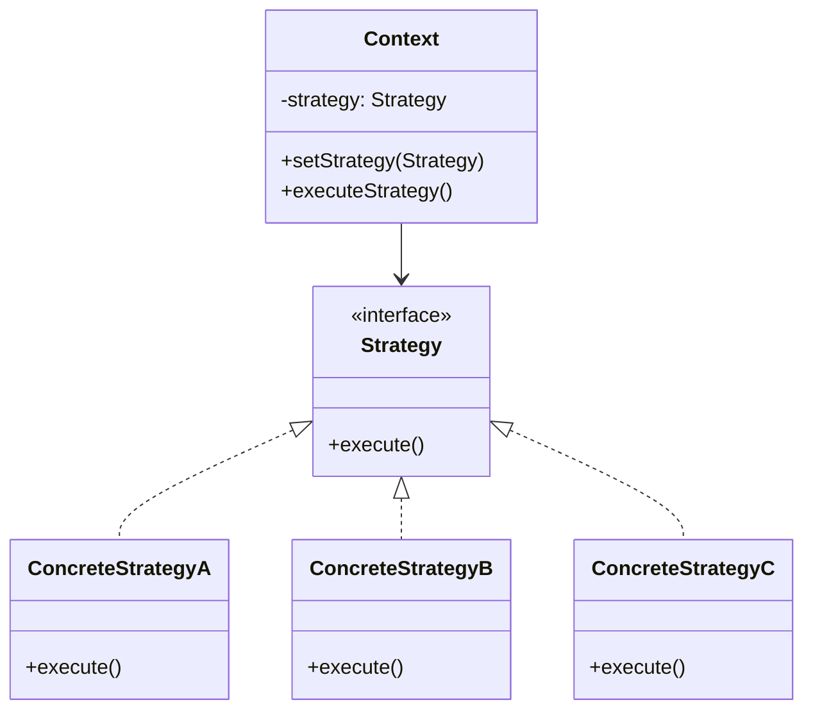

# 策略模式（Strategy Pattern）深度解析

策略模式是一种**行为型设计模式**，它允许在运行时选择算法的行为。该模式将算法封装在独立的类中，使它们可以相互替换，让算法的变化独立于使用它的客户端。

## 一、核心思想：解耦算法与使用

策略模式的核心是**将算法从使用它的对象中分离出来**，通过定义一系列可互换的算法类，让客户端能够根据需要动态切换算法。

### 关键特性：
- **开放封闭原则**：无需修改现有代码即可添加新算法
- **消除条件语句**：避免复杂的if-else或switch-case结构
- **运行时灵活性**：在运行时动态切换算法

## 二、经典结构



### 核心角色：
1. **Context（上下文）**：
   - 维护对策略对象的引用
   - 提供设置策略的方法
   - 执行策略接口

2. **Strategy（策略接口）**：
   - 声明所有具体策略必须实现的算法方法

3. **ConcreteStrategy（具体策略）**：
   - 实现策略接口的具体算法类

## 三、完整代码示例

### 场景：电商平台折扣策略
不同用户类型享受不同折扣：
- 普通用户：无折扣
- VIP用户：9折
- 超级VIP用户：8折
- 新用户：首单立减50元

```java
// 1. 策略接口
public interface DiscountStrategy {
    double applyDiscount(double originalPrice);
}

// 2. 具体策略实现
// 普通用户策略
public class NoDiscountStrategy implements DiscountStrategy {
    @Override
    public double applyDiscount(double originalPrice) {
        return originalPrice;
    }
}

// VIP用户策略
public class VipDiscountStrategy implements DiscountStrategy {
    @Override
    public double applyDiscount(double originalPrice) {
        return originalPrice * 0.9;
    }
}

// 超级VIP策略
public class SuperVipDiscountStrategy implements DiscountStrategy {
    @Override
    public double applyDiscount(double originalPrice) {
        return originalPrice * 0.8;
    }
}

// 新用户策略
public class NewUserDiscountStrategy implements DiscountStrategy {
    @Override
    public double applyDiscount(double originalPrice) {
        return Math.max(0, originalPrice - 50);
    }
}

// 3. 上下文类
public class OrderContext {
    private DiscountStrategy strategy;
    
    public void setStrategy(DiscountStrategy strategy) {
        this.strategy = strategy;
    }
    
    public double calculateFinalPrice(double originalPrice) {
        return strategy.applyDiscount(originalPrice);
    }
}

// 4. 客户端使用
public class Client {
    public static void main(String[] args) {
        OrderContext order = new OrderContext();
        double originalPrice = 300.0;
        
        // 普通用户
        order.setStrategy(new NoDiscountStrategy());
        System.out.println("普通用户价格: " + order.calculateFinalPrice(originalPrice));
        
        // VIP用户
        order.setStrategy(new VipDiscountStrategy());
        System.out.println("VIP用户价格: " + order.calculateFinalPrice(originalPrice));
        
        // 超级VIP用户
        order.setStrategy(new SuperVipDiscountStrategy());
        System.out.println("超级VIP价格: " + order.calculateFinalPrice(originalPrice));
        
        // 新用户
        order.setStrategy(new NewUserDiscountStrategy());
        System.out.println("新用户价格: " + order.calculateFinalPrice(originalPrice));
    }
}
```

## 四、策略模式 vs 条件语句

### 传统if-else实现：
```java
public double calculatePrice(UserType userType, double price) {
    switch (userType) {
        case NORMAL:
            return price;
        case VIP:
            return price * 0.9;
        case SUPER_VIP:
            return price * 0.8;
        case NEW_USER:
            return Math.max(0, price - 50);
        default:
            throw new IllegalArgumentException("未知用户类型");
    }
}
```

### 策略模式优势：
| **方面**     | **if-else/switch**    | **策略模式**                  |
| ------------ | --------------------- | ----------------------------- |
| **可扩展性** | 修改需改动原方法      | 新增策略类即可                |
| **可维护性** | 方法随业务增长变复杂  | 每个策略独立维护              |
| **可测试性** | 需覆盖所有分支        | 可单独测试每个策略            |
| **代码复用** | 相似逻辑可能重复      | 策略可被多个上下文复用        |
| **业务隔离** | 所有逻辑混在一起      | 业务逻辑分离清晰              |
| **复杂度**   | O(n) - 分支越多越复杂 | O(1) - 添加策略不影响现有代码 |

## 五、应用场景

### 1. 支付方式选择
```java
// 策略接口
public interface PaymentStrategy {
    void pay(double amount);
}

// 具体策略
public class CreditCardPayment implements PaymentStrategy {
    private String cardNumber;
    
    public CreditCardPayment(String cardNumber) {
        this.cardNumber = cardNumber;
    }
    
    @Override
    public void pay(double amount) {
        System.out.println("信用卡支付: " + amount);
    }
}

public class AlipayPayment implements PaymentStrategy {
    private String account;
    
    public AlipayPayment(String account) {
        this.account = account;
    }
    
    @Override
    public void pay(double amount) {
        System.out.println("支付宝支付: " + amount);
    }
}
```

### 2. 文件压缩策略
```java
public interface CompressionStrategy {
    void compressFile(String filename);
}

public class ZipCompression implements CompressionStrategy {
    @Override
    public void compressFile(String filename) {
        System.out.println("使用ZIP压缩: " + filename);
    }
}

public class RarCompression implements CompressionStrategy {
    @Override
    public void compressFile(String filename) {
        System.out.println("使用RAR压缩: " + filename);
    }
}
```

### 3. 导航路径计算
```java
public interface RouteStrategy {
    void calculateRoute(Point start, Point end);
}

public class DrivingRoute implements RouteStrategy {
    @Override
    public void calculateRoute(Point start, Point end) {
        System.out.println("计算驾车路线...");
    }
}

public class WalkingRoute implements RouteStrategy {
    @Override
    public void calculateRoute(Point start, Point end) {
        System.out.println("计算步行路线...");
    }
}

public class PublicTransportRoute implements RouteStrategy {
    @Override
    public void calculateRoute(Point start, Point end) {
        System.out.println("计算公共交通路线...");
    }
}
```

## 六、高级用法

### 1. 策略工厂 + 枚举
```java
public enum DiscountType {
    NORMAL(NoDiscountStrategy::new),
    VIP(VipDiscountStrategy::new),
    SUPER_VIP(SuperVipDiscountStrategy::new),
    NEW_USER(NewUserDiscountStrategy::new);
    
    private final Supplier<DiscountStrategy> constructor;
    
    DiscountType(Supplier<DiscountStrategy> constructor) {
        this.constructor = constructor;
    }
    
    public DiscountStrategy getStrategy() {
        return constructor.get();
    }
}

// 使用
DiscountType type = DiscountType.VIP;
DiscountStrategy strategy = type.getStrategy();
order.setStrategy(strategy);
```

### 2. Lambda表达式策略
Java 8+ 可以直接使用Lambda作为策略实现：

```java
public class Client {
    public static void main(String[] args) {
        OrderContext order = new OrderContext();
        double price = 300.0;
        
        // 使用Lambda定义策略
        order.setStrategy(p -> p * 0.85); // 临时85折策略
        System.out.println("临时折扣: " + order.calculateFinalPrice(price));
        
        // 复杂策略
        order.setStrategy(p -> {
            if (p > 200) {
                return p * 0.8;
            } else if (p > 100) {
                return p * 0.9;
            }
            return p;
        });
        System.out.println("阶梯折扣: " + order.calculateFinalPrice(price));
    }
}
```

### 3. Spring集成策略模式
```java
// 1. 定义策略接口
public interface DataExportStrategy {
    void exportData(List<?> data);
    String getFormat();
}

// 2. 实现具体策略
@Component
public class CsvExportStrategy implements DataExportStrategy {
    @Override
    public void exportData(List<?> data) {
        // CSV导出实现
    }
    
    @Override
    public String getFormat() {
        return "CSV";
    }
}

@Component
public class ExcelExportStrategy implements DataExportStrategy {
    // 类似实现...
}

// 3. 策略工厂
@Component
public class ExportStrategyFactory {
    private final Map<String, DataExportStrategy> strategies;
    
    @Autowired
    public ExportStrategyFactory(List<DataExportStrategy> strategyList) {
        strategies = strategyList.stream()
            .collect(Collectors.toMap(
                DataExportStrategy::getFormat,
                Function.identity()
            ));
    }
    
    public DataExportStrategy getStrategy(String format) {
        return Optional.ofNullable(strategies.get(format))
            .orElseThrow(() -> new IllegalArgumentException("不支持的格式: " + format));
    }
}

// 4. 使用
@RestController
public class ExportController {
    @Autowired
    private ExportStrategyFactory factory;
    
    @PostMapping("/export")
    public void export(@RequestBody ExportRequest request) {
        DataExportStrategy strategy = factory.getStrategy(request.getFormat());
        strategy.exportData(request.getData());
    }
}
```

## 七、策略模式与其他模式的关系

### 1. 策略模式 vs 状态模式
| **策略模式**       | **状态模式**         |
| ------------------ | -------------------- |
| 算法是主动选择的   | 状态转换是被动的     |
| 客户端知道不同策略 | 状态对客户端透明     |
| 策略间通常无关联   | 状态间相互关联可转换 |
| 关注算法替换       | 关注状态变化         |

### 2. 策略模式 vs 命令模式
| **策略模式**     | **命令模式**         |
| ---------------- | -------------------- |
| 封装算法         | 封装请求             |
| 关注如何执行任务 | 关注何时何地执行任务 |
| 通常无接收者概念 | 需要明确接收者       |
| 策略间无依赖关系 | 命令可组合成宏命令   |

### 3. 策略模式 vs 工厂模式
常结合使用：
- **工厂模式**：创建策略对象
- **策略模式**：使用策略对象

## 八、最佳实践与陷阱

### 最佳实践：
1. **合理划分策略粒度**：
   - 避免创建过多细粒度策略
   - 也不要有过于复杂的策略类

2. **使用依赖注入**：
   ```java
   // 通过构造函数注入默认策略
   public class OrderContext {
       private DiscountStrategy strategy;
       
       public OrderContext(DiscountStrategy defaultStrategy) {
           this.strategy = defaultStrategy;
       }
   }
   ```

3. **策略无状态化**：
   - 尽可能设计无状态的策略类
   - 相同策略可被多个上下文共享

4. **配合组合模式**：
   ```java
   // 组合策略示例
   public class CompositeDiscountStrategy implements DiscountStrategy {
       private List<DiscountStrategy> strategies = new ArrayList<>();
       
       public void addStrategy(DiscountStrategy strategy) {
           strategies.add(strategy);
       }
       
       @Override
       public double applyDiscount(double originalPrice) {
           double result = originalPrice;
           for (DiscountStrategy strategy : strategies) {
               result = strategy.applyDiscount(result);
           }
           return result;
       }
   }
   ```

### 常见陷阱：
1. **策略类爆炸**：
   - 问题：创建过多小型策略类
   - 解决：使用Lambda或方法引用简化简单策略

2. **上下文过度暴露**：
   - 问题：策略需要访问过多上下文信息
   - 解决：通过参数传递必要数据

3. **策略选择逻辑复杂**：
   - 问题：选择策略的条件变得复杂
   - 解决：引入策略工厂或责任链模式

## 九、实际应用案例

### 1. Java Collections.sort()
```java
List<Integer> numbers = Arrays.asList(3, 1, 4, 1, 5, 9);

// 策略1：自然排序
Collections.sort(numbers);

// 策略2：自定义比较器
Collections.sort(numbers, (a, b) -> b - a); // 降序
```

### 2. Spring ResourceLoader
```java
public interface ResourceLoader {
    Resource getResource(String location);
}

// 具体策略
public class ClassPathResourceLoader implements ResourceLoader {
    public Resource getResource(String location) {
        return new ClassPathResource(location);
    }
}

public class FileSystemResourceLoader implements ResourceLoader {
    // 实现...
}

public class UrlResourceLoader implements ResourceLoader {
    // 实现...
}
```

### 3. Java线程池拒绝策略
```java
ThreadPoolExecutor executor = new ThreadPoolExecutor(
    4, 4, 0L, TimeUnit.MILLISECONDS,
    new LinkedBlockingQueue<>(10),
    
    // 拒绝策略（具体策略）
    new ThreadPoolExecutor.AbortPolicy()  // 策略1：抛出异常
    // new ThreadPoolExecutor.CallerRunsPolicy() // 策略2：由调用线程执行
    // new ThreadPoolExecutor.DiscardPolicy()    // 策略3：静默丢弃
);
```

## 十、总结

### 策略模式核心价值：
- ✅ **解耦**：分离算法定义、实现和使用
- ✅ **扩展**：轻松添加新算法不影响现有代码
- ✅ **替换**：运行时动态切换算法
- ✅ **简化**：消除复杂的条件判断语句

### 使用时机：
1. 系统有多种算法变体需要切换
2. 存在复杂条件语句选择不同行为
3. 算法需要独立于使用它的客户端
4. 类包含多个条件分支的相似行为

### 经典格言：
> "策略模式定义了算法族，分别封装起来，让它们之间可以互相替换，此模式让算法的变化独立于使用算法的客户。" —— 《设计模式：可复用面向对象软件的基础》

策略模式通过将行为抽象为接口，提供了一种优雅的解决方案来处理算法变化，是应对需求变化的重要工具。当系统中存在多种相似行为需要灵活切换时，策略模式应是首选解决方案。