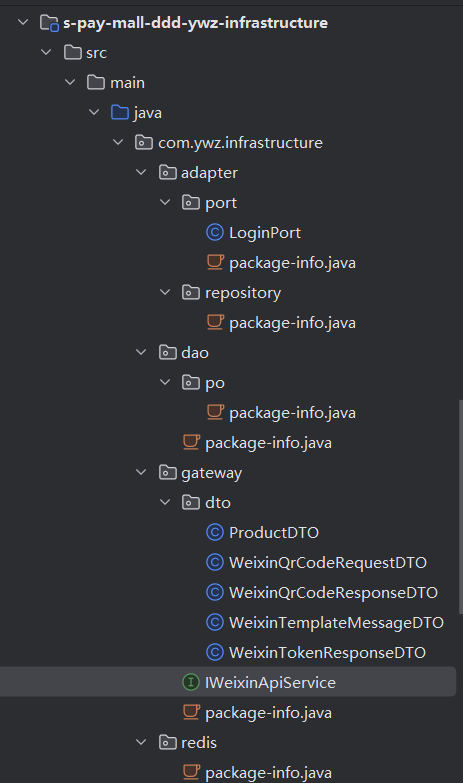
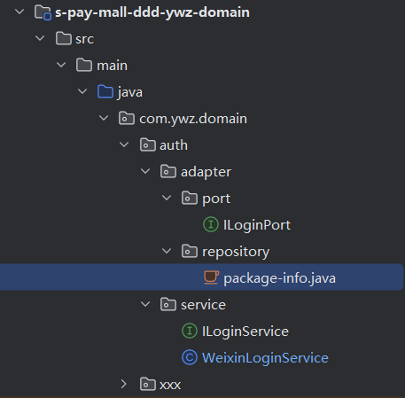
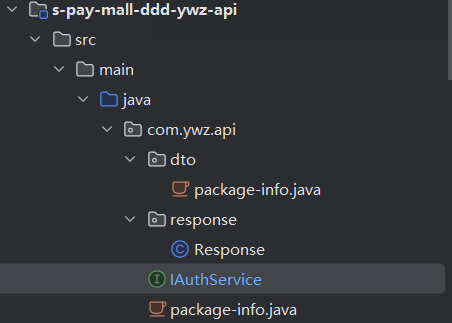
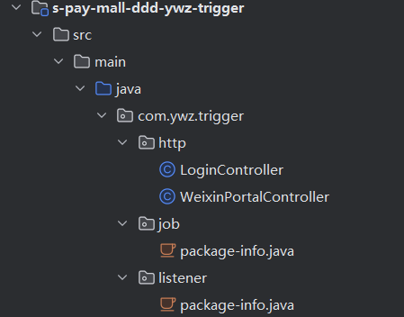

# 设计流程

# DDD架构中的基础设施层—-infrastructure

## 我的理解

- 所有外部接口的对接会放到**gateway**中：定义http、rpc接口，调用外部。在 adapter 中调用这部分内容

-  在**adapter**中的**port**包：实现对外部的api调用，类的名称为 XxxPort 接口定义在 domain 中

  

## deep seek的回答

在DDD（领域驱动设计）中，基础设施层负责处理技术细节和外部依赖。根据提供的文件结构，各包的作用如下：

### 1. **`adapter`**
   - **作用**：实现外部系统或框架的适配逻辑（如第三方服务、工具库等），将外部接口转换为领域层定义的接口。
   - **示例**：可能包含对微信API、支付网关等外部服务的适配实现。

### 2. **`port`**
   - **作用**：定义应用程序的**输入/输出端口**（接口），是领域层与基础设施层之间的抽象契约。
   - **示例**：`LoginPort` 是登录功能的端口接口，由基础设施层提供具体实现（如微信登录、手机号登录等）。

### 3. **`repository`**
   - **作用**：定义领域层所需的仓储接口（如数据库操作接口），具体实现在基础设施层完成。
   - **说明**：此处可能仅包含接口定义，实际数据库操作由 `dao` 或 ORM 框架实现。

### 4. **`dao`**
   - **作用**：**数据访问对象**（Data Access Object），提供对数据库的具体操作（如CRUD）。
   - **说明**：可能使用 JPA、MyBatis 等框架实现 `repository` 接口。

### 5. **`po`**
   - **作用**：**持久化对象**（Persistent Object），与数据库表结构直接映射的实体类。
   - **示例**：如 `UserPO`、`OrderPO` 等，通过 JPA 或 MyBatis 注解与表字段绑定。

### 6. **`gateway`**
   - **作用**：与**外部服务交互**的网关（如微信API、支付接口等），包含请求/响应的 DTO 和服务实现。
   - **关键文件**：
     - **`dto` 包**：定义数据传输对象（如 `WeixinQrCodeRequestDTO` 用于微信二维码请求）。
     - **`WeixinApiService`**：实现微信接口的具体调用逻辑（如获取 Token、发送模板消息）。

### 7. **`redis`**
   - **作用**：处理 Redis 缓存的配置和操作（如缓存读写、分布式锁实现）。

---

### 补充说明
- **`package-info.java`**：用于定义包的元信息（如包注释、公共注解等）。
- **分层逻辑**：
  - `port` 定义接口（领域层依赖），`adapter`/`dao` 实现接口（基础设施层提供）。
  - `gateway` 是典型的外部服务网关，与 `adapter` 类似，但更偏向业务集成（如微信支付）。

这种结构符合 DDD 基础设施层的职责：**封装技术细节，为领域层提供实现支持**。

# domain层

我发现domain层中的service包与mvc架构的service层功能类似，但是DDD中的service更多的是调用各个功能，把功能整合，

mvc中的service层是把功能就写在service中

# api层

定义api接口，接口的具体实现在触发器层

# trigger层— 触发器层

