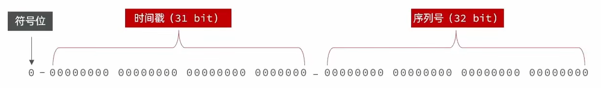
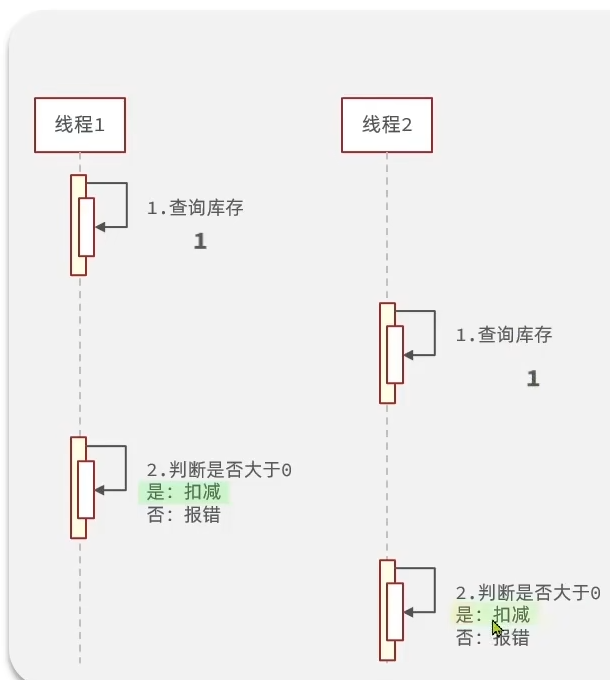

# redis使用技巧 代替session称为用户登录凭证


传统的项目中，在用户登录时在返回数据中加入session，以后的每次请求的请求头中都有session这样可以确保用户登录

这种处理方式在分布式场景下，因为session的数据在服务器存有状态，所以有多台服务器时session就失效了


### **综合对比表**

| 特性         | Session（传统）          | JWT                    | Redis 存储用户数据        |
| :----------- | :----------------------- | :--------------------- | :------------------------ |
| **状态管理** | 服务端有状态             | 无状态                 | 服务端有状态（集中存储）  |
| **扩展性**   | 依赖集中存储（如 Redis） | 天然支持分布式         | 依赖 Redis 集群扩展性     |
| **安全性**   | 高（数据在服务端）       | 中（依赖签名和 HTTPS） | 高（数据在 Redis）        |
| **网络开销** | 低（仅传 Session ID）    | 中高（传完整 Token）   | 低（仅传 Session ID）     |
| **撤销能力** | 即时撤销                 | 需黑名单机制           | 即时撤销（删除 Key）      |
| **适用场景** | 需强控制的单体应用       | 无状态分布式系统       | 高并发分布式 Session 管理 |

我认为jwt和redis都挺好

应该是jwt和redis一起使用，jwt中存储的信息是标识信息比如uid，redis中存其他信息，jwt从前端传过来之后通过uid从redis中获取数据，如果获取失败就代表用户未登录，

优点：

1. 这样比前端直接传回用户数据然后从redis中取数据的情况数据更加安全
2. 可以防止攻击者捏造uid正好歪打正着成功登录
3. 仅使用redis需手动维护redis中信息的过期时间，jwt自带过期时间不需要维护
4. 

苍穹外卖项目中使用jwt令牌但是校验是通过MySQL完成的，这个操作是很慢的，可以用redis优化


# redis可以缓存信息


redis可以当做缓存使用，当前端想要访问数据库前，先到redis中看看有没有，如果有直接返回，没有再从数据库中找，因为

在数据库中的操作是很耗时的

缓存更新策略：

当进行增删改操作时

在增删改操作的同时更新缓存，并为字段设置ttl过期时间

**缺点：**

- **并发写入时的竞态条件**：
  多个线程同时更新同一数据可能导致缓存与数据库短暂不一致。
  - 例如：线程 A 更新数据库 → 线程 B 更新数据库 → 线程 B 更新缓存 → 线程 A 更新缓存（覆盖新值）。
- **缓存穿透风险**：
  若某 Key 被频繁访问但数据库无数据（如恶意攻击），大量请求穿透到数据库。
- **缓存雪崩风险**：
  大量 Key 同时过期，导致瞬时数据库压力激增。


## 额外知识：

生产环境中常用 删除缓存+延迟双删

是的你没听错，直接删除缓存，不再更新缓存

假设写操作直接 **更新数据库后更新缓存**，以下并发场景可能导致缓存与数据库不一致：

- **时序问题**：
  线程 A 更新数据库 → 线程 B 更新数据库 → 线程 B 更新缓存 → 线程 A 更新缓存。
  最终缓存中存储的是线程 A 的旧数据（覆盖了线程 B 的新值）。
- **脏读问题**：
  线程 A 更新数据库 → 线程 B 读取缓存（旧值）→ 线程 A 更新缓存（新值）。
  线程 B 在缓存更新前读取到旧数据，导致短暂不一致。

#### **2. 删除缓存的优势**

- **强制后续读操作回填最新数据**：
  删除缓存后，下一个读请求会触发 **缓存未命中 → 从数据库读取最新数据 → 回填缓存**，确保缓存与数据库最终一致。
- **简化逻辑**：
  无需处理复杂的缓存更新逻辑（尤其当缓存是聚合数据或复杂结构时），只需删除 Key，由读操作重新加载。

**什么是延迟双删：**

仅删除缓存仍可能因并发问题导致短暂不一致。例如：

- 线程 A 删除缓存 → 线程 B 读缓存未命中 → 线程 B 查数据库（旧值，因 A 尚未提交事务）→ 线程 B 回填旧值到缓存 → 线程 A 提交数据库更新。
  最终缓存中存储的是旧值。

#### **解决方案：延迟双删**

1. **第一次删除**：在更新数据库前删除缓存（降低旧值被回填的概率）。
2. **第二次删除**：在数据库更新后，延迟一段时间（如 500ms）再次删除缓存，确保清理可能的脏数据。


## 缓存穿透

缓存穿透是指 有攻击者恶意构造大量数据库和redis中都不存在的请求，导致数据库受到影响

解决方案：当这种请求第一次到来时，在redis中缓存这种假数据并设置一个较短的过期时间，这样可以避免短时间大量请求到达数据库，

## 缓存雪崩

缓存雪崩是指在某一时刻，大量缓存同时失效，导致大量请求直接访问数据库，使数据库瞬间压力过大甚至崩溃的现象。

解决方法：

1. 设置随即过期时间
2. 对于redis宕机造成的缓存雪崩问题，可以使用集群//TODO

## 缓存击穿

缓存击穿是指某一热点数据的key突然失效，导致大量请求到达数据库，与缓存雪崩不同的是击穿是单个key失效，雪崩是大量key失效

解决方法：

1. 把热点数据设置为永不过期
2. 使用互斥锁保证同一时间只有一个线程能够请求数据库
   若没拿到锁就休眠一段时间然后重新查询缓存,
3. 使用逻辑过期时间,在写入缓存时不设置ttl,而是直接缓存一个过期时间,以后每次请求都查看是否到达过期时间

对比:

- 互斥锁：保证一致性更好，但会导致请求阻塞

- 逻辑过期：吞吐量更高，但一致性较弱


# redis实现秒杀业务

redis实现全局唯一id



支持一秒上千万单不会有重复id


## 库存超卖问题



解决方案:

使用乐观锁解决超卖问题

锁分为乐观锁和悲观锁,

### 悲观锁

悲观锁是把事情往坏处想,假设问题一定会发生 因此在执行操作前就锁定资源。

#### 工作原理

- 预先获取锁：在读取或修改资源前获取锁，确保独占访问

- 排他性访问：获得锁的事务拥有资源的独占权，其他事务必须等待锁释放

- 可能的等待：当多个事务尝试访问同一资源时，只有一个能获得锁，其他必须等待

#### 优点

- 确保数据一致性，防止并发修改导致的问题

- 实现简单直观

- 适合写多读少、冲突频繁的场景

#### 缺点

- 可能导致较高的等待时间，降低系统吞吐量

- 长时间持有锁会影响并发性能

- 在高并发场景下可能成为性能瓶颈


### 乐观锁

乐观锁基于一种乐观的假设，认为数据冲突很少发生，多个用户同时访问相同资源时不太可能同时修改它

#### 工作原理

- 延迟冲突检测：不会在操作开始时锁定资源，而是在提交更改时才检查冲突

- 版本控制：通常使用版本号或时间戳来检测冲突，在更新前比较版本信息

- 冲突处理：如果发现冲突（版本不匹配），系统会回滚事务或要求重试操作


#### 优点

- 减少资源争用，提高并发性能

- 避免了锁定带来的额外开销

- 适合读多写少的场景

#### 缺点

- 可能需要多次重试才能成功

- 实现逻辑较为复杂

- 对于高冲突的场景效率较低


在当前防止超卖的场景下,使用乐观锁,这里的版本号是库存,总共查询两次库存,请求刚到时查询一次,判断库存是否大于0,在修改数据库之前再查询一次库存,看看这次查到的库存与第一次查到的库存是否一致,如果一致再操作数据库,不一致直接报错


**缺点:** 当高冲突场景时,成功率太低

**优化** 只要第二次查询到的库存大于0,就可以操作数据库 


## 一人一单问题

使用悲观锁解决一人一单问题

用useid当作锁对象,只有uid不同的人能拿到锁,防止一个人短时间点击多下按钮,在内部查询数据库看看是否已经下过单

缺点: 这是单体环境下可以这么做,因为锁对象是存储在jvm中,可以保证这有一个线程能拿到锁,但在集群环境下,锁是在多个jvm中,每个jvm中都可以拿到锁,就失去了效果

优化方案:  使用分布式锁,redis实现分布式锁

实现方法:使用 `SET` 命令的 `NX`（不存在时设置）和 `EX`（过期时间）选项，保证原子性：

- **lock_key**: 锁的唯一标识。
- **unique_value**: 唯一值（如UUID+线程ID），用于安全释放锁。
- **EX 30**: 锁自动过期时间（秒），防止死锁。

问题: 线程一业务时间超过锁自动过期时间,导致其他线程获取锁,这时线程1完成业务释放锁,导致锁被误删,其他线程又可以来获取锁,无限套娃

解决方案:为了防止这种情况,我们应该把线程的唯一标识一起存到redis中,当删除锁时判断是不是自己,不是就不删了

这时又有一个问题: 判断锁是自己之后线程宕机了,又超过自动过期时间,锁自动释放,其他线程又可以获得锁,这时线程1 苏醒释放锁,这时释放的又不是自己的锁了

解决方案 : 使用lua脚本实现原子性

## 使用redisson替代setnx分布式锁

redisson的锁可以实现可重入


## 异步秒杀

秒杀下单后可以把订单信息存到阻塞队列中,然后直接返回,之后再单独开一个线程自己慢慢把阻塞队列中的订单拿出来做完


# 其他业务

## 点赞排行榜

使用redis中的sortedset实现

点赞功能:

```java
Long userId = UserHolder.getUser().getId();
        Double score = stringRedisTemplate.opsForZSet().score(RedisConstants.BLOG_LIKED_KEY + id, userId.toString());
        if (score == null) {
            // 没有点过赞
            boolean isSuccess = update().setSql("liked = liked + 1")
                    .eq("id", id)
                    .update();
            if (isSuccess) {
                stringRedisTemplate.opsForZSet().add(RedisConstants.BLOG_LIKED_KEY + id, userId.toString(), System.currentTimeMillis());
                return Result.ok();
            }
        }
        else {
            boolean isSuccess = update().setSql("liked = liked - 1")
                    .eq("id", id)
                    .update();
            if (isSuccess) {
                stringRedisTemplate.opsForZSet().remove(RedisConstants.BLOG_LIKED_KEY + id, userId.toString());
                return Result.ok();
            }
        }
```


查看点赞列表

```java
// 使用redis的zset类型
        Set<String> uidSet = stringRedisTemplate.opsForZSet().range(RedisConstants.BLOG_LIKED_KEY + id, 0, 4);
        if(uidSet == null || uidSet.size() == 0){
            return Result.ok(Collections.emptyList());
        }
        List<Long> ids = uidSet.stream()
                .map(Long::valueOf)
                .collect(Collectors.toList());
        String join = StrUtil.join(",", ids);
        List<UserDTO> users = userService.query().in("id",ids).last("order by field(id," + join + ")")
                .list()
                .stream()
                .map(user -> BeanUtil.copyProperties(user, UserDTO.class)).collect(Collectors.toList());
        return Result.ok(users);
```

